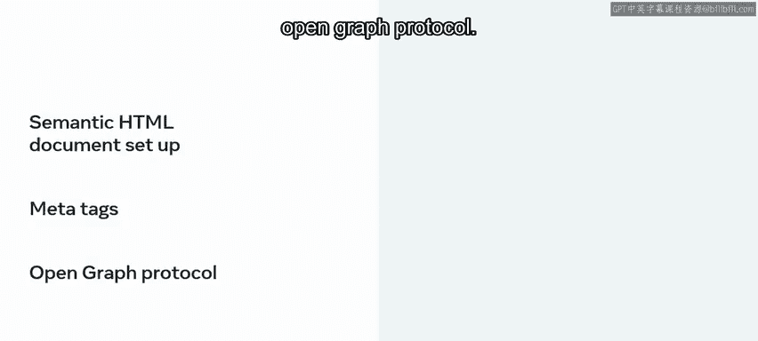
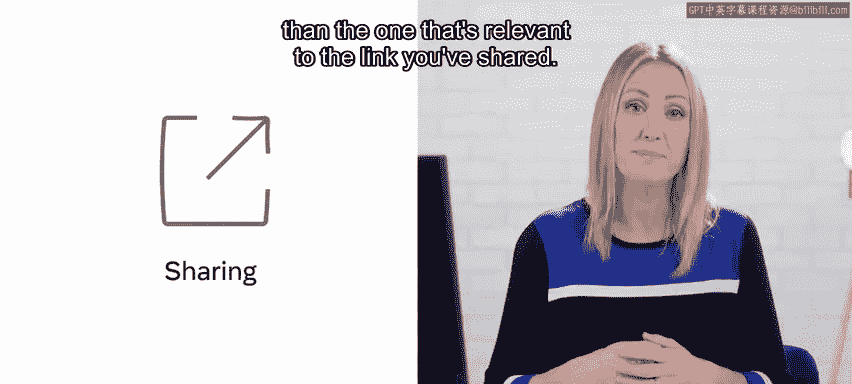
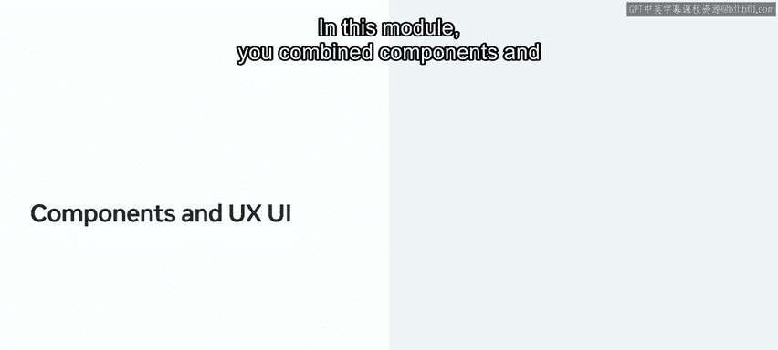

# Meta前端开发课程：P129：7_项目基础模块总结 🎯

在本节课中，我们将总结第二个模块的核心内容。这个模块涵盖了语义化结构、样式与响应式设计以及组件添加等关键概念，最终目标是构建一个响应式网站。

## 语义化HTML与元数据 🌐

上一节我们介绍了项目设置，本节中我们来看看语义化结构的重要性。你重新学习了如何设置语义化的HTML文档。本部分涵盖的另一个重要主题是**元标签**和**开放图谱协议**。

一个体现其重要性的实际例子是：在社交媒体上分享你的网页链接。如果没有正确设置元标签和开放图谱协议标签，你分享的链接可能无法在各种社交媒体或聊天窗口中显示图片，或者可能显示网站中与所分享链接不相关的其他图片。

开放图谱协议有助于解决这类棘手问题。

## CSS样式与响应式布局 🎨

在模块的第二课中，你重温了CSS样式。具体来说，你有机会重新学习**CSS Grid**及其与响应式和网站布局的关系。

CSS Grid功能非常强大，它允许你构建几乎任何类型的网站布局。尽管它的语法有时会有些复杂，但就像任何其他与Web开发相关的技术一样，你对CSS Grid的练习越多，掌握得就越好。

这堂课是一个进一步实践你在本专业系列课程中获得的知识的机会。

## React组件实践 ⚛️

在模块的第三课中，你开始为Little Lemon餐厅Web应用添加组件。组件是React乃至整个现代Web开发的基石。

这意味着理解React中组件的工作原理对你来说是一项至关重要的知识。因此，你完成了一堂完全专注于这项技能的课程，重温了React中组件的基础知识并将你的知识付诸实践。

在React中实现组件，同时确保你的Web应用看起来精致且样式正确，这与上一个模块的内容很好地结合了起来。在上一模块中，你设置了项目并围绕应用本身做了一些规划，同时考虑了所有UX/UI因素。

在本模块中，你将组件、UX/UI与一些样式和基于CSS Grid的布局结合起来。

## 总结与展望 🚀

现在项目基础部分已经完成，你已经准备好继续前进了。在下一个模块中，你将编写一些特定的交互功能，使Little Lemon网站的访问者能够根据客人数量和其他相关用户需求来预订餐桌。

**本节课中我们一起学习了**：语义化HTML与元数据的重要性、使用CSS Grid创建响应式布局，以及React组件的核心概念与实践。这些知识为构建功能完整、用户体验良好的Web应用奠定了坚实的基础。