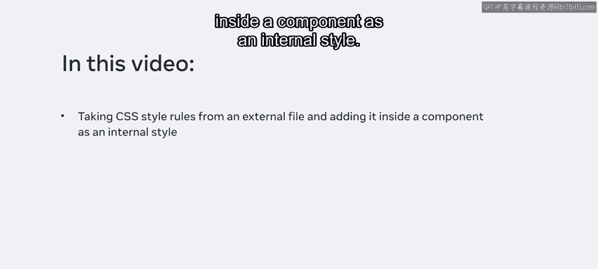
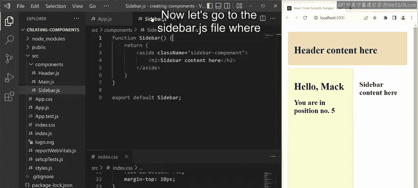
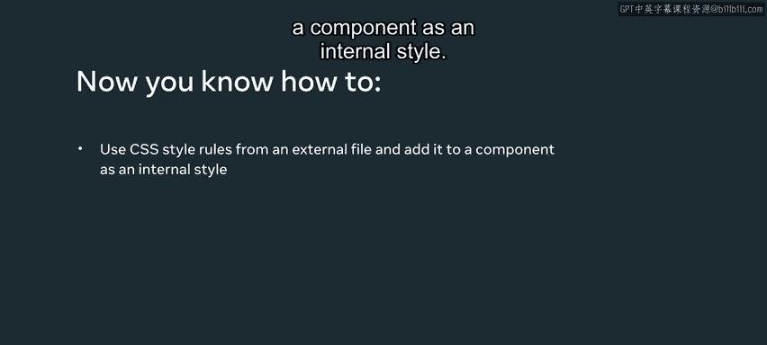

# 前端开发：P12：实际样式

在本节课中，我们将学习如何将外部CSS文件中的样式规则，转换为React组件内部的样式。我们将通过一个具体的例子，演示如何将CSS代码从外部文件移动到组件内部，并将其转换为JavaScript对象格式，以便在JSX中使用。

## 概述

在HTML文档中包含CSS有三种主要技术。第一种是**内联样式**，通过在HTML元素内部使用`style`属性实现。第二种是**内部样式**，通过在文档的`<head>`部分使用`<style>`元素实现。第三种是**外部样式**，通过使用`<link>`元素链接到外部的CSS文件实现。

上一节我们介绍了CSS的三种引入方式，本节中我们来看看如何在React组件内部实现类似“内部样式”的效果。

## 从外部样式到组件内部样式

在本视频示例中，我们将从一个名为`index.css`的外部文件中提取CSS样式规则，并将其添加到一个组件内部作为内部样式。这些样式规则随后可以在组件的`return`语句中被代码引用。

请注意，当前组件是由外部样式表`index.css`进行样式设置的。在本视频中，我将继续在一个由`Header`、`Main`和`Sidebar`组件组成的应用上工作。这次的重点是在`Sidebar`组件内部使用内部样式。

为了演示这个过程，我不需要移动`index.css`文件中的所有代码。相反，我将只关注与`Sidebar`组件相关的样式。

以下是具体的操作步骤：

1.  **提取相关CSS代码**：首先，在`index.css`文件中，选中应用于侧边栏（sidebar）的CSS代码，然后剪切它（在Windows上按`Ctrl+X`，在Mac上按`Command+X`）。保存文件后，你会注意到浏览器中显示的侧边栏组件失去了原有的样式。

2.  **将代码粘贴到组件文件**：接下来，打开`Sidebar.js`文件，将剪切的CSS代码粘贴到`return`语句之前。

3.  **将CSS转换为JavaScript对象**：直接将CSS代码粘贴到JavaScript文件中不会生效。我们需要将其转换为JavaScript对象。为此，需要声明一个常量变量（例如`sidebarStyle`）来存储样式对象。然后，对代码进行以下修改：
    *   将每个CSS声明末尾的分号（`;`）替换为逗号（`,`）。
    *   将CSS属性名中的连字符命名法（kebab-case，如`background-color`）转换为小驼峰命名法（camelCase，如`backgroundColor`）。
    *   因为CSS声明现在变成了对象属性，所以需要将它们的值用双引号（`"`）包裹起来，使其成为字符串。

4.  **在JSX中应用样式**：最后，在组件的`return`语句中，找到对应的HTML标签（例如`<aside>`），为其添加`style`属性，并通过JSX表达式将我们定义的样式对象赋值给它，代码格式为：`style={sidebarStyle}`。

完成上述步骤后，选择文件菜单中的“全部保存”来保存更改。此时，你会发现浏览器中的侧边栏组件恢复了编辑`index.css`文件之前的样式。这就是直接在组件内部使用内联样式的一个例子。

## 总结

本节课中我们一起学习了如何将外部CSS文件中的样式规则迁移到React组件内部。关键步骤包括提取CSS代码、将其转换为JavaScript对象格式（涉及命名法转换和语法调整），以及通过`style`属性在JSX中应用该样式对象。这种方法使得组件的样式可以更紧密地与组件逻辑封装在一起。

