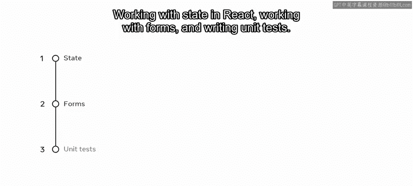
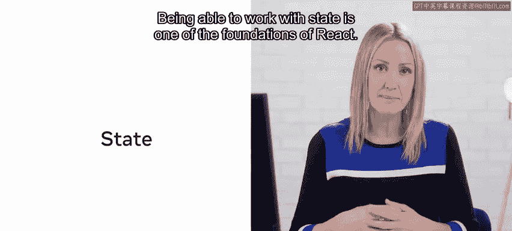
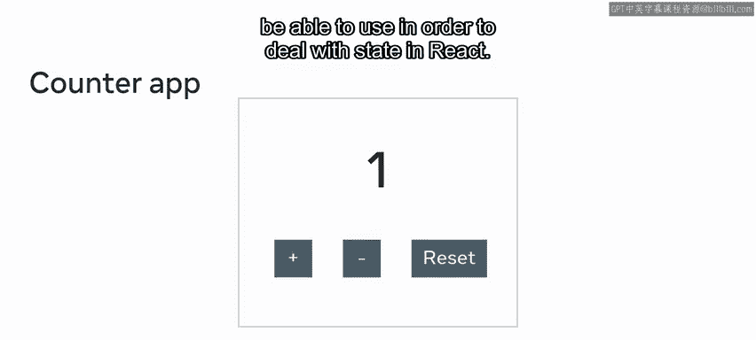
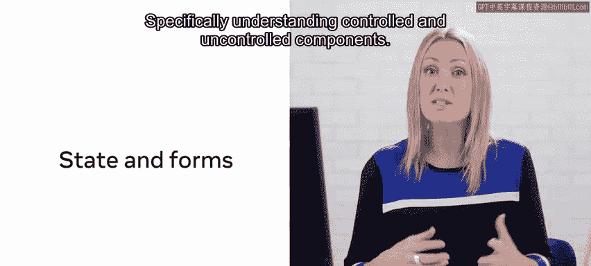
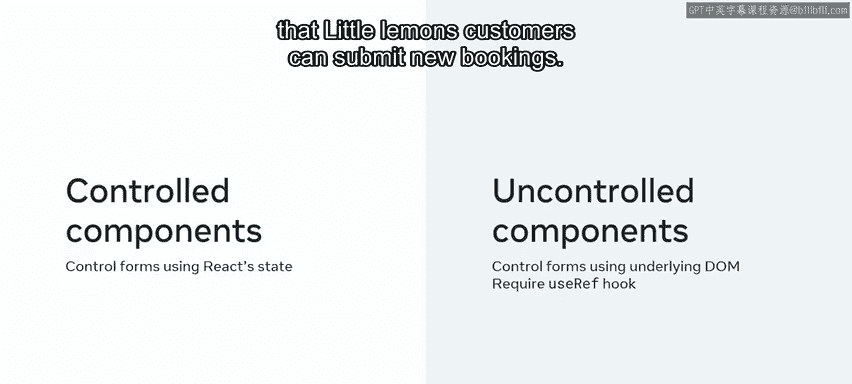
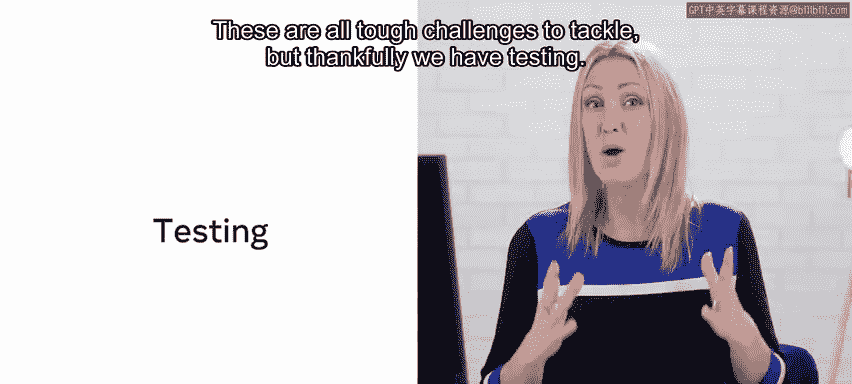
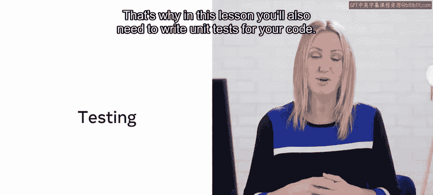
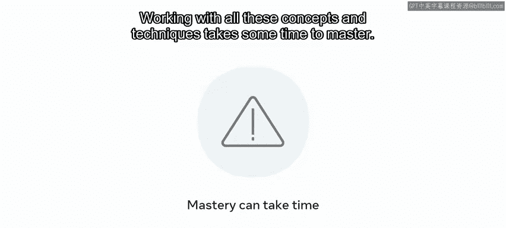

# 前端开发（React/UI、UX/毕业项目/code review）：P130：8_客户表预订

在本节课中，我们将为 Little Lemon 网站实现“预订餐桌”功能。为了正确完成此功能，我们需要回顾三个主要的 React 概念：**在 React 中处理状态**、**处理表单**以及**编写单元测试**。

## 状态（State）在 React 中的重要性

上一节我们介绍了本节课的目标，本节中我们来看看 React 状态的基础概念。

能够处理状态是 React 的基石之一。试想一下，如果 React 中没有状态，那么最终得到的将只是一系列静态组件。React 将仅仅是一种将大段 HTML 代码分割成更易于理解的小部分的方式。

换句话说，你仍然会得到组件，但这些组件不允许任何交互性。在这种情况下，组件的唯一好处在于它们允许你将描述整个网页的长代码分割成更小的块。除此之外，使用它们并没有真正的优势。这说明在 React 中，组件和状态是密不可分的。

## 一个简单的状态示例：计数器应用

以下是学习 React 状态时，给初学者展示的最简单示例之一：计数器应用或计数器组件。

一个计数器可能包含一个段落，该段落以一个特定的数字值开始。在该段落下方会有按钮，点击这些按钮会更新段落中显示的数字值。

要能够独立编写这样的简单示例，你需要了解 React 中的渲染，以及如何使用 `useState` Hook 和事件处理代码。

当然，这是一个非常基础的例子，但它经常被使用，因为它很好地演示了在 React 中处理状态所需了解和使用的不同知识。

## 状态与表单：受控与非受控组件

状态和 React 也与表单处理紧密相关，特别是**受控组件**和**非受控组件**。

*   使用**受控组件**时，你通过 React 状态来控制给定的表单。
*   使用**非受控组件**时，你通过底层的 DOM 来控制给定的表单。这当然需要使用另一个 Hook，即 `useRef` Hook。

考虑到这两个概念，你需要定义新的预订页面，以便 Little Lemon 的顾客可以提交新的预订。

## 代码质量保障：单元测试

一旦你创建了一个应用，如何知道它运行良好？如何知道之前的需求、质量保证（QA）部门、客户或顾客的要求都已得到满足？如何知道对应用功能的新增没有破坏之前的功能？

这些都是需要应对的严峻挑战。但幸运的是，我们有测试。这就是为什么在本节课中，你还需要为你的代码编写单元测试。

## 总结与学习建议

最后，请注意，结合本视频中简要提到的概念并非易事。掌握所有这些概念和技术需要一些时间。因此，在处理此功能时，你应该预留足够的时间。如果需要，也可以参考本课程计划中的其他资料。

让我们开始吧。