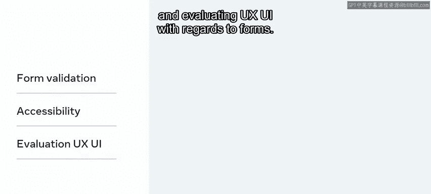
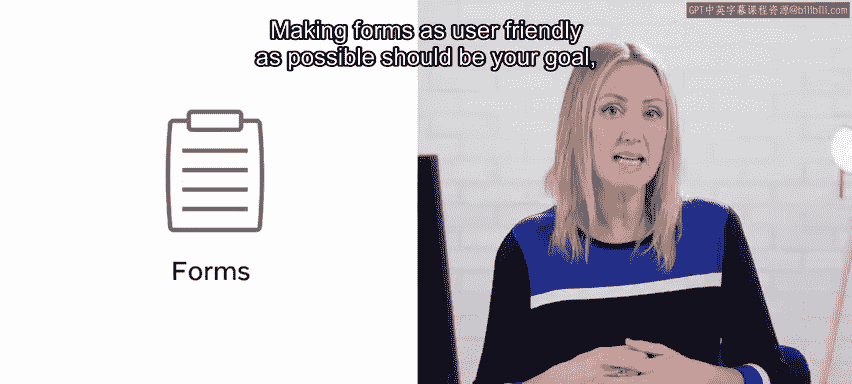
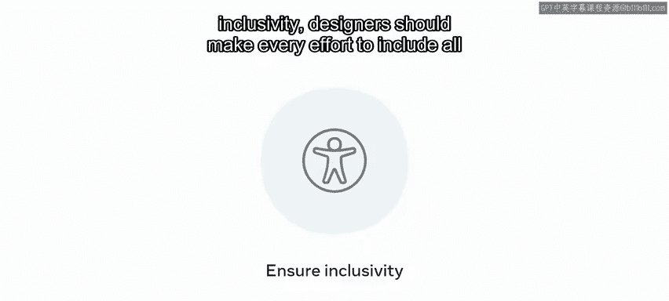
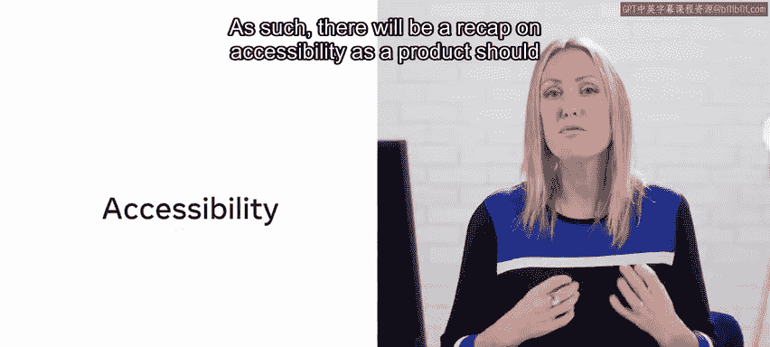
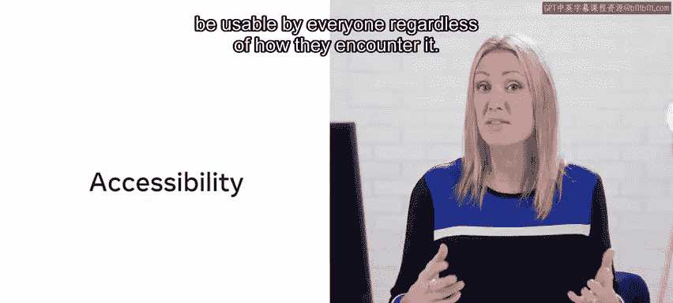
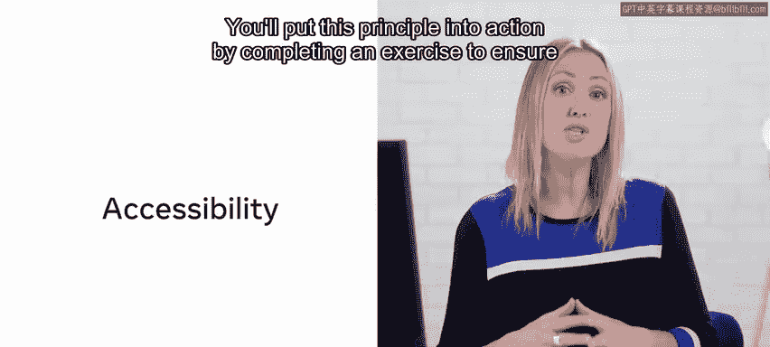
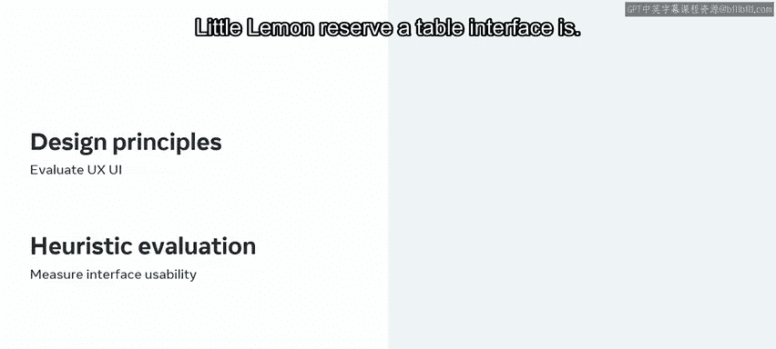

**Meta前端开发课程：P132：10_用户体验的重要性** 😊

在本节课中，我们将要学习用户体验（UX）的核心概念及其在表单设计中的具体应用。我们将探讨表单验证、可访问性以及如何评估表单的UX/UI，目标是让表单尽可能地对用户友好。

---

### **概述：什么是用户体验？** 😊

用户体验至关重要，因为它致力于满足用户的需求。其目标是提供令人满意的体验，从而维持用户对产品或服务的忠诚度。

每个人的用户体验都是独特的。在创建产品时，最重要的一点是：即使是你设计了它，你也可能不是它的用户。因此，你不能假设用户想要或需要什么。

你可能会问，什么构成了出色的体验？要找到答案，你应该贴近你的用户。与他们互动，观察他们如何使用你的产品，并思考他们为何做出某些选择。保持关注并提出问题，因为你可以从消费者和客户那里学到很多，从而帮助你为用户创造出色的体验。

---

### **表单设计的目标** 😊

本节课将围绕“小柠檬餐厅”网页应用中的“预订餐桌”功能展开，具体涵盖以下三个核心方面：

1.  **表单验证**
2.  **可访问性**
3.  **表单的UX/UI评估**

你的目标应该是让表单尽可能地对用户友好，因为填写表单对人们来说可能是一件繁琐的事情。

---



### **1. 表单验证** 😊



上一节我们介绍了课程的整体目标，本节中我们来看看第一个核心环节：表单验证。

表单验证是一个互联网技术术语，用于检查用户在网页表单中提交的数据是否准确。但请注意，这个过程的情感层面比技术层面更重要。表单应该在用户出错时提醒他们，或者在他们输入正确时给予确认，以增强用户的信心。

在练习中，你将完成客户端表单验证，检查它是否能正确验证“小柠檬餐厅”的用户数据。

以下是表单验证的一个基本代码逻辑示例：
```javascript
function validateForm(formData) {
  if (formData.email.includes('@')) {
    // 验证通过
    return true;
  } else {
    // 验证失败，提示用户
    alert('请输入有效的电子邮件地址。');
    return false;
  }
}
```

此外，你还将完成一个练习，为表单验证和提交功能实现单元测试。

---

### **2. 可访问性** 😊

在确保了表单的功能性之后，我们需要确保所有用户都能使用它。这就引出了可访问性的概念。

除了遵守确保包容性的可访问性法规外，设计师应尽力在所有使用场景中涵盖所有潜在用户。因此，产品应该让每个人都能使用，无论他们以何种方式接触它。

你将通过完成一个练习来实践这一原则，确保“小柠檬餐厅预订餐桌”网页应用对所有用户都是可访问的。

一个简单的可访问性实践是为图片添加描述文本：
```html

```

---

### **3. 评估UX/UI** 😊

最后，在表单功能完备且易于访问的基础上，我们需要评估其用户体验的好坏。

你将回顾如何通过关注先前课程中涵盖的原则来评估UX/UI，即“UX/UI设计原则”。接着，你将执行一次启发式评估，将你的界面可用性与公认的可用性原则进行比较，以确定“小柠檬预订餐桌”界面的可用性程度。

本节课包含技术和概念两个方面，以及多种练习。内容相当丰富，让我们开始深入学习吧。😊



---





### **总结** 😊



本节课中我们一起学习了：
*   **用户体验（UX）** 的核心是满足用户需求并创造满意体验。
*   设计**表单验证**时，需兼顾技术准确性与用户情感反馈。
*   遵循**可访问性**原则，确保产品能被所有用户平等使用。
*   运用**启发式评估**等方法，依据设计原则来评估和改进表单的UX/UI。



通过掌握这些知识并完成相关练习，你将能够创建出不仅功能正确、而且体验出色、包容性强的网页表单。