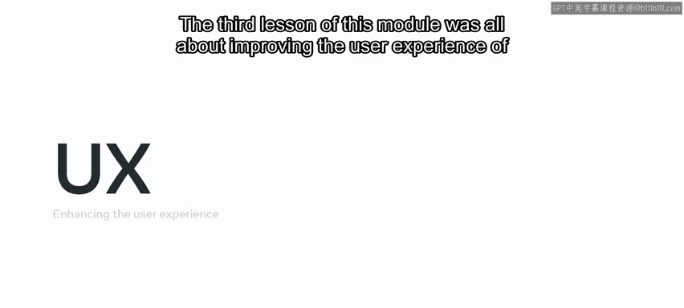
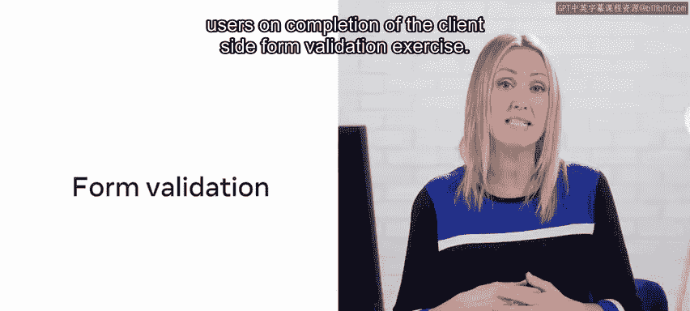
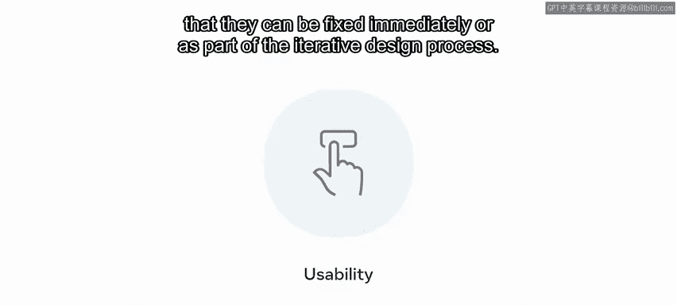
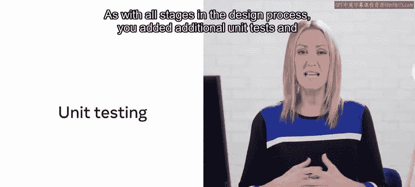
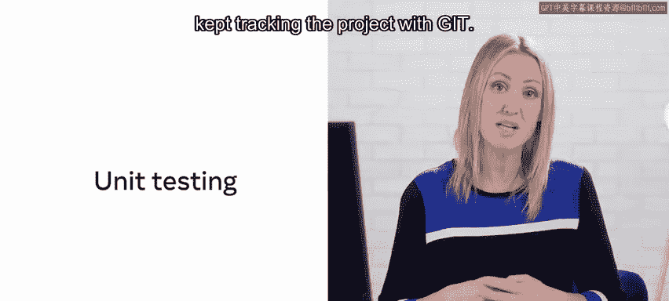

# Meta前端开发课程：P133：项目功能模块总结 🎉

在本节课中，我们将对课程第三模块“项目功能”进行总结。你已经完成了为Little Lemon餐厅创建前端应用的核心功能模块。本模块的每节课都聚焦于不同的概念、技术与方法。

## 模块内容概览

本模块主要涵盖三个核心部分：构建餐桌预订系统、与API交互以增强应用、以及通过多种方式提升用户体验。最终，完成这些课程后，你应该掌握如何搭建一个餐桌预订系统的前端，并利用HTML5验证和实时数据来优化用户体验。

现在，让我们简要回顾一下每节课的具体内容。

## 第一课：构建预订系统 🛠️

在第一课中，你构建了餐桌预订系统。为此，你需要重新回顾并应用以下核心概念。

以下是构建过程中涉及的关键技术点：

*   **React组件**：使用组件化思想构建用户界面。
*   **React状态管理**：在组件中使用`useState`或`useReducer`来管理状态。
*   **跨组件状态共享**：在多个组件之间有效地传递和共享状态。
*   **语义化代码**：编写具有良好语义结构的HTML，提升可访问性与代码可读性。
*   **单元测试**：为你的功能编写测试用例，确保代码质量。
*   **Git版本控制**：像在其他课程中一样，使用Git来跟踪和管理代码的更新。

## 第二课：与API交互 🌐

在第二课中，你通过与应用编程接口（API）交互，进一步改进了你的应用。

以下是实现API交互的主要步骤：

1.  **发起API请求**：使用`fetch`函数或类似方法查询餐桌预订API。
2.  **处理副作用**：利用`useEffect`钩子来处理数据获取等副作用操作。
3.  **更新应用状态**：根据API调用返回的JSON数据，使用`useState`或`useReducer`来更新应用的内部状态。
4.  **增强测试与跟踪**：编写更多的单元测试，并继续使用Git跟踪项目进展。

## 第三课：提升用户体验 ✨

本模块的第三课专注于全方位提升你应用的用户体验。

你首先重新认识了表单验证的重要性，并为预订功能中的表单添加或改进了客户端验证，以优化用户体验。在完成客户端表单验证练习后，你亲身体会到填写一个简单的表单也可能让用户感到沮丧，从而更理解优化的重要性。

接着，你通过确保组件的可访问性，使你的Web应用能够服务于所有用户。

通过关注并融入可访问性设计，Little Lemon的“预订餐桌”网页应用现在应该能在所有使用场景下服务于所有潜在用户。

之后，你重新学习了可用性评估的方法与原则，并完成了一次启发式评估，以识别UI设计中的可用性问题，同时评估了这些问题的严重性与紧迫性，以便立即修复或将其纳入迭代设计流程。

与设计流程的所有阶段一样，你添加了额外的单元测试，并持续使用Git跟踪项目。

## 总结与展望 🚀

至此，你已经完成了涵盖“项目功能”的课程第三模块。你现在已经准备好进入最后一个模块，在那里你将进一步深化知识，并且截至目前的所有辛勤工作将通过自我评估和同行评审来检验。

本节课中，我们一起回顾了构建Little Lemon预订应用功能模块的全过程：从搭建系统基础、集成外部API到精细化打磨用户体验。你掌握了React状态管理、API交互、表单验证、可访问性设计及可用性评估等一系列核心前端开发技能。