# 前端开发毕业项目：P134：12_毕业项目课程回顾 📚

在本节课中，我们将回顾毕业项目课程的全部内容，并了解最后一个模块——项目评估与课程总结的具体安排。

## 概述

欢迎来到毕业项目课程的第四个也是最后一个模块。本节课程将对整个项目历程进行回顾，并详细介绍最终评估阶段的任务，包括项目自评、同行评审以及课程总结。

---

## 课程回顾 🔄

上一节我们完成了项目的核心功能开发。现在，让我们快速回顾一下你在本课程中已涵盖的内容。

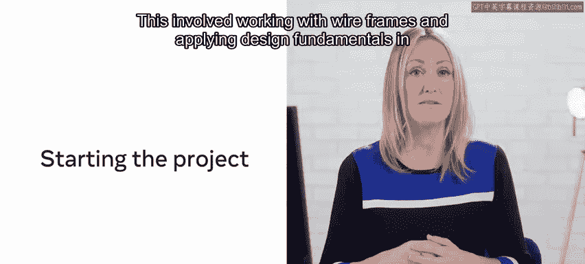

### 模块一：项目启动与设计

在第一个模块中，你被介绍了课程及其大纲，有机会认识你的同学，并学习了如何在本课程中取得成功。你设置了项目，包括：
*   创建初始的 React 应用。
*   使用 Git 跟踪你的更改。
*   规划项目的用户体验和用户界面。这涉及在 Figma 中使用线框图并应用设计基础。

### 模块二：项目基础

模块二涵盖了项目的基础。你完成了以下工作：
*   处理代码中的语义结构，确保尽可能使用语义化的 HTML5 标签。
*   为你的应用处理元标签和开放图谱协议设置。
*   重新使用 CSS Grid 来创建响应式布局。

### 模块三：项目功能

第三个模块“项目功能”涉及为 Little Lemon 网络应用编写餐桌预订系统并定义预订页面。你实现了：
*   单元测试。
*   与 API 协作。
*   进一步打磨了应用的 UI。
*   验证了用户数据。
*   为你的应用编写了更多测试。

---

## 模块四：项目评估 📋

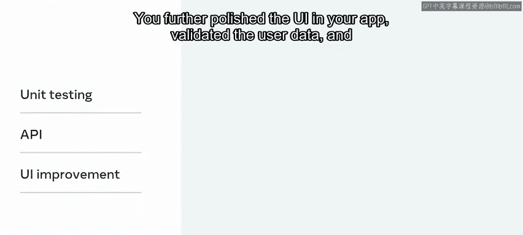

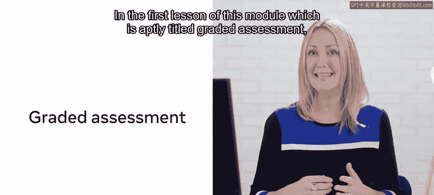

以上内容将你带到了当前的模块——项目评估。既然你已经通过完成 Little Lemon 项目展示了前端开发技能，现在是时候进行评估了。

### 分级评估

在本模块的第一课，即恰如其分地命名为“分级评估”的课程中，你需要通过以下方式参与评估过程：
1.  进行项目自评。
2.  在可用性、可访问性、设计和代码方面，对另一位学习者的解决方案进行同行评审。

别担心，这并不难做，并且会有指导让你更容易完成。这是一个你应该享受并从中学习的趣味任务。

本模块的核心是与你的同伴协作，并检查已完成的 Little Lemon 项目，以便将你的设计和代码与其他项目进行比较。这种方法让你有机会：
*   进一步巩固学习。
*   增进知识。
*   深入了解其他人如何应对你在本课程中被要求完成的相同挑战和练习。

完成同行评审后，你将有机会检查一个已完成的解决方案，以便将其与你自己的实现以及你同伴的实现进行比较。这样做的目的是确保你能接触到解决同一问题的另一种方法。如前所述，有机会检查完成同一任务的多种方式应该能增进你的学习，让你更广泛地理解各种解决方案，并最终提高你作为 React 开发者的能力。

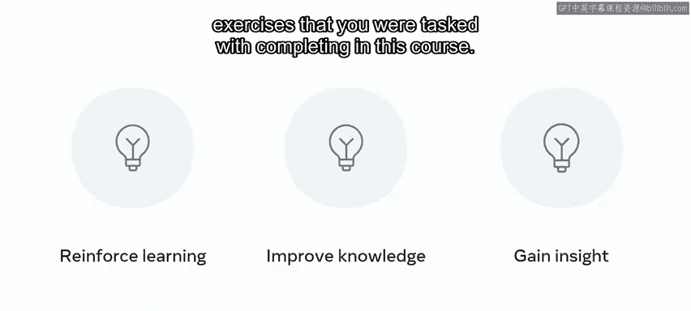

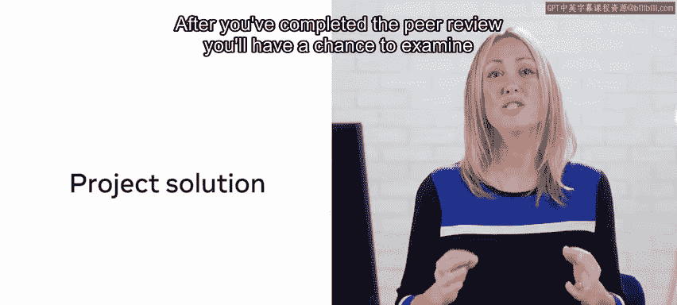

你将以一个分级评估测验来结束本课。

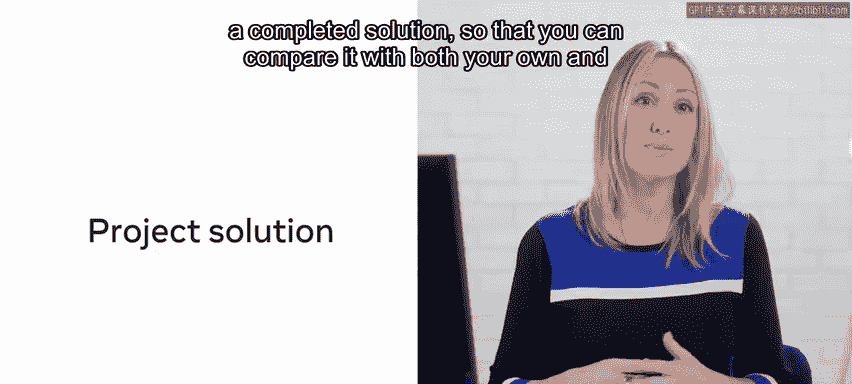

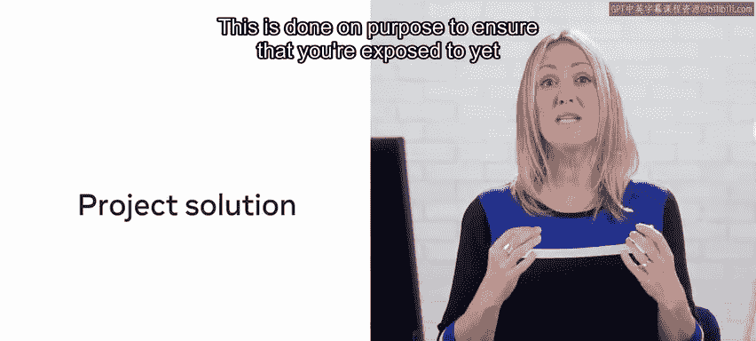

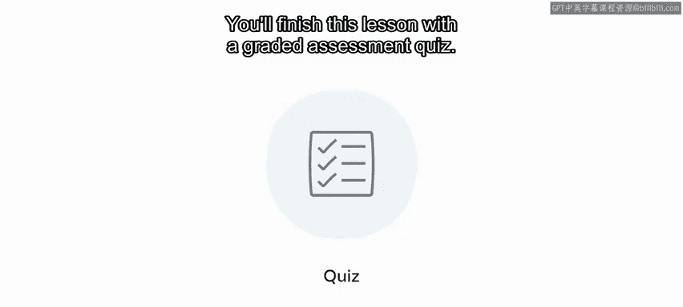

### 课程总结

第二课将以课程总结的形式进行。你将有机会反思完成项目所遵循的历程、获得的知识、沿途取得的成就，以及完成本课程后潜在的下一步计划。

---

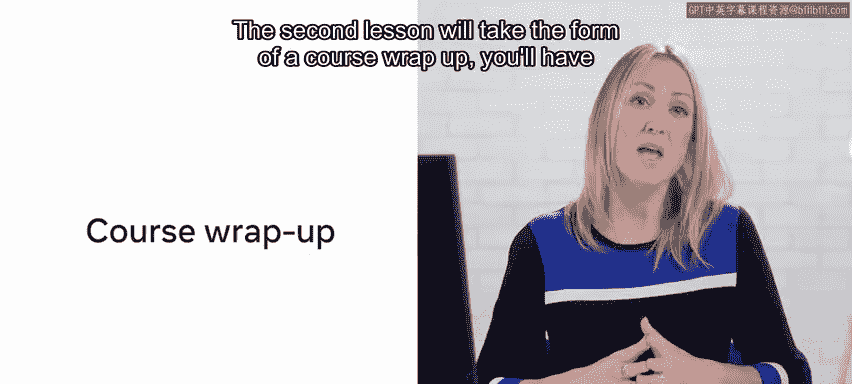

## 总结

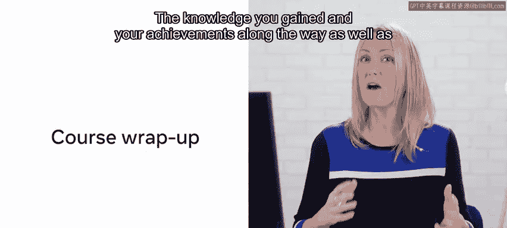

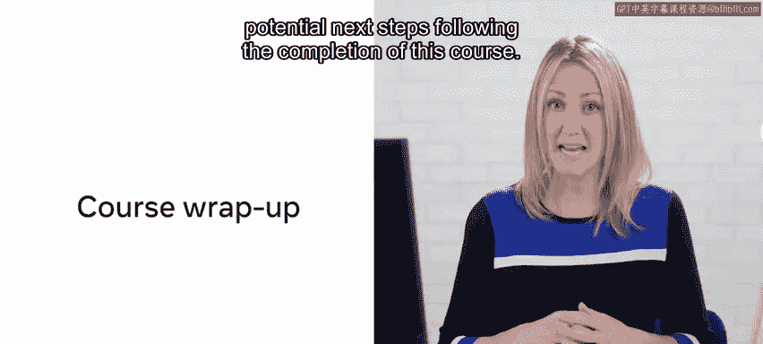

本节课中，我们一起回顾了整个毕业项目课程的四个模块：从项目启动与设计、打下基础、实现功能，到最后的评估与总结。现在，你已经准备好进入评估阶段，通过自评和同行评审来巩固所学，并从他人的解决方案中获得新的见解。