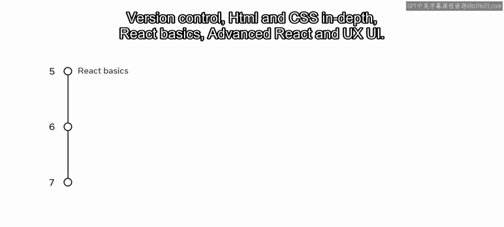
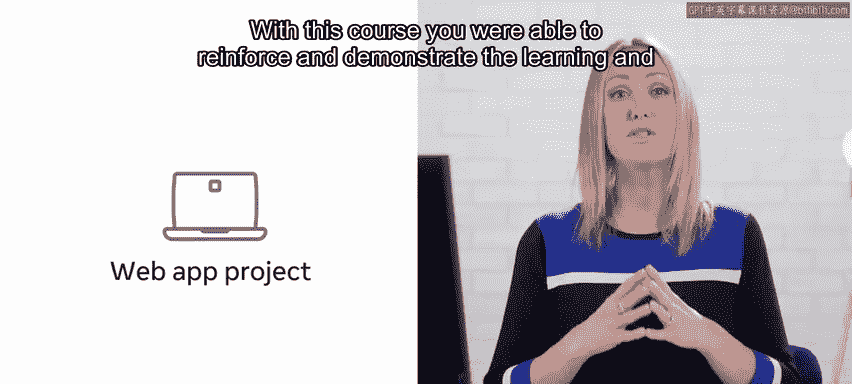
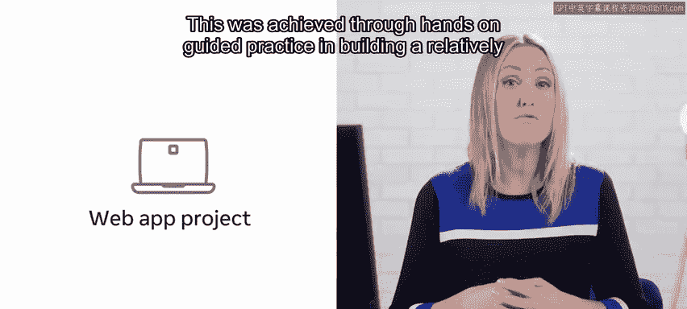
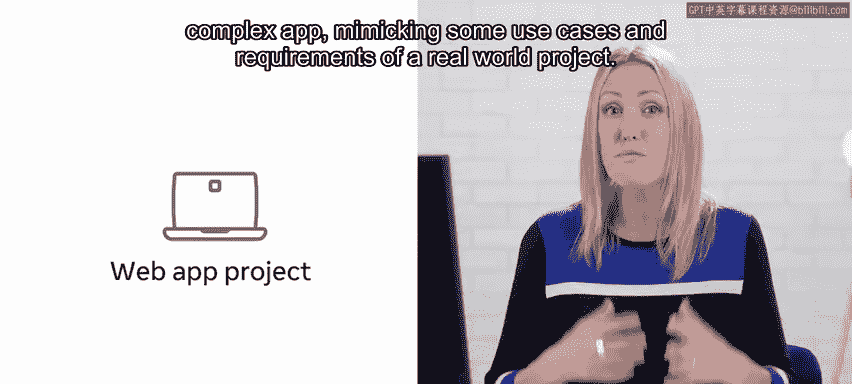
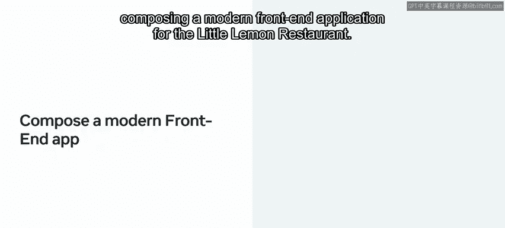
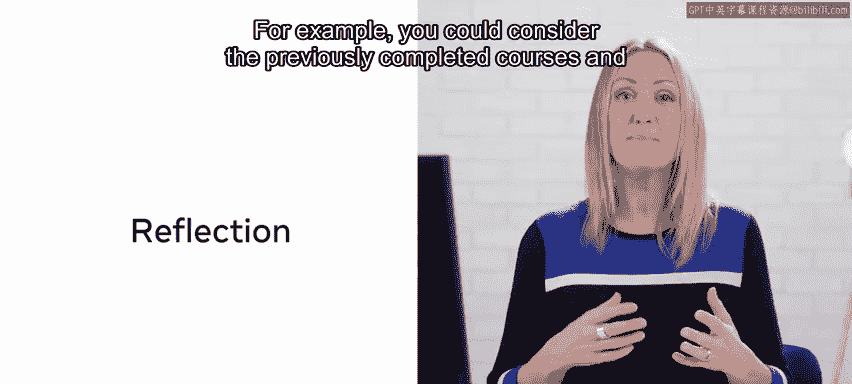
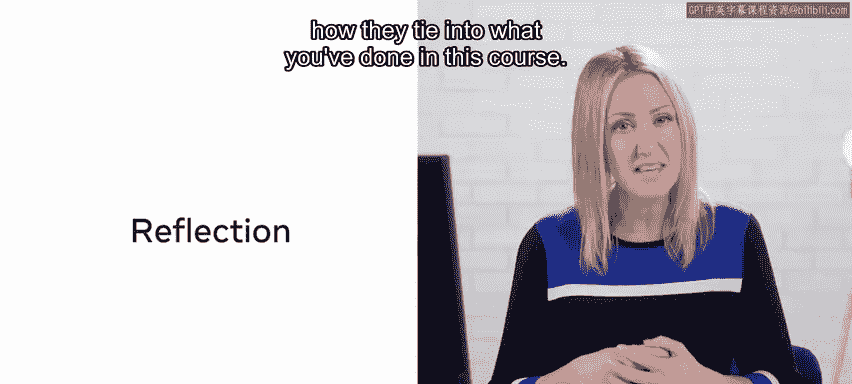
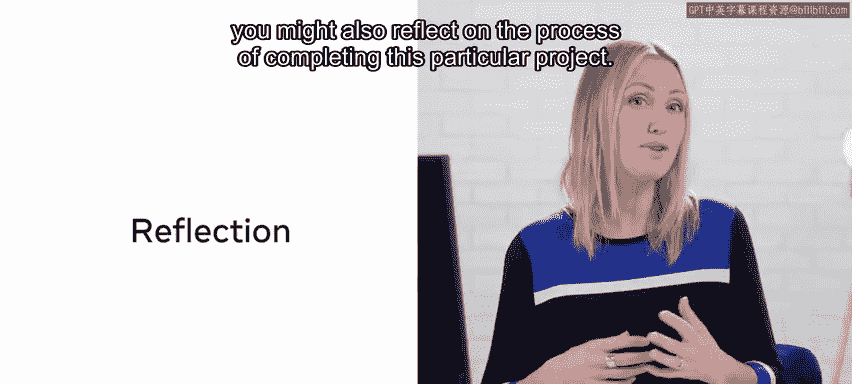
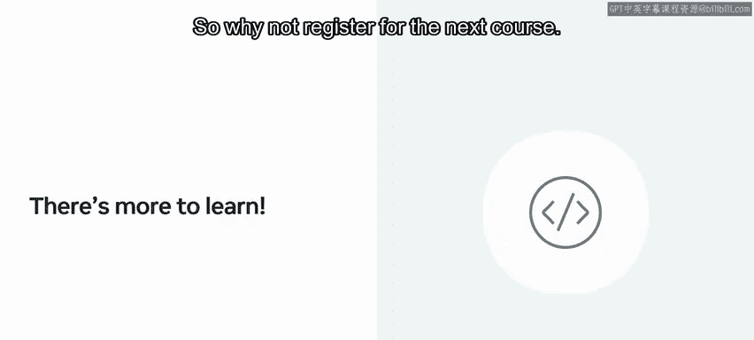
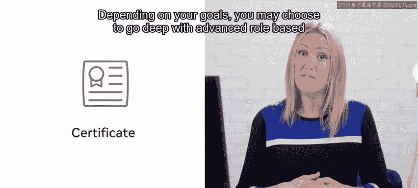

# 前端开发：P135：恭喜你完成了毕业项目 🎉

在本节课中，我们将回顾并总结你在毕业项目课程中的学习成果与旅程。你已经完成了这个顶点项目课程，这是对你整个前端开发学习路径的一次重要检验和综合展示。

## 课程概述

你已抵达这个顶点项目课程的终点。你付出了辛勤努力才走到这里，并在前端开发者的旅程中取得了令人难以置信的进步。这门课程以及你所取得的一切成就，实际上是你在这个前端开发项目中完成的所有先前课程的结晶。

具体来说，这些课程包括：**Web开发入门**、**JavaScript编程**、**版本控制**、**深入HTML与CSS**、**React基础**、**高级React**以及**UX/UI设计**。

## 项目成果与技能巩固

通过这门课程，你得以巩固并展示了在整个项目中学到的知识和实践开发技能。这是通过动手构建一个相对复杂的应用程序来实现的，该程序模拟了真实世界项目的一些用例和要求。

最终，你通过为“小柠檬餐厅”组合构建一个现代前端应用程序，展示了在整个项目中学到的多项技能。现在你已经完成了这个Web应用项目，这是一个停下来反思的好时机。

## 如何进行项目反思

你可以从多个角度反思已完成的课程。例如，你可以回顾之前完成的课程，并思考它们如何与你在这门课程中所做的事情联系起来。

除了思考完成课程所需的知识，你也可以反思完成这个特定项目的过程。你可以问自己一些问题，例如：
*   项目的哪些部分最难？
*   项目的哪些部分最容易？
*   我从构建这个项目中获得了什么经验？
*   我是否会从重新学习部分先前课程甚至再次学习它们中受益？

你甚至可能发现，项目中需要完成的大部分练习和任务都很容易，并且你已经准备好迎接更大的挑战。

## 展望下一步

这为你顺利进入本项目的下一门课程奠定了良好基础。在每一门前端开发课程中，你已经发展了一套广泛的技能。现在，你已有机会应用所学的一切，并使用**React**构建了自己的功能完整的网站，你已经为旅程的下一步做好了准备。

因此，何不注册下一门课程呢？一旦你完成了所有课程，你将获得前端开发证书。这些证书提供了全球认可且行业认可的技术技能证明，也可以根据你的目标，作为进阶其他课程和项目的凭证。你可以选择深入学习基于高级角色的项目，或学习基础课程。

## 总结与祝贺

再次祝贺你完成这个顶点项目课程。请记住，在本课程中完成的项目证明了你对前端开发价值和能力的理解。你现在拥有了一个使用**React**构建的、完全可运行的网站，可以将其纳入你的作品集进行展示。

这不仅展示了你的技能和知识，也充分说明了你是一个自我驱动、富有创新精神的个体。感谢你，很荣幸能与你一同踏上这段探索之旅。祝你在未来一切顺利。