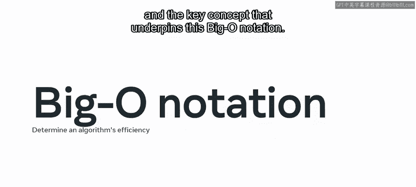
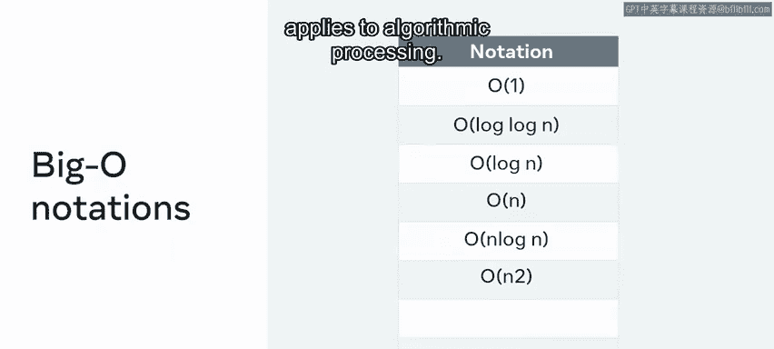
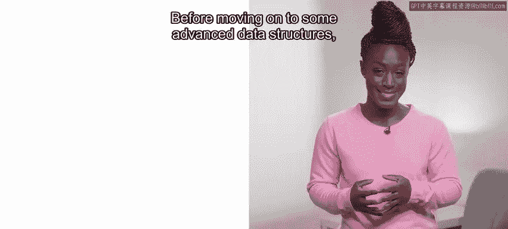
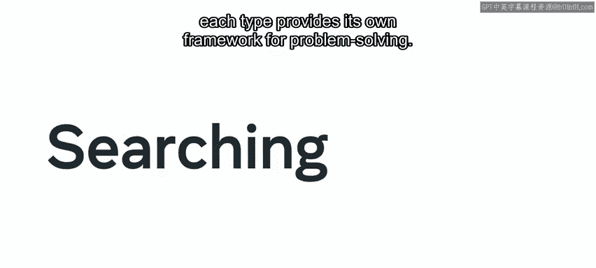
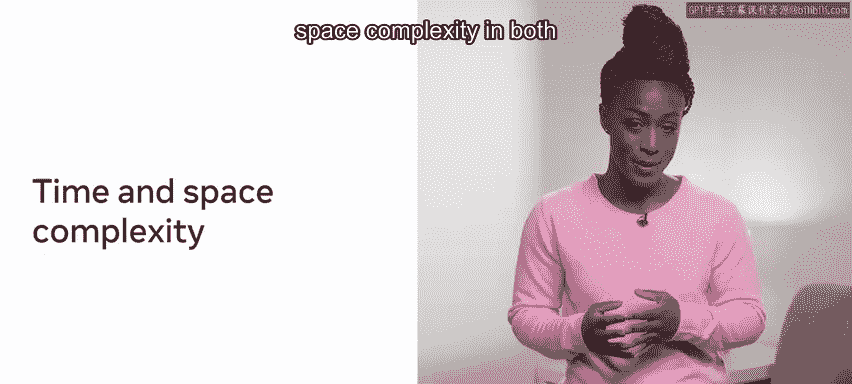
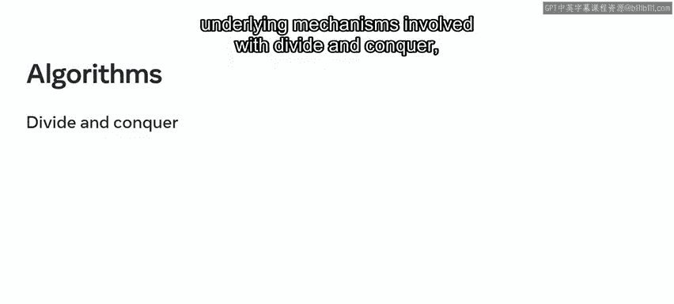
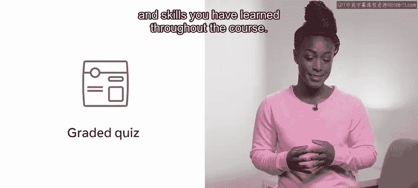

# Meta《前端开发（React／UI、UX／毕业项目／code review）｜Meta Front-End Developer》中英字幕 - P136：0_简介.zh_en - GPT中英字幕课程资源 - BV1uJ4m1e7HT

Hello and welcome to this coding interview preparation course This course will help prepare you for the unique and challenging aspects of the potential coding interview。

 including some of the approaches to problem solving and computer science foundations that you may need to be aware of or apply。

😊，Let's take a moment to preview some of the key concepts and skills that you'll learn。😊。

In the first module， you'll start by discovering what a coding interview is， what it can consist of。

 and the types of coding interviews that you might encounter。😊。

You'll also explore how you can prepare yourself for a coding interview。

 including a focus on communication such as explaining your thought process。

 handling mistakes and the ST method， you'll also learn about how to work with pseudocode to demonstrate how you might reach a solution。

😊，Some important tips that might help with any practical solution design and how to test your solutions。

Next， you will get an introduction to computer science。

 starting with the fundamental concepts of binary and how binary relates to real life hardware and computing。

😊，You will explore memory and the key components of computer memory， read access memoryory， RA。

 and read only memory， roM， and how your computer uses memory to perform its tasks。

 processes information and store data。Next， you will take a dive into time complexity and the key concept that underpins this big O notation。

And you'll discover some of the types of big O notation and how this applies to algorithmic processing。

😊。

You will explore space complexity， which is essentially the space required to compute a result。

In the second module， you will learn about data structures and how each one comes with certain benefits and limitations。

 so understanding each of these can be really important when designing a solution。

 You will start with basic data structures by addressing the implementation and capabilities of data structures between various programming languages and the similar patterns of the overarching architecture。

 You will explore the main basic data structures， strings， integers， Booleions， arrays and objects。😊。

You will go on to examine some collection data structures， starting with lists and sets。

Then you will learn about stacks， queues and trees。

Before moving on to some advanced data structures， namely hash tables， heaps and graphs。

In the third module， you will get an introduction to algorithms。

 including the types of algorithms available to you and how best to work with them to sort and search your data。

You will start by exploring sorting algorithms and how working with sorted data or having the ability to sort your own data can result in significant time savings。

 and you will explore the three main types of sorting， selection sort， insertion sort and quick sort。

 and you will learn that each approach has its trade offs and is more effective in some environments than others。

😊，Next， you'll discover searching algorithms and how each type provides its own framework for problem solving。

You will also gain insight into time and space complexity in both searching and sorting algorithms。

 you will take a deep dive into the processes and underlying mechanisms involved with divide and conquer。

 recursion， dynamic programming and greedy algorithms。 Finally， in the last module。

 you will get the chance to recap on everything you've learned throughout the course before taking the graded course quiz。

 which will test you on all of the key concepts and skills you have learned throughout the course。😊。

In this video you have had a broad overview of the course specifically you have discovered how this course will help you prepare for the unique and challenging aspects of a potential coding interview。

😊，Including some of the approaches to problem solving and computer science foundations that you may need to be aware of or reply。

😊，Now， let's get started。