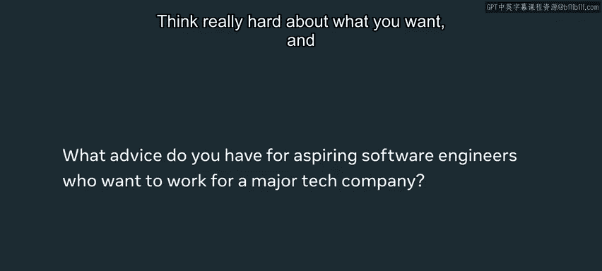

# Meta《前端开发（React／UI、UX／毕业项目／code review）｜Meta Front-End Developer》中英字幕 - P137：1_介绍技术招聘流程.zh_en - GPT中英字幕课程资源 - BV1uJ4m1e7HT

It takes approximately 39 months to find software engineers and developers in TechHub cities in the US The interviews that you will go through sometimes have skills that you don't normally use in your day to day job。

 It's not just about how well you can program it's also about how well you're displaying a lot of interpersonal skills。

 how well you're able to drive projects， how well you're able to collaborate with others。

 You don't need to worry about showing up in a suit。

 you really can just kind of wear whatever be yourself and focus on the technical aspects of the interview。

Hi my name is Julie and I am a software engineer on the IG shopping team at Meta New York Hi my name is Maxxie Herrera I use Data and pronouns I'm a software engineer in the social impact work and metata and I work at the Menlo Park Office My name is Chanel Johnson I work remotely in Maryland for Me and I'm a software engineer for the Facebook Appcorps architecture team where we work on infrastructure for the Facebook mobile app My name is Mariri Baallando I am a software engineer for the Web3 monetization team within Me and I work on different ways creators and influencers can make a living off of the Facebook platform using web3 technologies like NFs and cryptocurrency。

I think it can be broken up into three general areas， one is the application process。

 one is actual interviewing and one is the calibration process when they discuss your packet and give you an offer in terms of the actual interview process that's broken up into technical architecture and behavioral for the application phase it's a lot of it's recruiters kind of screening the your resume。

 your work experience， the recruiter then well meet with you and talk with you where to get an better idea about your skills。

 your experience is what you're looking for to make sure like you're a good fit for the role Ph two is the technical aspect of it。

 there can be a range of one to four or five or even more interviews there so this could be things like a coderpa interview where you're on the phone or over a voice chat with a recruiter or a engineer to kind of go through some technical challenges you'll have some behavior。

Interviews where people are just gonna engaging of what it's like to work with you。

 how do you solve problems。 And then oftentimes there are architecture interviews as well。

 where you build kind of an end to end products， discuss the full architecture for that Ph3。

 the final phase is when everyone involved in the process kind of gets together and discusses how you did throughout the phases and if they should extend an offer to you if you decide to take on the offer。

 you go through what is called bootc process where you get to learn the ropes of how it is working at meta and also sit with the teams that you're interested in so that you know what choice you end up making and you get to choose ultimately what team you go in。

If you are interviewing for a specific pipeline like iOS Android or ML or AI。

 you should expect some questions that deal with that specific domain， so for example in my case。

 I was interviewing for the iOS pipeline so in addition to those algorithms and data structure questions that I got asked。

 I also got asked some iOS questions or some questions that I deal with in my dayto day work as an iOS engineer so you can imagine similar things as if you were an Android engineer or if you were an AI or ML engineer。

I think in the application phase is when a lot of candidates get screened out what can really help there is crafting your resume and focusing on real experience that will really help when it comes to software engineering roles so if you don't have job experience totally fine work on side projects and that will show both you know concrete experience and a drive that you're actually interested in working on the role that you're applying for I will say the coding interview portion is where a lot of people get disqualified there are gonna be many reasons for it but the biggest reason I see is that sometimes when you're writing up your code the person being interview is not explaining their thought process what's going on they're not asking clarifying questions sometimes if the interviewer gives them a hint they're not listening so communication skills is where I also see a lot of people getting disqualified in the coding interview portion。

Some candidates IC do not have a structured process for answering problems they may not have heard or seen before。

And they kind of just go cowboy coding and just start coding without even knowing what they're supposed to solve So I think having a robust problemso process for questions you may or may not have seen before is very important doing well in these coding interviews One common problem is people get stuck and they get so wrapped up in it that they're unable to kind of take feedback what interviewers are looking for are a holistic approach to the problem so it's not just about solving the problem it's about how you go about it it's about collaboration with the interviewer so that's a really important piece to remember。

The biggest thing that I've learned is to really be myself。

 I have found it much more successful and way less stressful to just be who I am unapologetically。

 But it also means whenever I come。😊，Come forward as like a candidate like I am presenting myself as I am and not trying to hide anything。

 given that this is who I want to be at work， this is who I want to be in my life and I think having that mentality has made it so much easier regardless of the outcome of the process。

Think really hard about what you want and choose companies that resonate with what you value。

 There are other things other than compensation and just。

The prestige of a company that will that matters in how happy you are with the company so make sure you make a list of those and consider that whenever you' are choosing companies My biggest piece of advice is just going through as much practice as possible so two main ways to do that I think is one while you go through lead code problems or mock interviewing doing the whole thing end to end even if you're unable to solve the problem you get stuck you don't know what to do finishing it out as if it's a real interview it'll give you really good practice for when you actually get to the interview and then the second thing is applied to as many places as possible it gives you the best chance of getting interviews and then once you're in a reallife interview situation it's a lot easier if you've already had experience doing that before it really helps calm the nerves and it helps you get more practice there's not all just only like one particular person we're looking for when it comes to tech we want different backgrounds in different perspectives and experience because that's。

Only way we're going to make our products better， we need that iss such a rewarding process to。

UMake an impact and actually for the better and just meet with people and keep learning。

 you will never get bored at this job， never as you start to interview。

 you will face many ups and downs。And these are all experiences you can learn from if you keep pushing。

 keep learning。You will eventually get to a role where you can start an amazing career in technology The amount of preparation you're going to do is going to lead you to having a really big impact in the world because software is just everywhere and it's used by millions and billions of people。

 so I think it's well worth the preparation the amount of effort it takes to land a job at a very influential and impactful tech company。

