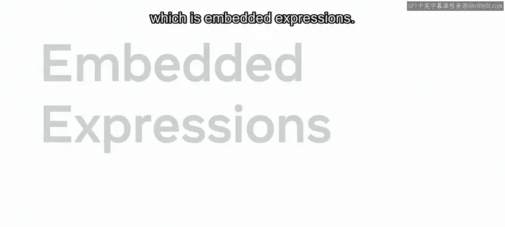
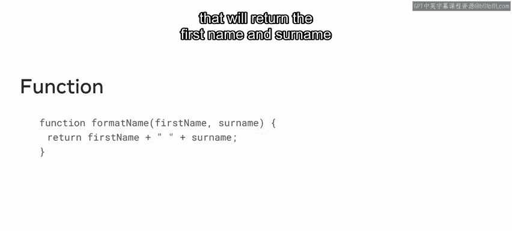
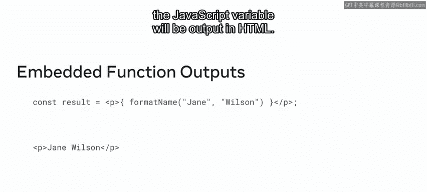
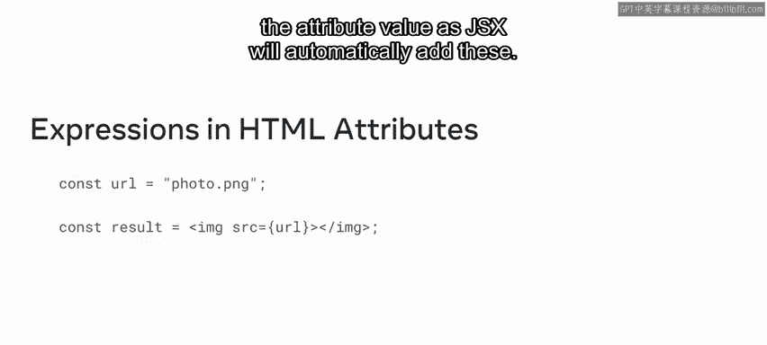

# Meta《前端开发（React／UI、UX／毕业项目／code review）｜Meta Front-End Developer》中英字幕 - P13：12_嵌入 JSX 表达式.zh_en - GPT中英字幕课程资源 - BV1uJ4m1e7HT

Recall that JSX is a syntax extension to JavaScript that is used with React it allows developers to write HTML as part of their component code and is frequently used in reactact as it offers greater flexibility in this video you'll learn how JSX is used and how to use its key feature embedded expressions。

First， let's examine a JSX example that will output some text on a webpage the code consists of a paragraph HTML element containing the phraseHello world it is assigned to the constant variable named result Note that when this JSX code executes。

 the result variable will contain a react element that can then be inserted into the webpage。

This is one of the key features of JSX， building react elements from HTML code automatically。

Let's explore another important feature of JSX， which is embedded expressions。

Embbedded expressions allowed developers to insert the values of JavaScriptscriptive variables into the HTML of the resulting react element Embedd expressions can also embed the outputs of functions let's say you need to output the person's name in a specific format to do this you can first create a function named format name that will return the first name and surname with a space character between them in your JSX you can then call this function inside the curly brackets As with the previous example the value that the function generate for the JavaScriptscript variable will be output in HTML Expresss can also be used for HTML attributes This is useful if you need to insert the address of a person's profile picture。

To do this， first you would store the profile picture address in a variable named URL the image will be displayed using the IMG elements so you should embed the URL variable into the SRC attributes。

 note that the double quote are not needed for the attribute value as JSX will automatically add these。

This is just one example of how JSX is an efficient way of outputting HTML elements that contain JavaScript variable content and you'll encounter more as you progress。

In this video you explored several JSX examples， including one that uses embedded expressions to insert the values of JavaScript variables into HTML within a react element。

