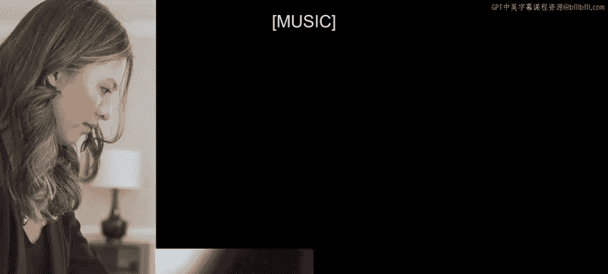
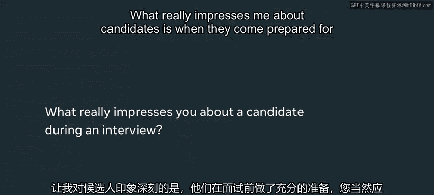

# Meta前端开发课程：P140：4_期望从技术面试获得什么

在本节课中，我们将了解Meta技术面试的构成、面试官的期望以及如何有效准备。课程内容基于Meta软件工程师的经验分享，旨在帮助你理解面试流程并提升表现。

---

根据一家知名招聘网站的数据，近一半的软件开发人员认为编码面试是所有技术面试环节中压力最大的部分。

面试中你会被问到很多技术问题、架构问题和组织问题。面试官真正想了解的是你的为人以及你所重视的价值观。

我面试时的一种练习方法是，对着一个真实的毛绒玩具讲话。这迫使我完整地练习整个面试过程，就像真的在出声思考一样。

我认为Meta的面试官都受过良好培训，能让面试者感到受欢迎，并能舒适地一起解决问题。

**面试官介绍**

*   **Marri Baallando**：Meta软件工程师，在FB Web3货币化团队工作，帮助创作者和影响者通过Facebook产品谋生。
*   **Maxxie Herrera**：Meta软件工程师，在Social Impact Award团队，于门洛帕克办公室工作。
*   **Julie**：Meta软件工程师，在纽约的IG购物团队工作。
*   **Chanel Johnson**：在马里兰州为Meta远程工作，是Facebook Acorps架构团队的软件工程师，负责Facebook移动应用的基础设施。

---

## 面试类型概述 🧩

上一部分我们认识了分享经验的工程师，接下来我们具体看看Meta技术面试通常包含哪些类型。

面试通常分为三种不同类型：技术面试、架构面试和行为面试。

以下是每种面试的详细说明：

1.  **技术面试**：即常规的算法编码面试。在面试过程中你通常会有2到4轮这样的面试。其中一到两轮是初筛，通过初筛后还会有几轮。每道题的答题时间大约是20到30分钟，都是经典的算法题。
2.  **架构面试**：这是一场约45分钟到1小时的面试。你会被问到如何构建一个端到端的功能。问题可能更偏向产品，例如“构建俄罗斯方块”；也可能更偏向后端，侧重于数据流以及如何为大量用户扩展系统。
3.  **行为面试**：你会被问到关于你与他人合作的经验、曾面临的挑战以及参与过的激动人心的项目等问题。

我通常会问的一个问题是：“你在团队合作中，事情进展不顺利的一次经历是什么？”我问这个问题的主要原因是，在Meta，你需要与很多人合作，这不是一份孤立的工作。因此，你需要学习如何沟通，以及如何真正与他人一起学习和成长。

---

## 面试问题示例与准备 💡

了解了面试类型后，我们来看看具体的面试问题例子以及如何有针对性地准备。

当我面试时，我被问到了很多我作为iOS工程师预料之中的通用问题。例如，“我将如何构建Facebook应用中的新闻推送界面？”我需要说明我会创建哪些对象、这些对象如何相互通信、我期望的网络API是什么，并能够从高层次描述我将如何应对这些挑战，以及作为iOS工程师我将如何构建应用结构。这是一个非常经典的问题。

一个练习面试问题的技巧是，在白板编程时讲解你的解决方案。我会和朋友或同事一起做的是，当你写出解决方案时，解释你的思考过程：你在考虑时间复杂度吗？你在考虑如何让它更快、如何减少空间占用吗？这些也是我们作为面试官希望看到的，因为在实际工作中编码时，你需要思考这些事情。这是一个很好的练习，让你在梳理代码时解释：“我这样做是因为X、Y、Z，同时我也在考虑这一点。”

作为面试官，我实际上衷心希望你能表现出色。因为我希望的不是坐在那里盯着屏幕45分钟，看着你挣扎。我更愿意看到你成功，并和我们一起解决问题，这样我才能尽可能多地收集关于你的信息，以便我能做出你是否适合Meta的正确决定。

---

## 面试表现要点与常见误区 ⚠️

我们已经讨论了如何准备和回答问题，现在让我们关注面试当天的表现和需要避免的常见错误。

关于面试着装，关键是要做自己，穿你觉得舒服的衣服。没人指望你穿西装来。我见过很多面试者只是穿着T恤和牛仔裤。

我真正寻找的候选人是愿意解释他们的想法、愿意深入参与，并展现出高度自信和知识水平的人。

我见到人们最常犯的错误是，他们可能是一名非常有才华的iOS工程师，但他们的软件通用技能可能有所欠缺。因此，请确保你为那些通用的算法和数据结构类型的问题做好准备，因为无论你面试的是哪个职位方向，这些问题都会出现。

有时在技术挑战中你会卡住。而你能做的最糟糕的事情就是什么都不说。因为我无法读懂你的心思，也不知道你在做什么。所以你确实需要解释你在想什么、你是怎么卡住的、为什么卡住了。因为即使你没有答对问题，如果你能表现出你对问题有很好的理解，那也足以让你进入下一轮。

---

## 给面试官留下深刻印象的关键 🌟

避免错误是基础，那么如何才能脱颖而出，给面试官留下深刻印象呢？本节将揭示面试官看重的特质。

候选人真正让我印象深刻的是当他们为面试做好了准备。你显然应该为面试做好准备，但当他们研究过公司、了解公司的价值观、知道这些价值观如何应用到他们自己身上以及他们能为Meta带来什么时，这很加分。

在面试中，候选人真正让我印象深刻的是当他们能够接受我的反馈。即使他们已经走在正确的轨道上，有时如果我能看到这一点并稍微推动他们一下，这是一个非常好的迹象，表明他们能听取我的反馈并与我合作解决手头的任何问题。这很好地表明他们是我在实际工作中愿意与之共事的人。

面试实际上是展示你是谁，展示你知道什么、你如何成长、如何学习的过程，这没有什么单一的技巧。你真的需要稍微了解一下自己，以及你如何展示这些特质，并让它对你起作用。

一个非常热情、对面试感到兴奋并且态度非常积极的候选人，这真正显示出他是否是我想要共事的人，一个会对所做工作充满热情的人，我认为这正是通往成功的激情所在。

---

## 总结与鼓励 🎯

在本节课中，我们一起学习了Meta技术面试的主要类型，包括技术面试、架构面试和行为面试。我们了解了面试官的期望，例如希望候选人能够清晰地解释思路、积极协作并展现出扎实的基础知识。我们还探讨了有效的准备方法，如模拟练习和深入研究公司价值观，并指出了需要避免的常见错误，如沉默不语或忽视通用算法准备。

尽管面试过程可能很长，但最终能在像Meta这样的地方工作，处理每天被数百万人使用的产品，并与一些你见过的最聪明的人共事，是非常有回报的。这会帮助你在短时间内获得惊人的成长。

感谢观看，希望你能学到一些在Meta面试的好技巧，并祝你接下来的旅程好运。

