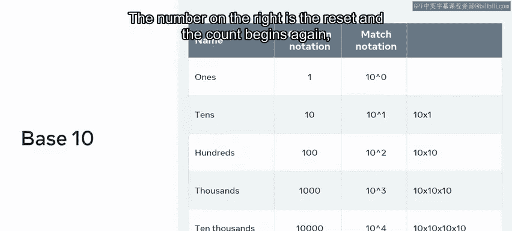
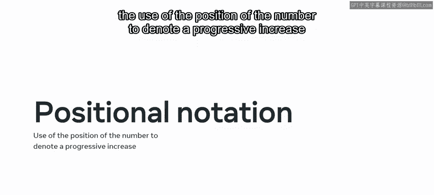
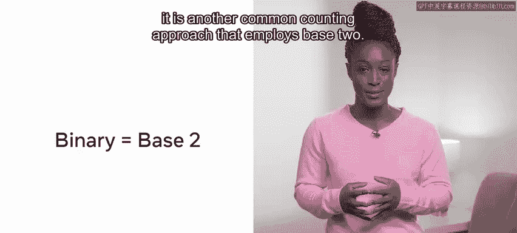
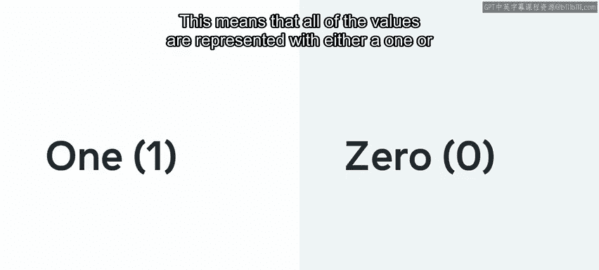
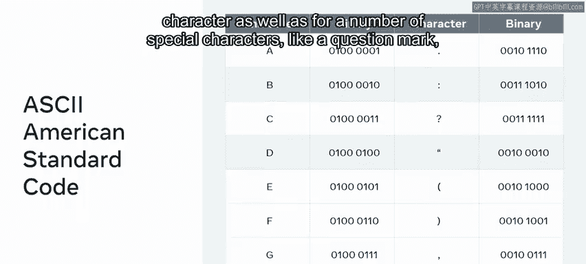
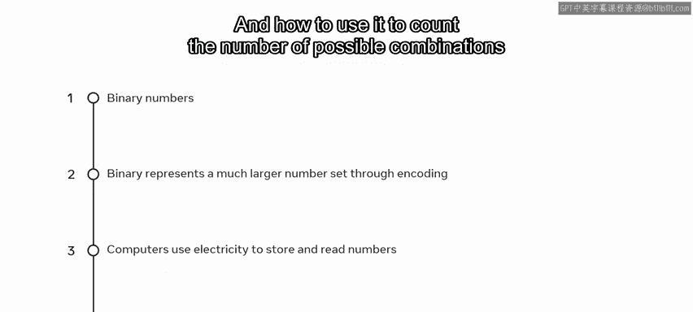

# Meta《前端开发（React／UI、UX／毕业项目／code review）｜Meta Front-End Developer》中英字幕 - P141：5_二进制.zh_en - GPT中英字幕课程资源 - BV1uJ4m1e7HT

In this video， you will learn about binary numbers， what they are。

 and how computers use them to represent human language。

You will learn how positional encoding can turn a limited set of numbers into an infinity size representation of values。

Lastly， you will learn how computing the power of a number can be applied to determine how many states this simple representation can hold。

 Traditionally， you count using 10 different digits 0 to 9。

 This stems from the early development of maths。 It was a natural progression resulting from humans having 10 fingers and 10 toes。

 Counting with the use of 10 digits is referred to as base 10。

Base 10 means you have 10 different numbers to use before you have to add another digit and reuse numbers。

Each time you exhaust the range， you reset the number on the left and add a 0 to the right。

 This new digit has to be 10 times greater than the digit to its right。

The number on the right is the reset， and the count begins again。

The use of the position of the number to denote a progressive increase in value is called positional notation。

😊。

When you consider it， it is an early implementation of an algorithm to allow for the recording of an infinite number of values。

😊，Simple in implementation， but very powerful in effect。😊。

Binary works using the same positional notation approach。

 It is another common counting approach that employers base， too。

This means that all of the values are represented with either a one or a0。😊。

Computers store information as bytes。 Each byte is made up of 8 bits that can either be one or0。😊。

As you have now learned in decimal， the count would come to 9。

 and you would add another digit and reset in binary， the same thing happens。 But in this case。

 only two digits are used to progress the count， you move the number left。

 move the one to the left until all configurations of ones and zeros have been used。

 at which point you add another 0 to the end。 At this stage， all the numbers are reset to 0。

 apart from a single one at the beginning。😊，Let's explore it step by step。Start to count with a0。

 then add one to get to3， start back at 0 again， but add a1 on the left。

 As soon as all the ones are full， start back at 0 again and add one to the number on the left。

 but that number is already at one。So it also goes back to zero and one is added to the next position on the left。

😊。

Binary has many uses in computing。It is a very convenient way of translating electricity into computer code。

😊，If a signal is present or one is displayed， otherwise a zero is used。😊。

The binary counting system allows these base two signals to amount to a significant amount of information。

 transportation and storage。😊，This is the same way as Boolean numbers are stored。

 A Boolean value is either one for true and 0 for false。

 Some powerful applications can be built using this simple information representation。

The AS key American Standard Code for information Interchange is a map of binary to character encoding or a mapping from binary to text。

 There is a binary number reserved for each digit and character as well as for a number of special characters like a question mark。

 brackets， full stop and even the space bar。 It was already mentioned that a byte is made up of 8 bits。

 Each bit can take the value of0 or one。😊。

So that raises the question， how many different values can be represented in each byte here。

 we would use exponuniation or counting the power of a number。

 An example would be 2 to the power of3。 That is 2 multiplied by two， multiplied by2， which equals 8。

 Now， consider that you have a lock with four different digits。East did it can be a0 or a one。

How many potential pass numbers can you have for the lock？

The answer is two to the power of four or two times 2 times 2 times 2 equals 16。

You are working with a binary lock， therefore each digit can only be either zero or one。

So you can take four digits and multiply them by two every time and the total is 16。😊。

Each time you add a potential digit， you increase the possible permutations。😊。

So the same lock with five digits would have two to the power of five or 32 different combinations。😊。

Now。Coming back to our original question， how many different representations can there be in a by。

 It was already mentioned that a by is made up of 8 B， which can be either a 0 or a  one。

8 Bs would have two to the power of 8 or 256 different combinations。 In this video。

 you learned about binary numbers， the language of computers。😊，While at first glance。

 it seemed quite limited to honor off。 You learned that through the use of positional encoding。

 it could be used to represent a much larger number set。

You learned how computers can use electricity to store and read numbers and how exponentciation or counting the power of a number relates to counting unique states and how to use it to count the number of possible combinations a number lock could have。

😊。

Binary is the language of computers， understanding how it is used to store information will give you a greater understanding when discussing data and the structures that hold it。

😊。