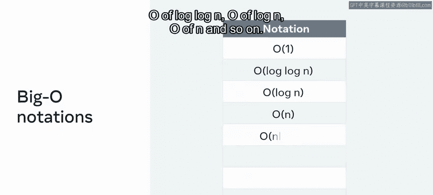
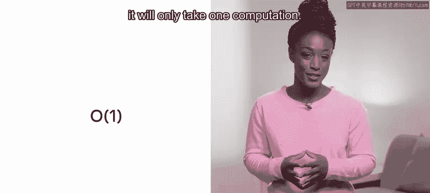
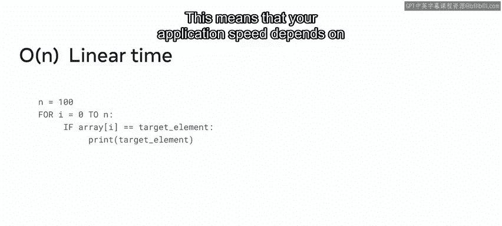
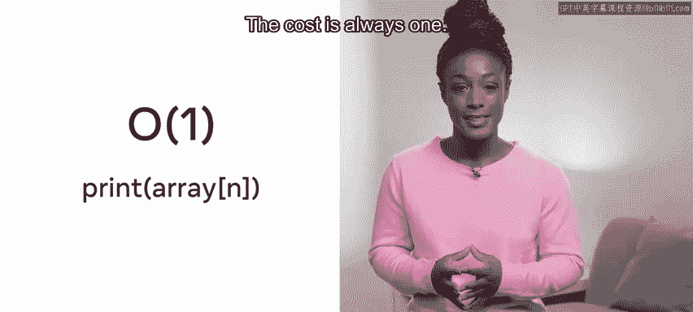
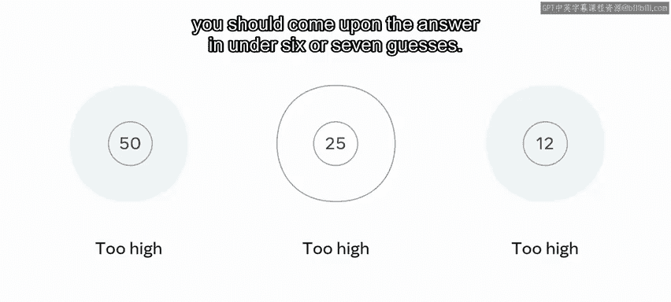
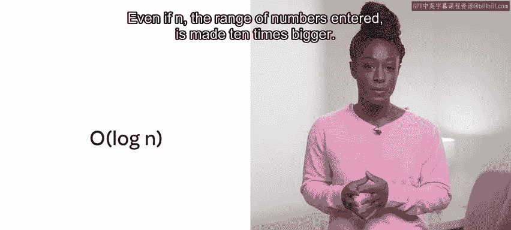
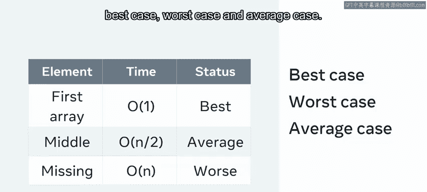

# 前端开发：P143：时间复杂度 ⏱️

在本节课中，我们将学习如何评估算法或代码的效率，特别是从时间消耗的角度。我们将介绍时间复杂度的概念，以及如何使用大O表示法来衡量不同算法在处理数据时所需的时间。

## 概述

开发应用程序或评估效率时，拥有一个度量标准或视角来评估功能适用性总是有用的。计算机科学中的评估通常会考虑两个方面，即时间和空间。在本视频中，你将学习如何通过完成任务所需的时间来评估时间效率或衡量性能。你可以将此称为任务的时间复杂度。

一个应用程序必须在可接受的时间范围内返回信息。如今，人们期望在点击网站时能获得即时响应。然而，根据用户的需求和期望，更复杂的查询可能会被允许有额外的处理时间。

大O表示法是确定算法效率的度量标准。简单来说，它估算了你的代码在不同输入集上运行所需的时间。本视频将考虑算法所需的时间量。

## 大O表示法简介

你将遇到的一些大O表示法包括以下内容：

*   **O(1)**
*   **O(log log N)**
*   **O(log N)**
*   **O(N)**
*   等等。

那么，如何衡量某事物可被计算的最快可能时间呢？你需要利用常数时间算法，该算法需要 **O(1)** 的时间来计算。简单来说，这意味着无论向系统输入什么，都只需要一次计算。

一个简单的例子是考虑打印数组中的第一项。在这种情况下，无论数组中存在多少个值，该方法的时间复杂度都是 **O(1)**。

## 线性时间复杂度 O(N)

如果你需要进行搜索，情况可能会变得更复杂。假设你有一个包含10个项目的数组，并且你想知道某个特定值是否在这个数组中。你可能会应用一个循环并检查每个项目，以查看该值是否存在。在这个例子中，复杂度被称为 **O(n)**。这被称为线性时间。

搜索所需的时间将等于数组的长度。数组越大，搜索所需的时间就越多。因此，如果数组有100个项目而不是10个，那么搜索将花费10倍的时间。

让我们探讨一个例子。每个操作在时间复杂度上都有一个时间代价。所以，**O(1)** 意味着它花费一次计算，而 **O(n)** 意味着它花费n次计算。例如，你不会说它花了45秒。你会说复杂度是n。因此，对于每一个n操作，我们的最终复杂度结果就加一。如果n等于100，那就是100次检查。复杂度仍然是 **O(n)**。只是n意味着它长了10倍。

这意味着你的应用程序速度取决于正在处理的数据大小。打印数组第N个位置是 **O(1)** 操作的一个例子。这意味着无论n是多少，都打印该位置的值。n有多大并不重要。代价始终是1。

## 对数时间复杂度 O(log N)

接下来，我们继续看 **O(log N)**。这种搜索的强度低于 **O(n)**，但比 **O(1)** 差。**O(log n)** 是对数搜索，因此它会随着新输入的添加而增加，但这些输入只带来边际的增长。

一个很好的实际例子是二分查找。想象你正在玩一个猜数字游戏，提示是“太高”、“太低”、“正确”。给定一个从1到100的范围。你可能会决定系统地处理这个问题。首先，你猜50，结果太高。然后你猜25，仍然太高。接着你决定猜12或13，仍然太高。

这里发生的情况是，你每猜一次，搜索空间就减半。因此，虽然这个函数的输入是100，但使用二分查找方法，你应该在不到6或7次猜测内找到答案。

这个解决方案的时间复杂度可以说是 **O(log N)**。即使n（输入的数字范围）变大10倍，所需的猜测次数也不会增加10倍。

## 平方时间复杂度 O(N²)

**O(N²)** 对计算的要求很高。这是一种二次复杂度，意味着对于数组中的每个元素，工作量都会加倍。一个很好的可视化方法是考虑你有一个数组的数组。第一个循环将等于输入元素的数量，即N。第二个循环也会查看输入元素的数量N。因此，运行这种方法的总体复杂度可以说是n乘以N，即n²。

那么，如何直观地表示这个问题呢？下图展示了时间复杂度的算法。X轴与输入数量相关，Y轴与所用时间相关。

请注意，随着输入数量的增加，它对所有情况下的线条梯度都有不同的影响，除了 **O(1)**。在这个关于N如何与所采取的计算次数相关的图形表示中，最佳目标是 **O(1)**。**O(log N)** 仍然非常好。**O(n)** 可以接受，而 **O(N²)** 则不太好。

当然，并不总是能判断一个方法需要多长时间。让我们回到在循环中查找某物的例子。虽然你可以说搜索一个循环需要 **O(n)** 时间，但这可能并非总是如此。

## 最佳、最坏与平均情况

考虑被搜索的项目是数组中的第一个。那么返回将在 **O(1)** 时间内完成，这非常好。同样，元素可能缺失，因此必须搜索每个项目，这是 **O(n)** 时间。中间情况是它在循环中间附近被找到，即 **O(N/2)**。

在评估一种方法时，会使用三种定义：**最佳情况**、**最坏情况**和**平均情况**。

## 总结

在本节课中，我们介绍了与复杂度相关的时间概念。在实施问题解决方案时，你获得了一些需要考虑的因素。在开始之前，问自己一个好问题是：我的解决方案采用了多少次计算，是否有更好的方法？

现在你使用了一个度量标准来评估你对给定问题的解决方案，你可以开始思考其相对于时间复杂度的效率了。这并不是考虑解决方案的唯一方式，在下一个视频中，重点将放在空间复杂度上。