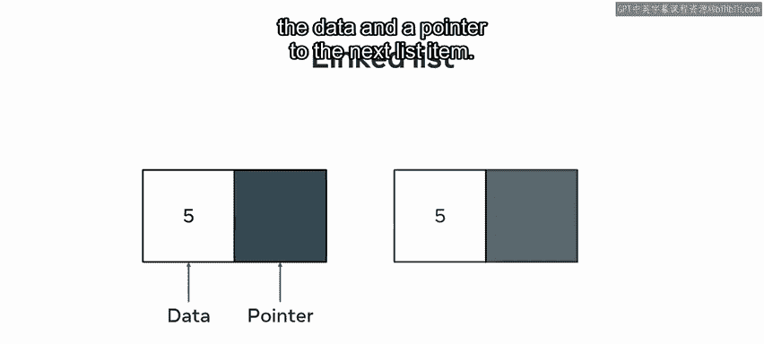
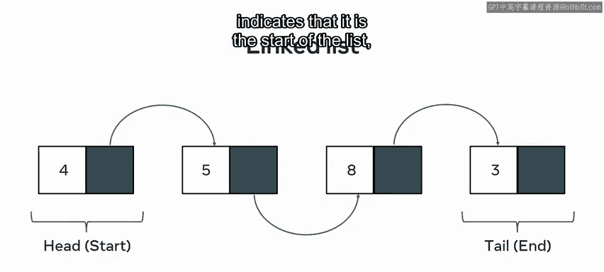
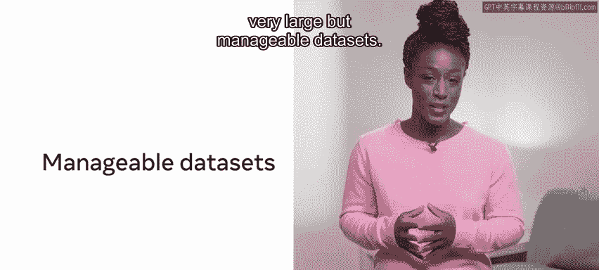
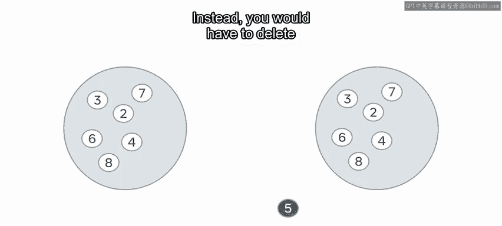
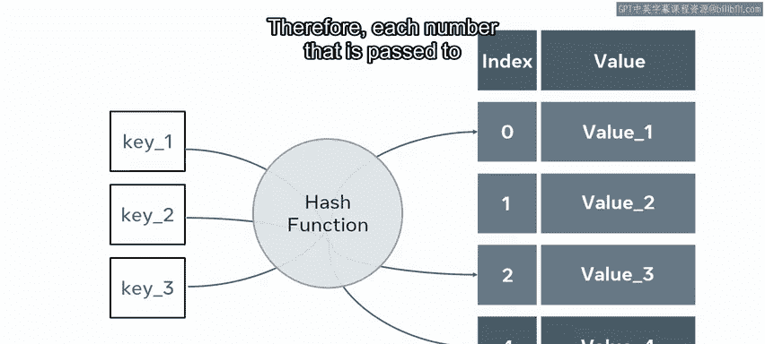
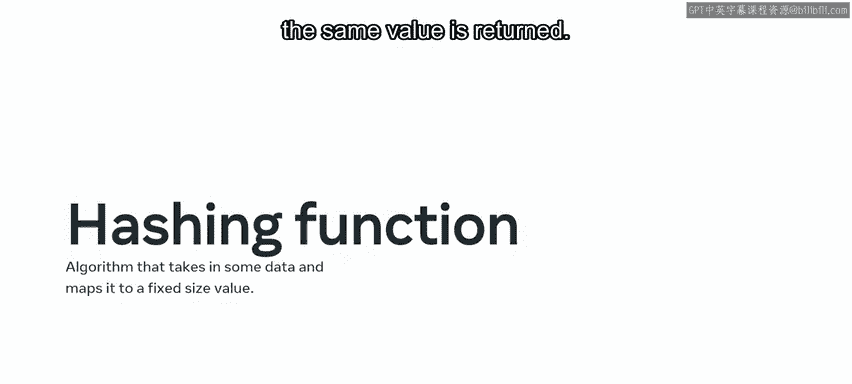
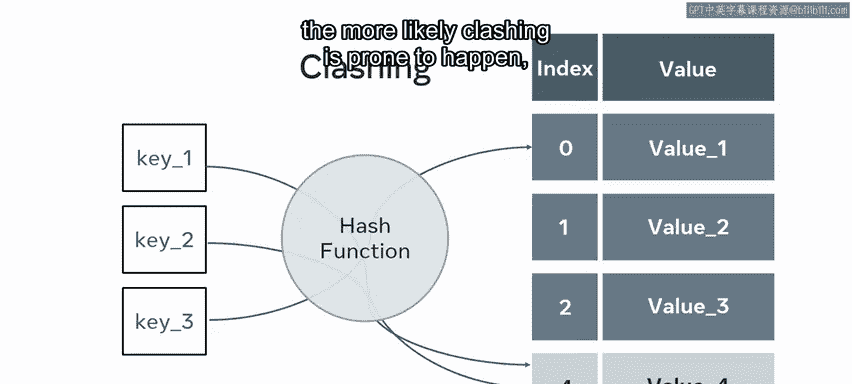

# Meta《前端开发（React／UI、UX／毕业项目／code review）｜Meta Front-End Developer》中英字幕 - P147：11_列表和集合.zh_en - GPT中英字幕课程资源 - BV1uJ4m1e7HT

Have you ever needed to store some data， but were unsure about what sort of data structure to use。

 It's a common coding problem In this video， you will discover two important data structures that could be used。

 Ls and sets。 both are very useful data structures with their own strengths and weaknesses。

 Ls and sets are common in many programming languages。Let's get started by exploring lists。

In most programming languages， lists are represented as objects。

This means that in addition to storing data， they also have their own inbuilt methods。Here。

 an inbuilt sort method is used to arrange the numbers in a list。 As with arrays。

 it is common to find lists that are declared as either a string， an integer or float。

In some programming languages， you can have lists with mixed element types。

A list is an abstract concept that refers to a container of elements。

A stable implementation of a list is done using either an array or a linked list。😊。

An array based list is an ordered collection built using arrays as the underlying data structure。

As such， they are subject to the same strengths and limitations associated with arrays。

Array based implementations relate to the initial sizing。

 rather than simply pointing to another node as with a linked list。

Some languages require that you initially determine how big a structure will be。

 while others allow for dynamically growing structures。

It should be noted that this freedom is somewhat surface level。For many dynamic structures。

 there is an initial size automatically configured at instantiation。 When this limit is reached。

 the array will copy itself into a new structure with a larger size allocation。 Therefore。

 the decision not to arbitrarily allocate space at the onset may come at a cost at run time when such data structures may have to expand multiple times during the execution of other operations。

Consider the computation cost of a list dynamically growing while performing operations in a loop。

In this case， it would help to set the initial list size to be larger rather than dynamically growing。

 which can be costly due to having to create and copy over values into increasingly bigger lists。

 A linked list works differently。A linked list contains two pieces of information。

 the data and a point to the next list item。 A linked list begins with an empty list and can grow dynamically by introducing new cells to the list To grow a linked list。

 you simply have to add a new node and point the list at its location。😊。

This makes them very fast， for storing large amounts of data。

The flexibility of linked lists is achieved by including some additional storage requirements。

 notably， in each node， there must be some reference to the nodes around it。😊，There is also a head。

 and a tail。The head is a unique node that indicates that it is the start of the list。

 and the tail indicates where the list ends。

This approach to growing the size of the data structure is very powerful and can lead to very large but manageable data sets。

 So what do sets entail。

Set is very similar to a list。 However， a set will store its elements in an unordered way。

Though there are some possible implementations of ordered sets， sets have some unusual tendencies。

 a set will only hold unique elements。So adding an element that already exists to a set will make no difference to the data stored there。

The unordered process in which sets store their information means that printing out a set will not necessarily reflect the order in which the element was added to the set。

Once a value has been added to a set， it cannot change。 Instead。

 you would have to delete it and add a new value Instead， Se are exceptionally fast to search。

 This is because of its internal mechanisms。 A set uses hash tables to determine where to store the elements of a set。

 Therefore， each number that is passed to a set will have a hashing function applied to it。

A hashing function can be defined as an algorithm that takes in some data and maps it to a fixed size value。

😊，The value is theoretically unique， and every time the function is applied to the data。

 the same value is returned。😊。

This means that searching a set can be done in01 time。

 This is due to the mechanism that is used to save values in a set。

 You will learn about hashing functions in more detail， later in the course。

A O N approach would be to iterate over the entire data structure to check for the presence or absence of a value sets instead apply the mapping function to the input data and check the resulting output to see if a value exists there。

If it does， then the value is returned。 If it doesn't exist in the set。

 then the data was not stored in the set and hence， will return a false。

While sets can perform an exceptionally quick search。

 performance degrades when dealing with very large data sets。😊。

This is due to the nature of the hashing function。 The more values retained。

 the more risk there is of clashing。Clashing is when the hashing functions return the same unique mapping for two different values。

 The larger the data set used， the more likely clashing is prone to happen。

 So there we are in this video， you have explored two very important and useful data structures。

 lists and sets and learned about the strengths and weaknesses inherent in both。😊。

You should now have a greater sense of when to use each。

 depending on the storage needs of the solution。