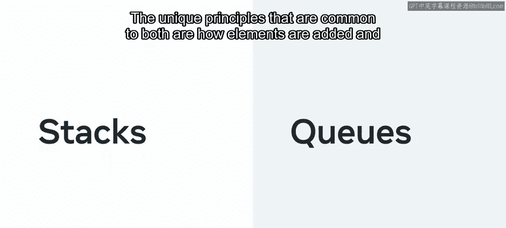
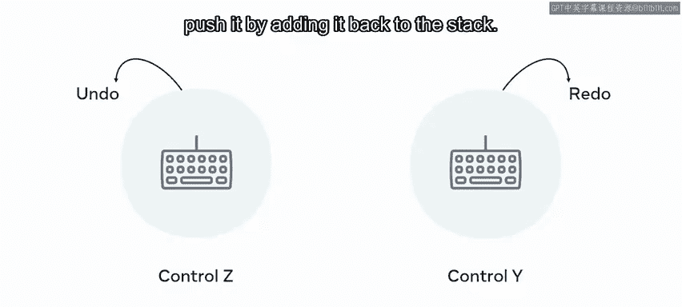
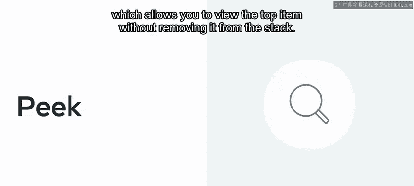
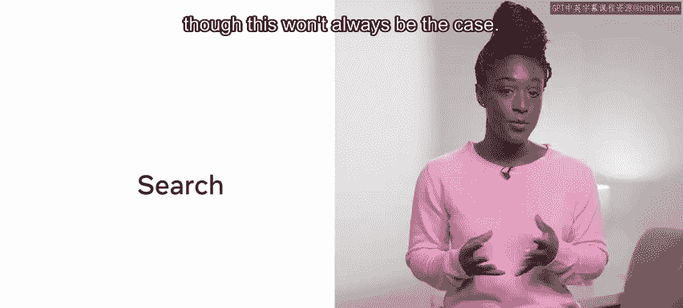
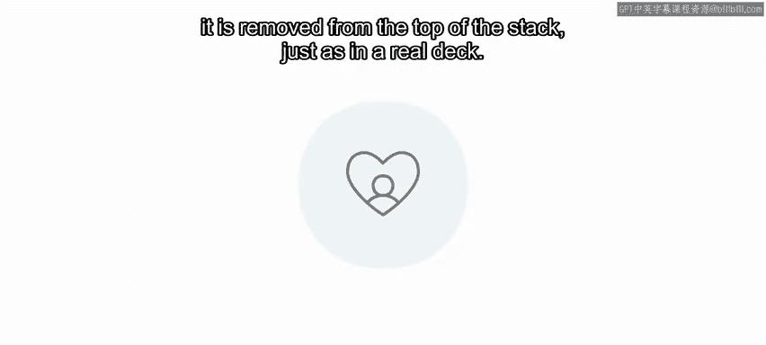
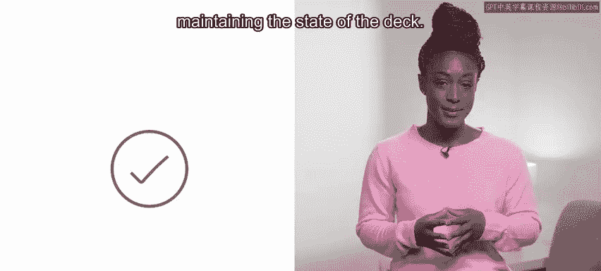
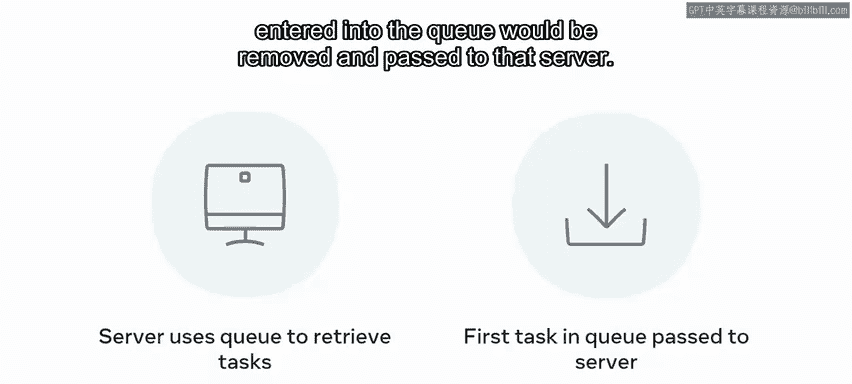

# 前端开发：P148：栈和队列 🧱➡️📚

在本节课中，我们将要学习两种重要的数据结构：栈和队列。我们将探讨它们的定义、工作原理、核心方法以及它们之间的关键区别，并通过实例帮助你理解在何种场景下应选择使用哪一种。

栈和队列是两种抽象数据结构，它们在不同的编程语言中有多种实现方式。它们的共同核心原则在于元素添加和移除的特定方式。

与允许随机访问的列表和数组不同，栈和队列采用顺序访问。这种对数据访问方式的限制，在你希望控制数据如何被访问时非常有用。

## 栈：后进先出（LIFO）结构

上一节我们介绍了栈和队列的基本概念，本节中我们来看看栈的详细工作原理。

栈是一种线性数据结构，对项目的添加和移除有严格的规定。顾名思义，栈是元素相互堆叠的集合。这意味着你无法从中间抽取项目。栈遵循严格的 **“先进后出”** 原则，也可表述为 **“后进先出”**。这是一个简单而强大的概念，它规定项目只能从栈顶被检索，这决定了你检索它们的顺序。

一个生动的例子是在任何文本编辑器或代码环境中使用 **`Ctrl+Z`** 进行撤销操作。按一次 `Ctrl+Z` 会撤销最后一个操作，再按一次则撤销上一个操作，依此类推。类似地，**`Ctrl+Y`** 会重做操作，相当于将操作重新“推”回栈中。

栈通常只有少数几个核心方法。

以下是栈的主要方法：

*   **`push(item)`**：将一个项目添加到栈顶。
*   **`pop()`**：从栈顶移除并返回一个项目。
*   **`isEmpty()`**：检查栈是否为空。
*   **`isFull()`**：检查栈是否已满（在固定容量栈中常用）。
*   **`peek()`**：查看栈顶项目但不移除它。

这些方法的功能与其名称相符。调用 `pop()` 或 `push()` 会永久改变栈的状态。而 `peek()` 方法则允许你查看栈顶元素而不改变栈的结构。有些实现可能包含搜索功能，但这并非必需。

现在，让我们探索一个例子。

想象一个应用程序生成了一副扑克牌。你可以创建一个包含52张牌的栈。每次发牌时，就像从真实的牌堆中一样，从栈顶移除一张牌。

以这种方式使用栈，可以简化维护牌堆状态所需的代码。

## 队列：先进先出（FIFO）结构

了解了栈之后，现在让我们来探索队列。队列与栈非常相似，通常具有类似的方法，如创建、插入、移除和检查状态。但与栈不同，队列基于 **“先进先出”** 原则工作。其名称很好地指示了该结构的工作方式。

举个例子，想象在快餐店有一排人等着买汉堡。第一个进入队列的人会先得到服务。随后的每位顾客都站在前一位后面，依次被处理。

与栈类似，队列也会从结构中“弹出”选定的项目，尽管不同语言对此有不同的实现。从队列中移除的元素是位于“底部”的那个，换句话说，是最早加入队列的项目。

用一个真实的IT例子来说明，服务器负载均衡系统通常使用队列来获取任务。该结构会按照插入顺序保存每个任务。当有服务器可用时，队列中第一个进入的任务会被移除并传递给该服务器处理。

## 总结

本节课中，我们一起学习了栈和队列以及它们之间的区别。栈遵循 **LIFO** 原则，而队列遵循 **FIFO** 原则。它们是编程工具包中非常有用的工具，了解它们对于处理需要结构化方式访问和插入数据的问题将是一个优势。