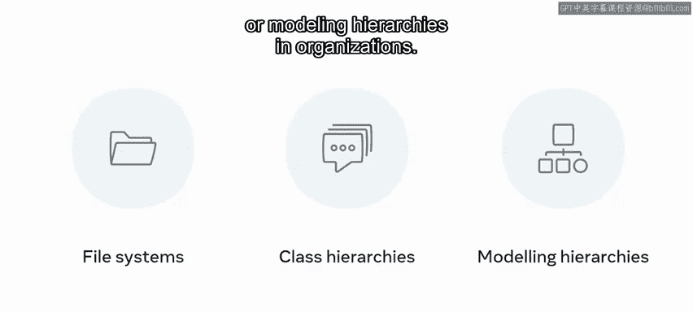
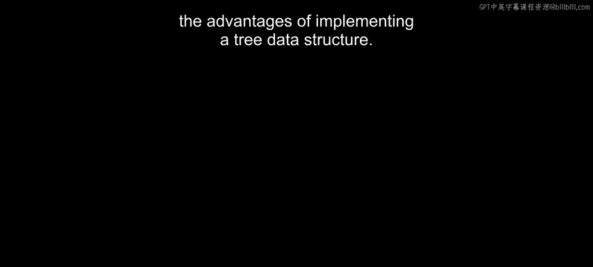

# Meta《前端开发（React／UI、UX／毕业项目／code review）｜Meta Front-End Developer》中英字幕 - P149：13_树.zh_en - GPT中英字幕课程资源 - BV1uJ4m1e7HT

In previous videos， you have learned about data structures like lists， stacks and queuees。

 Another data structure you have not yet learned about is trees。😊。

So what exactly is a tree in the data structure context。

 Tes are a powerful data structure that gives you great flexibility in adding and searching values。😊。

The inherent structure of the tree can allow you to understand a lot about the relations between the data stored。

 which can save a lot of time and code when extracting information from the data。In this video。

 you will explore the general structure and inherent features that trees provide。

 You will also learn about some of the different types of trees and the advantages of using a tree data structure。

So let's get started。 A tree is a very complex data structure that resembles a tree in design。

 It consists of nodes that are linked with one another。 A node can be a parent or child node。

 A parent node may have a connected set of children nodes。

 nodes with no children are referred to as leaf nodes。 As with a tree。

 nodes can branch off in different directions， allowing for powerful search and storage features。

 General， we can look at a tree as a graph like structure that has nodes that contain data and edges that model how each node relates to one another。

 when discussing trees， it is important to node some of the terminologies。

The top level node is referred to as the root。Each subsequent node down that is connected to this node is referred to as a child node。

😊，Notes that have the same parent are referred to as siblings and are considered to be on the same level。

One might picture a chapter of a book where the subsections correlate to connected nodes。

The theme of these nodes will be of a very similar nature。

Other branches would be other chapters that still fall under the general theme。

 but on different topics。A path refers to a series of connected nodes。

 You might assume a connection between two nodes by determining the shortest path。

This is to say the quickest way that you can move from one node to another。Intuitively。

 nodes with shorter paths will have more in common。😊。

The depth of a node refers to how many edges there are from the parent to the root or the longest path。

The height of the tree refers to the number of edges between the topmost node to the deepest node within the structure。

 And finally， the size of a tree refers to the total number of nodes within the tree。

There are many variants and implementations of trees， such as binary trees。

 bee trees and B plus trees。 There are also quad trees and A VL trees to name a few。

 While all of them will contain the general theme outlined。

 their use an implementation differ slightly， depending on the type of tree being applied。

There are many advantages to storing your data in a tree like structure。

 The connections between the nodes indicate a relationship that is inherent in your data。

They can store information in hierarchical fashion。

 where the topmost content is stored in the upper nodes。

 and more in depth information can be retrieved by traversing a given branch to a tree。

They are also very efficient for inserting and deleting data due to the flexible way in which they are implemented。

The nonlinear nature of a tree means that there are many ways of traversing the data。In binary trees。

 this feature can be very useful when storing data。😊，A left node has a lesser value。

 while the right node indicates that there is a greater value。😊。

Let's demonstrate that with some data values。The first data contains the value of 23。

Then a four is added。Because it is less than 23， it goes to the left。😊，Following is a one。

 also less than 23， but also less than 4。That also goes to the left。The next number to follow is 30。

 because it is now larger than 23。 It goes to the right。A 24 is added。

 and because it is less than the 30， it goes to the left。

But the 56th that was added goes to the right of the 30 again。One can traverse a tree in depth。

 first or bread first method。A depth first method involves visiting every node from top to bottom sequentially。

 A breadth first method involves searching each node on the same level before ascending to the next level and repeating until the root node has been reached。

 More benefits of trees are that they can be used to model file systems on your laptop。

 Class hierarchies like those found in Java or modelling hierarchies in organizations。😊。

In this video， you explored the general structure and inherent features that trees provide。

 You also learned about some of the different types of trees and the advantages of implementing a tree data structure。

