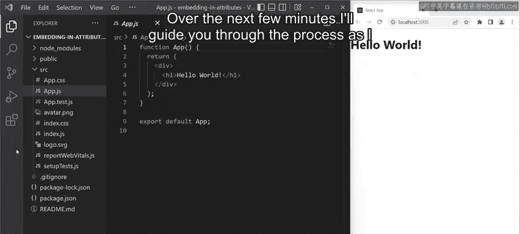

# Meta《前端开发（React／UI、UX／毕业项目／code review）｜Meta Front-End Developer》中英字幕 - P14：13_在属性中嵌入.zh_en - GPT中英字幕课程资源 - BV1uJ4m1e7HT

I'm building an application using React and I now need to add a new feature to the app that renders images。

 I can do this by embedding a Js expression in an attribute。

 specifically the SRC attribute of the HTML image tag。 Over the next few minutes。

 I'll guide you through the process as I complete the steps。 and by the end of this video。

 you'll be able to demonstrate how to embed a Js expression in an attribute。

 including adding additional styling and importing additional assets and utilize additional assets within an app by importing components。

Now I'm in the app。jS file of a new project and start with an app component that returns the H1 header textHello world。

I've previously copied the Avatar profile limit from the Corursera GitHub account。

 which is publicly available through the GitHub API。

 I've pasted the images into the root of the SRC folder and named it Avatar。pNG。

In order to use the image， I need to import it into the app components。

I then add a new function in the app do JS file named logogo。

The logo function is essentially a separate component， but to keep things clean for this example。

 I'll save the code in the app component instead of a separate file。

 The logo function accept the props object and inside of the logo function。

 I declare a user pick con and assign it a JSx element。

 This is an image element and I'm passing the imported avatar Png image as a value of the SRC attribute inside this image element。

Finally， I'm returning the user pickcons from the logo function back inside the app component I'll now render the logo component by adding the logo element inside the app component's return statement。

Let me now preview my app in the browser Great， so it displays the header text along with the image。

 Keep in mind that if I were to continue building this app with more components。

 it would be best to extract the logo component to its own file and then import and render it as needed。

 and that's a demonstration on how you can embed a JSX expression in an attribute。 In this case。

 the SRC attribute of an HTML image tag。

