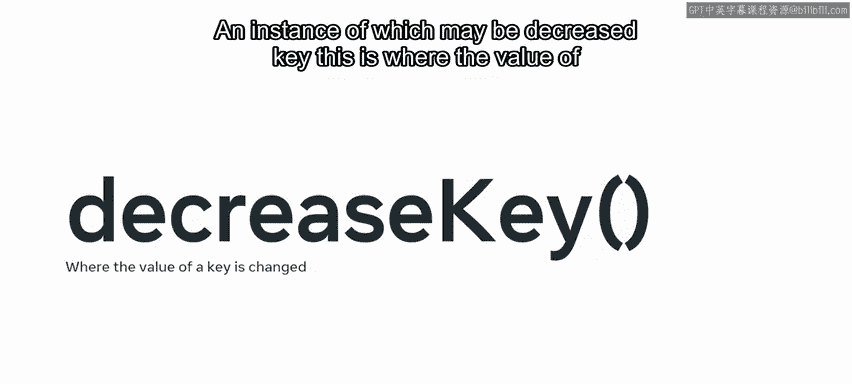
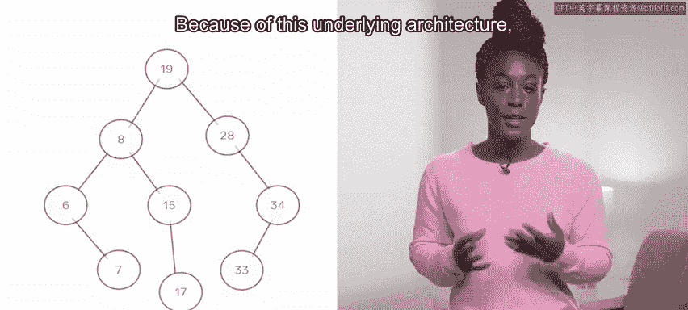

# 数据结构与算法：15：堆（Heap）😊

在本节课中，我们将要学习一种名为“堆”的数据结构。堆这个名字听起来可能不那么引人注目，但它是一种非常重要的组织工具，它结合了其他一些数据结构的特性和优点。

我们将了解堆的结构和特性，并探索如何使用堆来按重要性从低到高组织元素。同时，我们也会看到，通过限制堆的功能，反而可以提高其处理效率。

## 什么是堆？😊

堆是一种特殊的数据结构，其模型类似于树，但其行为方式与队列相似，不过有一个显著的区别：堆会为某些元素分配优先级。

堆中的每个元素都有一个键值，优先级可以是键值最小的元素，也可以是键值最大的元素。

*   **最小堆**：将优先级赋予键值最小的元素。
*   **最大堆**：将优先级赋予键值最大的元素。

堆最初是为了高效存储和搜索数据而引入的。但后来人们认识到，堆可以应用于许多非常有用的操作。

## 堆的核心操作

堆可以执行几个核心操作。对于最小堆，核心操作是 `insert`（插入）、`find_min`（查找最小值）和 `delete_min`（删除最小值）。对于最大堆，则是 `insert`、`find_max` 和 `delete_max`。

在本节接下来的讨论中，我们将围绕最小堆展开，但你可以将所讲的内容反过来理解，它们同样适用于最大堆。😊 两者唯一的区别在于优先级的放置位置。

与课程中讨论的许多数据结构一样，这些方法是构成堆的基本元素。不同语言的不同实现可能会添加额外的方法。😊 其中一个例子可能是 `decrease_key`（减小键值），即更改某个键的值。这样做的动机在于，现实世界中键的优先级可能会发生变化。

## 堆的底层结构




在讨论树时，我们提到过二叉搜索树会根据值的大小顺序来查找：如果值小于节点，则沿左路径向下；如果值大于节点，则沿右路径向下。

```
如果值 < 节点值: 向左子树查找
如果值 > 节点值: 向右子树查找
```

由于这种底层架构，堆通常使用二叉树来构建，不过另一种方法是让数组以模仿二叉树行为的方式工作。



在最小堆中，最小值被放置在根节点，随后的每个值都根据其值的大小被放置在层次结构中的相应位置。这意味着从堆中检索最小值的时间复杂度是 **O(1)**，因为它总是存储在根节点。

与栈不同，检索一个值并不会导致它从树中被移除。相反，如果目的是在处理项目时将其移除，可以调用 `delete_min` 方法。

## 堆的设计哲学

通常，堆不支持删除优先级元素以外的操作。😊 原因在于，堆是为特定目的而构建的，即识别最重要的项目并在尽可能短的时间内返回它，然后排列下一个重要的项目。删除树中的项目需要重新构建树，这会导致性能下降。😊


如果你正在寻找一种可以以这种方式操作的数据结构，那么可能需要考虑堆以外的结构。

## 堆的插入过程


向最小堆中插入元素是通过“上浮”过程完成的。

每个新项目首先被插入到堆的底部（在数组表示中为末尾）。然后，将其与其父节点的值进行比较。如果新插入的项目值小于其父节点，则交换它们的位置。这个过程持续进行，直到新插入的项目上方没有比它更大的值，并且下方的值比它小。在堆中插入元素可以在 **O(log N)** 的时间内完成。

## 堆的应用场景

在了解了堆的底层机制之后，你现在可能对如何应用这种数据结构有了一些想法。

考虑到其固有结构能从一组元素中优先处理特定值，其自然的应用场景就是**调度**。这可以应用于CPU、路由器或数据包处理。


此外，可以想象这样的结构在优先处理某些任务时也很有用，例如面试安排，其中用于存储候选人的键可能与他们在面试流程中所处的阶段有关。😊 或者与职位在组织内的优先级有关？


拥有一个能根据重要性自动应用调度流程的系统，可以极大地节省时间。😊

## 总结

在本节课中，我们一起深入理解了堆，以及如何使用它来按重要性从低到高组织元素。我们了解到，通过限制功能，反而可以提高生产力。与选择任何数据结构一样，重要的是为正确的工作找到合适的工具。😊