# 数据结构与算法：16：图 🕸️

在本节课中，我们将要学习一种重要的数据结构——图。我们将了解图的基本概念、组成部分、不同类型以及如何遍历图。通过学习，你将理解图如何以一种灵活的方式建模数据，并基于数据的存储方式推断信息。

## 概述

在计算机科学中考虑一个给定问题时，始终需要思考解决该问题可能需要执行哪些操作。通过这种思考，可以选择一个合适的数据结构来存储数据。

假设你在一家大型互联网公司工作，需要存储一系列地点及其相互之间的连接关系。在这种场景下，图是一种非常有效的建模工具。

## 图的基本概念

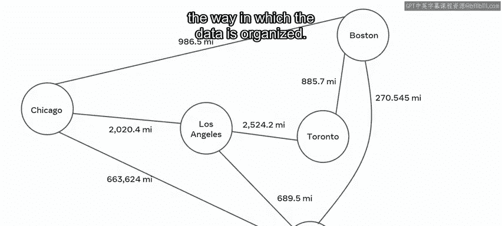

上一节我们提到了使用图来建模地点关系。本节中，我们来看看图的具体构成。

图由**节点**和**边**组成。
*   **节点**：表示实体，例如城市、网页或人。
*   **边**：表示节点之间的关系或连接。

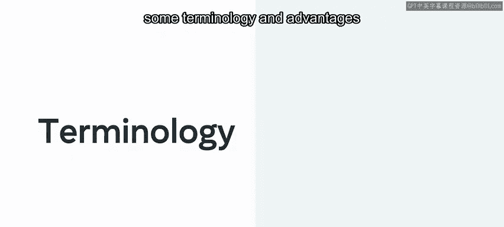

这种保存信息的方法就是基于图的方法。在接下来的内容中，将概述一些相关术语和这种方法的优势。

## 图的类型

了解了图的基本组成后，我们需要区分不同类型的图。

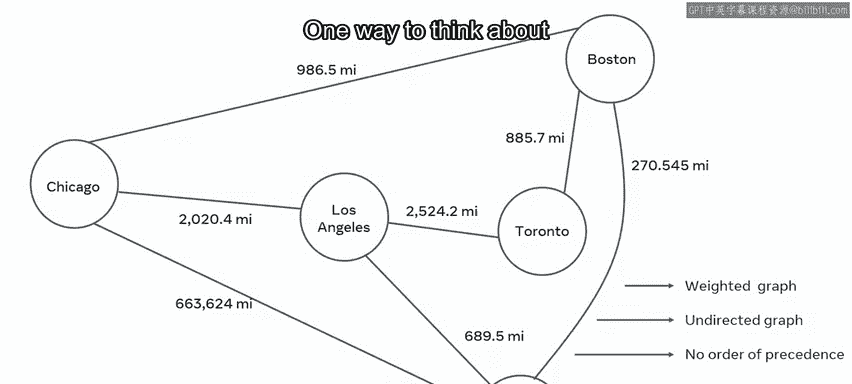

上图展示的图由表示目的地的节点和显示每个节点如何关联的边组成。节点之间存在数值，这意味着这是一个**加权图**。图中没有箭头，这意味着这是一个**无向图**。

与有向图相比，无向图没有优先级顺序。思考有向图和无向图的一种方式，是像双向街道和单向街道。

以下是图的主要分类：

*   **有向图 vs 无向图**：有向图的边有方向（如A->B），无向图的边没有方向（A-B）。
*   **加权图 vs 无权图**：加权图的边带有权重（如距离、成本），无权图的边没有权重。

有时，为了突出某种进展，在排列数据时给边赋予方向会很有帮助。而在其他情况下，边仅仅用来表示关联。

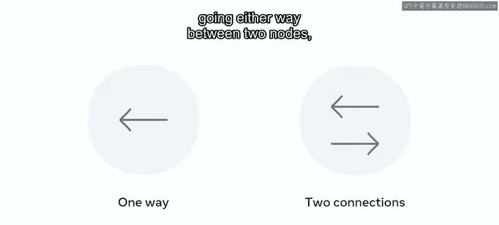

## 图的连接与路径

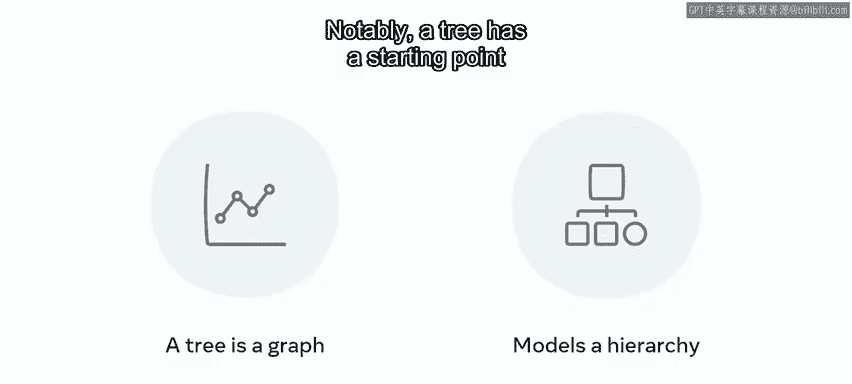

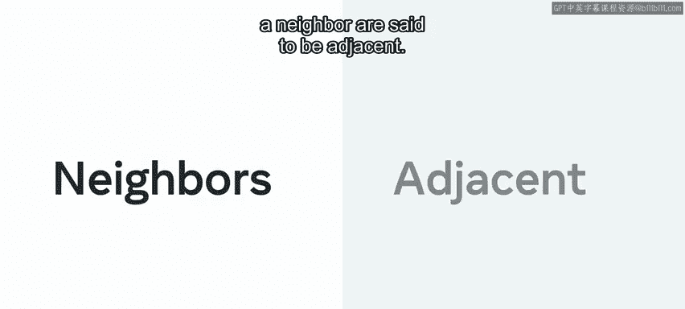

现在我们已经知道了图的类型，接下来探讨节点之间是如何连接的。

**路径**是由边连接的两个或更多节点的序列。

在有向图中，如果边只是单向的，那么这种连接被认为是**弱连接**。然而，如果两个节点之间有双向连接，则可以说是**强连接**。

此时，你可能会认为图类似于树。在某种程度上，可以说树是一种简单的图。值得注意的是，树有一个起点，并模拟了父节点和子节点的层次结构。而图是一种复杂得多的结构，没有开始或结束。

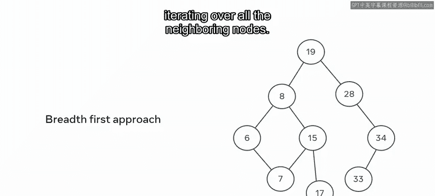

两个相邻的节点被称为**邻居**，通过一个邻居连接的节点被称为**相邻**节点。

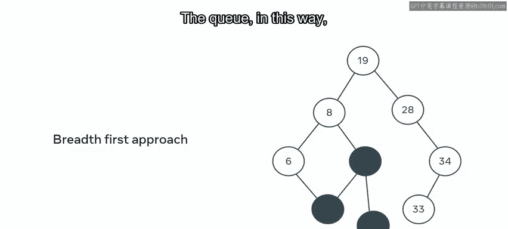

## 图的遍历

和树一样，图也可以进行遍历，主要方法有广度优先搜索和深度优先搜索。

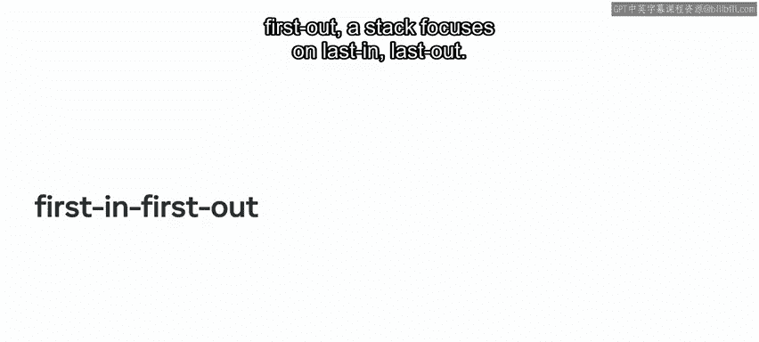

回忆一下，**广度优先搜索**涉及访问同一层的每个节点，然后再向下进行。而**深度优先搜索**则是在移动到下一个分支之前，先深入到每个分支的末端。

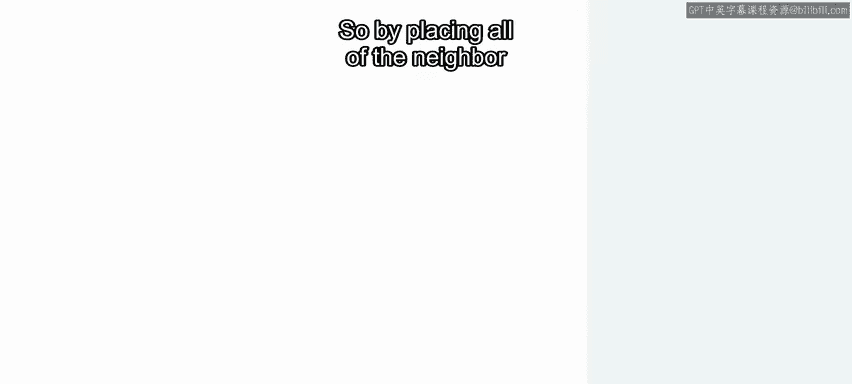

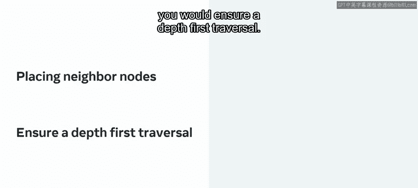

以下是两种遍历方法的简要说明：

*   **广度优先搜索**：选择一个给定的起始位置，遍历所有相邻节点。每个邻居都有一组连接的节点，这些节点可以被添加到另一个数据结构——**队列**中。通过这种方式，可以系统地访问每个节点。
    
    

*   **深度优先搜索**：为了实现深度优先搜索，可以使用**栈**。回忆一下，栈处理元素的方式与队列不同。队列遵循**先进先出**的原则，而栈则遵循**后进先出**的原则。因此，通过系统地将所有邻居节点放在栈上，可以确保进行深度优先遍历。
    
    
    

## 图的应用

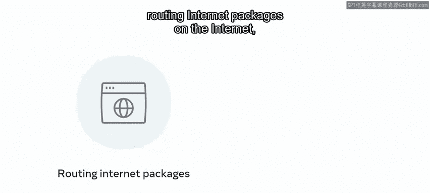

图是一种被广泛研究的数据结构，是许多用于确定节点间重要性的算法的基础。

无论节点中存储的元素是什么，一个著名的算法是**最短路径**算法：找到从节点A到节点E的最快方式。边的权重会提示选择每条路径的成本。这种方法用于在互联网上路由数据包，或在谷歌地图上计算行程。

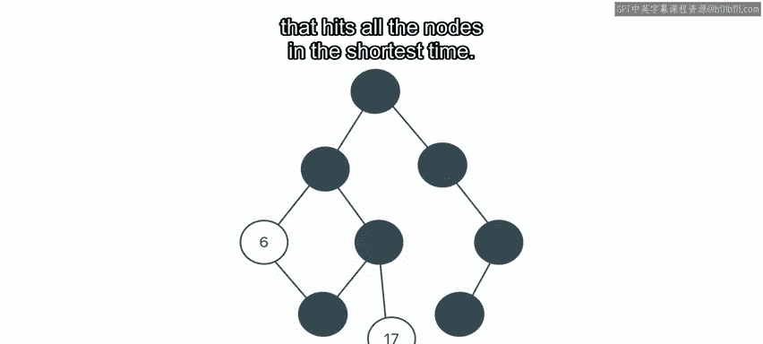

另一个常见的基于图的挑战是**旅行商问题**。

一个销售员需要访问几个特定的节点。规划一条在最短时间内覆盖所有节点的最佳路线是什么？这将用于包裹路由。

给定X个目的地和Y辆车，规划出最有效的路线，以便用最少的资源消耗交付所有包裹。

## 总结

本节课中，我们一起学习了图如何让你有机会以一种灵活的方式对数据进行建模，并通过数据的存储方式促进对信息的推断。

这种多功能的方法只保留最少的信息。从芝加哥到波士顿的距离没有存储在任何地方，但可以推断出来。很容易查询不同的问题，而无需改变数据的构成。计算步行时的最佳时间可以轻松替代驾驶时间，而无需大费周章。

有一个完整的统计学领域致力于从节点位置推断信息，这可以用来对存储在那里的任何数据进行推断。