# Meta《前端开发（React／UI、UX／毕业项目／code review）｜Meta Front-End Developer》中英字幕 - P154：18_排序算法.zh_en - GPT中英字幕课程资源 - BV1uJ4m1e7HT

Sorting a set of data might sound like a straightforward task。

 given what you have already learned throughout this course。 However。

 it can be surprisingly challenging when you get into the details。In this lesson。

 you'll explore sorting algorithms and the different sorting methods that are available to you。

 You'll be introduced to some of the various approaches to searching such as linear and binary。

You'll also discover the steps involved in implementing both of these approaches and explore the advantages they offer。

You'll also learn about the steps required for implementing， selection， insertion， and Quick sort。

 and discover the strengths and weaknesses of each sorting approach。😊。

There are several algorithms that have been developed for this challenge and some data structures that have previously been discussed。

 like binary trees and heaps。 Both of these data structures have been designed with the aim of retaining the data in asorted manner。

Working with sorted data or having the ability to sort your own data can result in significant time savings。

😊，Therefore， a data set of elements that can be ordered is fundamentally necessary。

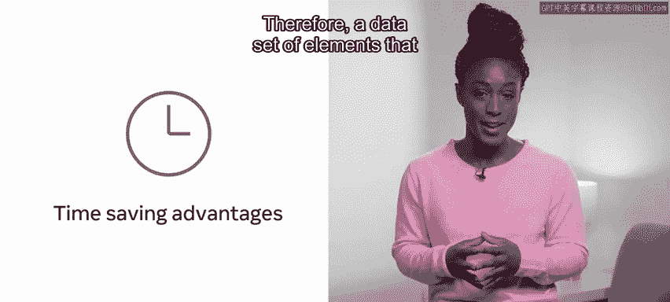

This order could be alphabetically， sequentially， chronologically。

 by size of shape or by hue of colour。The actual metric that is used is less important than the fact that they can be arranged in an ascending or descending order。

A second consideration that's factored in is whether the ordering is permuted， meaning， reordered。

 or has been accomplished by creating a copy whilst keeping the original list。

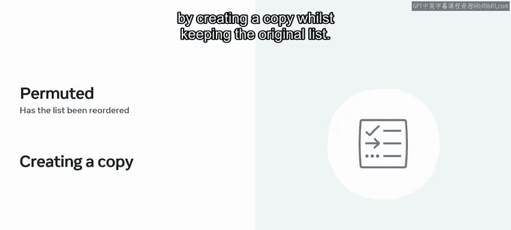

Selection sort is an early approach to sorting。 It mimics how a human might approach the problem。

 The underlying principle is very straightforward。 You start by searching through a list to identify the smallest element。

Then switch this with the first element so that the smallest element is placed at the top。Now。

 the previous occupant of the top spot has been switched into the vacated spot in the list。

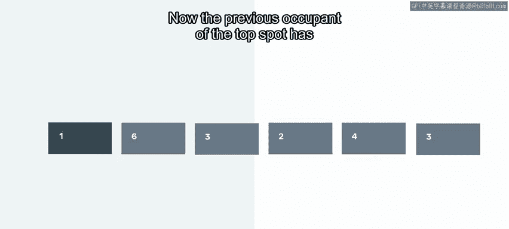

This is repeated for every element in the list until the list has been ordered from the smallest through to the largest。

😊，Let's explore this in an example。You'll see in this diagram element 35 at index location 0 in a selection sort a comparison is made between the element at index 0 and each element in the array until the lowest is found。

😊，Equally， element 46 in the next location is compared to each element， and in this case。

 switched with6。 Next is element 36 found at indexex 2。

 You'll notice that element 9 at index 3 is deemed the smallest。 However。

 the entire array must be searched。😊，This process is continued until every element is ordered by size。

 smallest to the left， La to the right。 Another straightforward approach to sorting is insertion sort。

 rather than searching through all the elements。 This approach begins by examining the first two elements in a list。

 The smaller of the two is then moved to the front。😊。

This is repeated for every element。 Each one being compared to the element on its left。

 a subsequent switch to the left is made if it's found to be smaller。

 So element 2 is compared with element 4。 It's found to be smaller。 So as swap happens。 Next。

 element 2 is compared with element 1。 It's found to be larger。 So no more comparisons are made。

 Then element 3 is first compared with element 4。 It's found to be smaller。 So as swap occurs。Next。

 element 3 is compared to element 2。 It's larger， so no further comparisons are made。

 Let's explore an example of this。

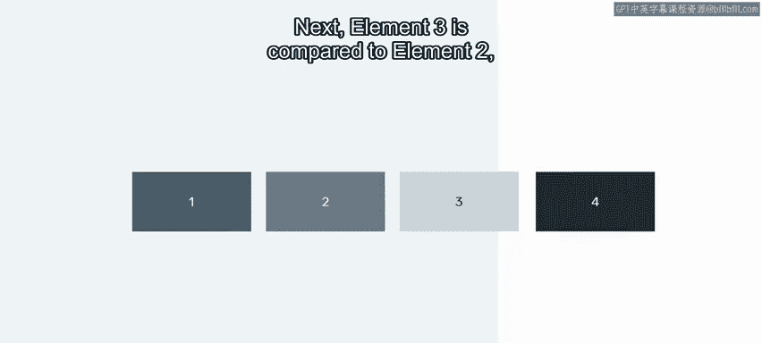

On screen， you'll notice an array of numbers。 The first element 35 has nothing larger to the left。

 so it remains where it is。Then element 46 is compared and is also left where it is。😊。

Next you see element 36， this is compared with location1， it's smaller than 46， so they are swapped。

😊，Checks against location 0 shows that no further swaps need occur for this element。 At step 3。

 you'll notice element 9。 This is compared with 46 and is therefore swapped to location 2。😊。

It is further compared with location 0 and one， and swapped again。😊，Next。

 the element found at location 4 is compared with location 3 and swapped。

 It's further swapped with location 2 and location 1， Its also compared with location 0。

 but as it greater， no further movement is made。😊，The process is continued。

 moving from right to left until the entire array is sorted。

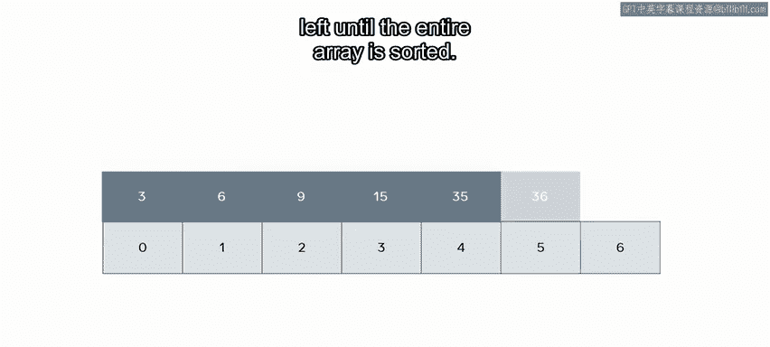

Both the insertion and selection sort a straightforward approaches working on a simple paradigm。

Quicksort is a more sophisticated approach that is more complex to implement。However。

 it shows far greater efficiency。 Quicksort operates on the principle of pivots。

 The algorithm selects an element in the array as the pivot。

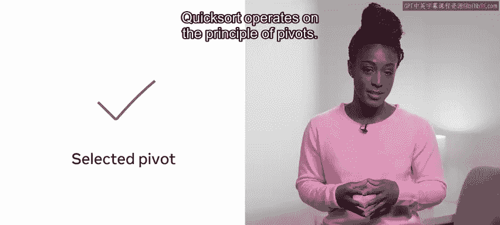

Then all items in the array larger than this value are moved to the right of the pivot and all elements less than the value are moved to the left。

This process is repeated for both sides of the pivot until all the items are sorted。

 Let's explore this， in an example。Here， element 9 is selected as the pivot point using Quick sort。

 All items that are less than 9 are swap left， and all items larger than 9 are swap right。Therefore。

 the smaller elements have now been moved left after this first split。In this example。

 these smaller elements are6 and3。😊，Applying the same procedure again to the resulting array terminates when three is found to be the only element not split。

😊，Now， taking the values that are greater than the original selected pivot， you select a new pivot。

 In this case，36 is selected and a further swapping of elements is performed。😊，Finally。

 the remaining unsorted index locations are swapped in relation to a new pivot。

 Once all elements have been sorted， the algorithm terminates。😊。

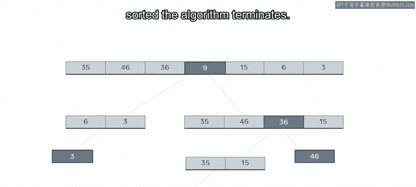

There are many additional sorting approaches that can be used with some approaches。

 even forming hybrids of these existing ones。 In practice。

 you probably would not write your own implementations。

 as there are excellent implementations in every language。

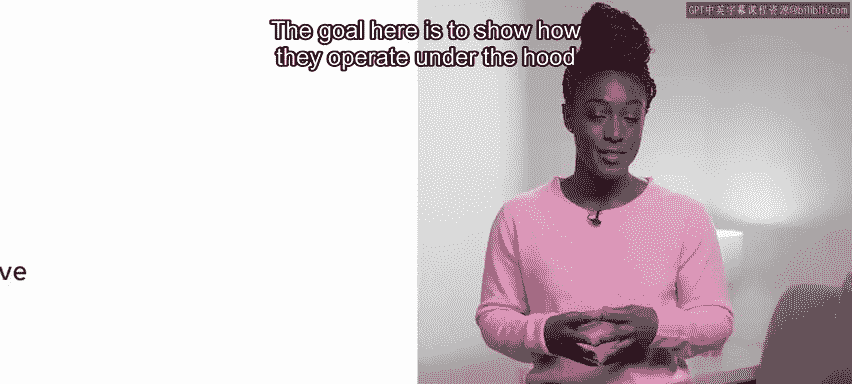

The goal here is to show how they operate under the hood so that you can choose the best one when faced with a given problem。

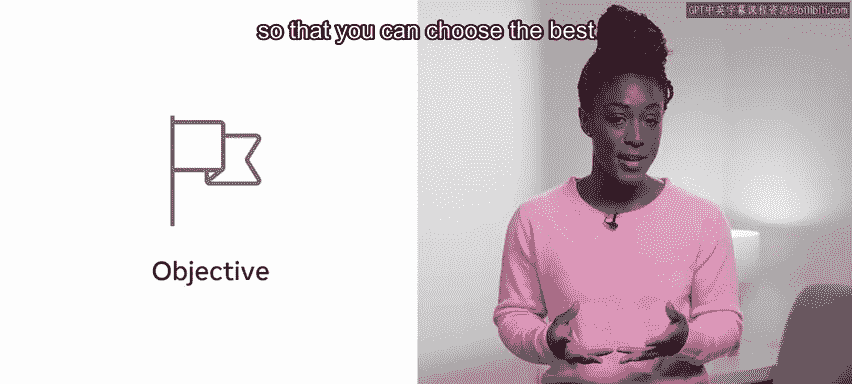

As with data structures， there is not one sorting algorithm that provides the best result in every given scenario。

 Each approach has its trade offs and is more effective in some environments than others。

 You will learn more about the efficiency of these approaches when compared to big O notation soon In this video。

 you've explored sorting algorithms and the different sorting methods that are available to you。

 You have also learned about the steps required for implementing selection。

 insertion and quick sort and discovered the strengths and weaknesses of each sorting approach。😊。

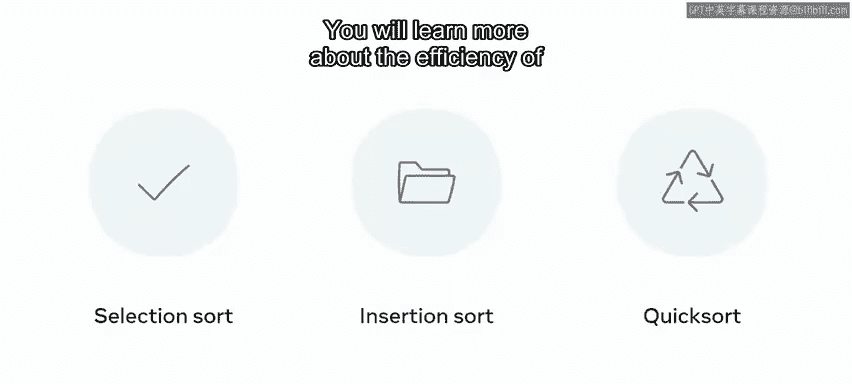

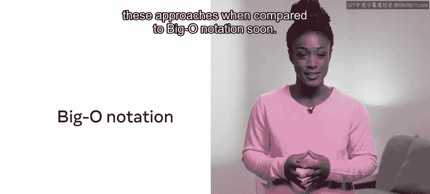