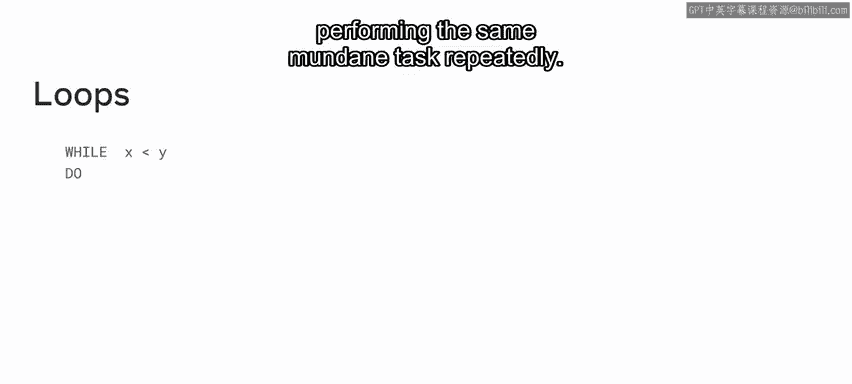
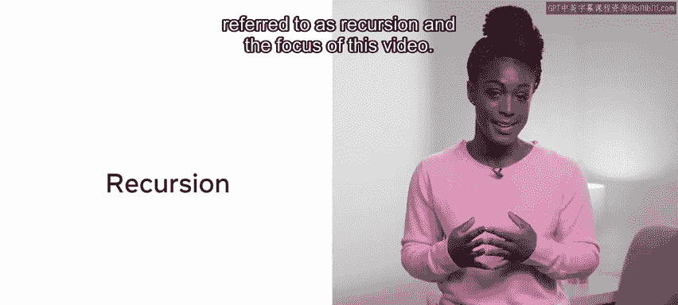
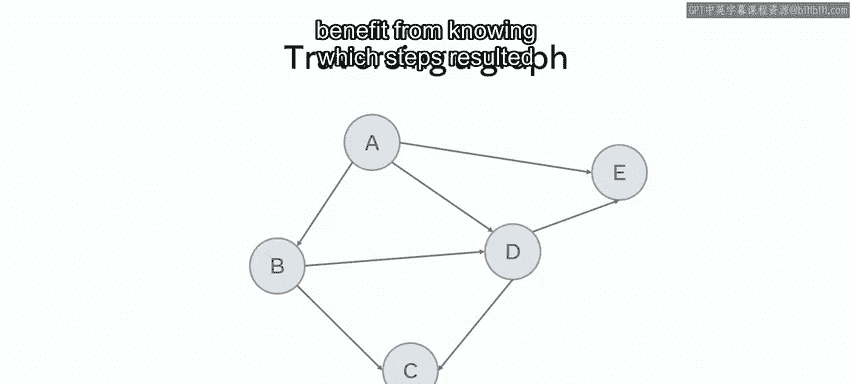
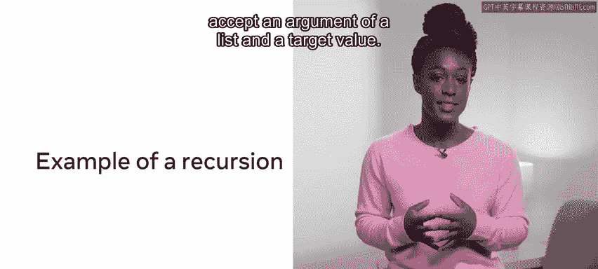
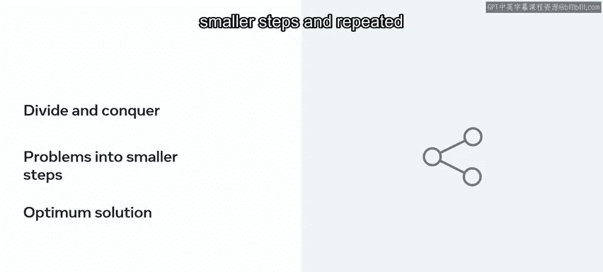

# Meta《前端开发（React／UI、UX／毕业项目／code review）｜Meta Front-End Developer》中英字幕 - P157：21_递归.zh_en - GPT中英字幕课程资源 - BV1uJ4m1e7HT

In a previous video， you learned about the divide and conquer paradigm。 In this video。

 you are going to learn about recursions and how to implement the requirements for a recursive solution。

😊，One of the basic tenets of any given language is its ability to perform loops。

 Los enable us to perform actions repeatedly until the desired output is achieved。 Unlike humans。

 computers never tire of performing the same mundane task repeatedly。😊。

An alternative approach to solving a problem than a loop is recursion。

 The practice of having functions call themselves is referred to as recursion and the focus of this video。

Recursion is when a function calls itself with a smaller instance of a problem repeatedly until some exit condition is met。

😊，So what is required for recursion？There are three requirements for implementing a recursive solution。

Namely， the base case， the diminishing structure and the recursive call。

Let's look at an example relating to binary to better illustrate these three requirements。

 Consider a challenge where you are tasked with finding the exponent of a number。

Recall that calculating an exponent of a number is to determine how many potential permutations can be derived from it。

This was discussed when demonstrating how binary can be used to represent a range of characters。

The base case ensures that the function will not continue to call itself， and eventually ends。

Line 1 outlines a function that will take two arguments。 X and N。 The base case is if n equals 0。

 In this instance， the programme will terminate。 Line 4 is the second part of the conditional statement。

 If a termination point has not been reached。 Call the function again with a reduced structure。

In this instance， the goal is to multiply x by n to find the total number of potential states that could exist for the binary number。

😊，Reducing the input value is as important as establishing a base case。This way。

 the function will eventually reach the base case and cease to call itself。😊。

The third component of a recursive function is to include a call to itself。This happens on line 5。

 where the exponent is accepting the diminished structure。😊。

The structure can be said to be diminished because the size has been reduced from one call to another。

Each time the function is called， a new instance is created on the call stack。😊。

Calling the above function with x equals 2 and n equals 3 will result in three instances being created and placed on the call stack。

😊，This increases computational cost as resources are required to make a function call。😊，However。

 the computation from each result will be retained on the call stack。

This can be useful when computing hierarchical problems or problems where one can benefit from knowing which steps resulted in a given outcome。

 like traerssing a graph。

Let's explore an example of the use of recursion。Consider the video on binary search。

A binary search function will accept an argument of a list， and a target value。

First， the middle point of the list is checked against the elements to determine which half of the list to check。

This process is repeated until the target element is found or deemed to be not there。

You might consider solving this problem through a loop or recursively。

The input to the recursion would be a list and a search element。

 and the recursive function would call itself until the target endpoint is reached。

 So why then use recursion when a simple loop will do Some problems lend themselves well to recursive calls。

 Consider calculating the Fibonacci of a given number。

The beacci is a sequence of numbers where the first two numbers are 0 and1。

 and every other number is the sum of the previous two numbers in the set。

Calculating the result involves passing a number， calculating the output， changing the number。

 then calling the function again with a new integer input。

Writing the code this way means that you can simply call the function with a different integer。

 and it will return a breakdown of the required steps。Readability is a strong plus for recursion。

 Sometimes when a problem requires many checks， a loop can quickly become unwieldy。

Recursive solutions reduce the amount of code required to solve a problem and can be easier to read and understand。

Finally， one would employ a recursive approach as part of a divide and conquer solution。😊，Here。

 the problem is broken into smaller steps and repeated to come upon the optimum solution。

In this video， recursion has been introduced， you have learned that while recursion can add some computation overheads to a problem。

 it can also result in eloquent， easily read code。😊，Additionally。

 that recursion epitomizes a divide and conquer solution。

 breaking the problem into its smallest components and solving those。

