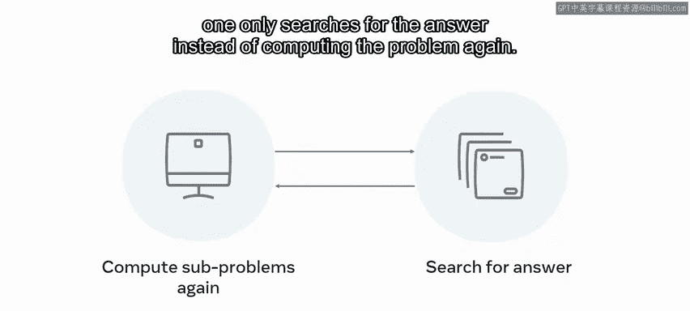
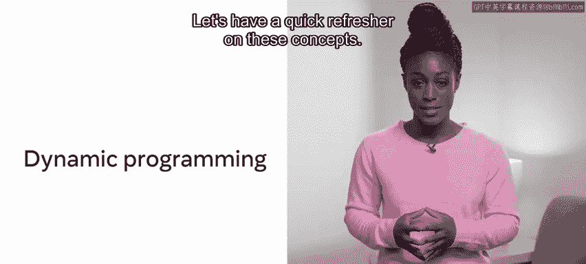
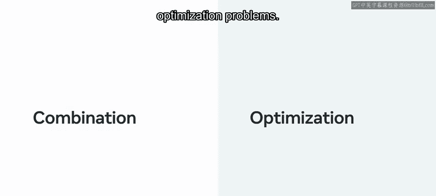
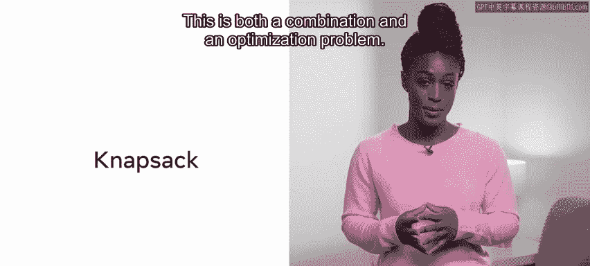
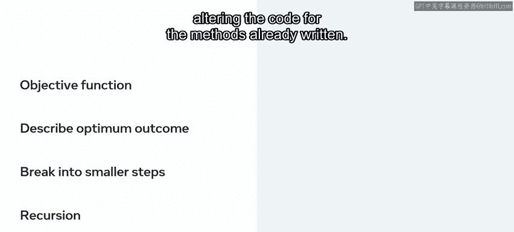

# 动态规划：22：动态规划概念与记忆化

在本节课中，我们将要学习动态规划的基本概念，包括其核心思想、记忆化技术以及它与分治法和递归的关系。我们将通过简单的例子来理解动态规划如何优化问题求解过程。

---

在接触动态规划之前，你已经学习了分治范式和递归。

本节中，我们将探讨记忆化和动态规划的概念。动态规划是一种编程范式，它提倡通过将问题分解为更小的子问题来解决它们。

这些子问题的解决方案随后被存储在适当的数据结构中，以备后用。

这样做的好处是，如果这些子问题需要再次计算，只需查找答案，而无需重新计算整个问题。

这种解决子问题并存储结果，以便在未来可能查找时节省时间的技术，被称为**记忆化**。

动态规划与前面视频中已经遇到的两个概念相关。

让我们快速回顾一下这些概念。第一个是**分治法**，即将一个大问题分解为一组较小的子问题，然后解决这些子问题。

第二个是分治法的一个子集，称为**递归**。递归是一种编码解决方案的实践，它避免运行循环，而是通过多次自我调用来得出解决方案。

动态规划是这些方法的扩展，它额外涉及记录每次新运行子问题时产生的结果。

在后续运行中，不再重新计算结果，而是查询上一次遇到相同问题时的答案。

如前所述，这种方法称为记忆化。为了强化这个概念，记忆化是指当编译器识别出某个计算已为之前的任务运行过时，存储并使用先前计算的结果，以替代重新运行计算。

为了举例说明，请考虑视频中提出的关于二进制数的问题：一个六位二进制锁有多少种可能的组合？

在之前的视频中，已经展示可以通过指数运算或求幂来发现这一点。因此，同一个六位锁将有 `2^6` 或 64 种组合。

所以 `2^6 = 2 × 2 × 2 × 2 × 2 × 2`。

或者，你可以将其分成两组，先计算 `2 × 2 × 2`，再计算 `2 × 2 × 2`，结果是 `8 × 8`，同样得到相同结果。

应用分治法，并利用记忆化高效计算，将首先计算 `2^3`，然后再次使用 `2^3`，从而减少所需的计算总量。

通过应用记忆化，第一个 `2^3` 将被计算出来，然后在第二个括号中重用，减少了整体所需的计算。

---

那么，什么样的问题适合用动态规划解决呢？

动态规划方法通常应用于组合或优化问题。

一个已经提到的组合问题的例子是斐波那契数列。另一个你可能在面试中遇到的例子是**背包问题**。

这既是一个组合问题，也是一个优化问题。

假设你为一次计划好的露营旅行做准备。你可以往背包里装必需品。每件物品都有重量成本：手电筒重 1 公斤，水重 2 公斤，帐篷重 3 公斤。此外，每件物品都有价值：手电筒价值 1，水价值 2，帐篷价值 3。

简而言之，背包问题列出了一系列重量不同、价值不同的物品。你的背包只能携带一定数量的物品。问题要求计算，如果你的背包能承受特定重量，你能携带的最佳物品组合是什么。目标是找到在背包重量容量限制下的最佳回报。

为了计算这个问题的解决方案，你必须选择所有加起来达到给定重量并包含给定价值的物品。

可携带的重量会发生变化。这个问题可以应用于资源分配，例如你拥有一定的 CPU 算力，需要运行 X 个任务，就像 CPU 完成任务的容量一样。有时重量可能是 7 公斤，其他时候可能是 10 公斤。

动态规划涉及保存用于得出给定解决方案的计算过程。

所以，如果你已经计算出了 7 公斤的最佳选择方案，当重量要求提高到 10 公斤时，你无需重新运行初始计算。这可以成为一种节省时间的度量方法。

---

在计算动态规划解决方案时，你必须首先确定**目标函数**，即对最佳结果是什么的描述。

接下来，你必须将问题分解为更小的步骤。实现这一点的一种已经讨论过的方法是使用递归函数，即反复调用自身直到得出解决方案的函数。

这些函数应该以这样的方式编写：你可以在不更改已编写方法代码的情况下改变结果。

---

## 总结

本节课中，我们一起学习了动态规划是一种旨在优化给定问题解决方案的方法。它利用记忆化和重叠子问题的原理，来识别何时可以快速实现目标函数，从而优化所需的计算步骤。