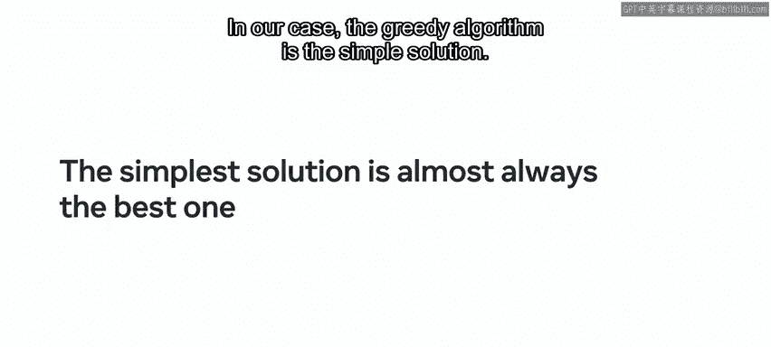
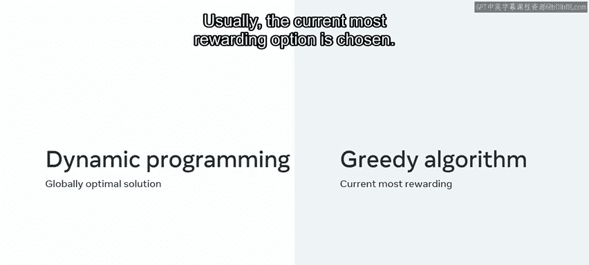
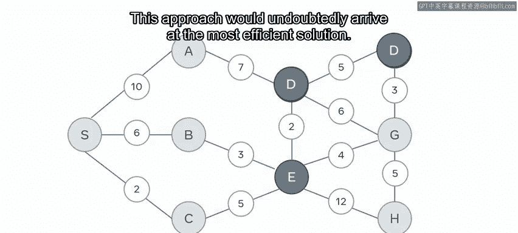
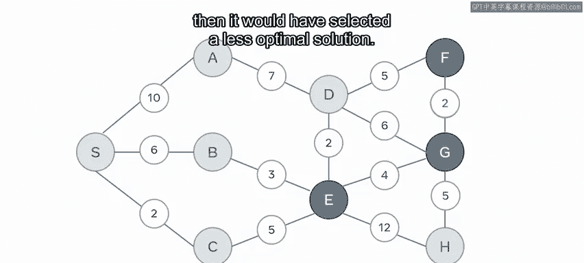

# 前端开发：P159：贪婪算法 🧠

在本节课中，我们将学习如何使用贪婪算法这一范式来解决复杂问题。我们将探讨其核心思想、与动态规划的对比，并通过具体例子理解其工作原理和优缺点。

## 概述

贪婪算法是一种遵循“奥卡姆剃刀”哲学原理的问题解决方法，该原理主张最简单的解决方案几乎总是最好的。在算法领域，贪婪算法通过一系列局部最优选择来寻求问题的整体解决方案，它注重即时回报，而非全局的、长远的规划。

上一节我们介绍了算法设计的不同范式，本节中我们来看看其中一种强调即时与局部最优的策略——贪婪算法。

## 贪婪算法与动态规划

这是一种有别于动态规划的替代方法。动态规划旨在通过解决所有子问题并选择最优子集来找到全局最优解。而贪婪方法则查看解决方案列表，并实施局部优化，通常选择当前回报最高的选项。

为了更清晰地说明，让我们举一个CPU需要完成一系列任务的例子。

*   **动态规划方法**：类似于“背包问题”，需要确定在给定时间内可以完成哪些任务的子集，以最大化总价值。这涉及计算所有可能的组合。
*   **贪婪算法方法**：总是选择当前最有价值的任务（例如运行时间最短的程序）放入“背包”，而不考虑这可能会排除其他哪些任务。

因此，在我们的CPU示例中，贪婪方法会先选择运行时间最短的程序，然后是次短的，依此类推。虽然这可能不会带来全局最优解，但它减少了计算最有效任务子集的开销。

为了更好地理解这两种方法的差异，让我们考虑最短路径问题。

## 实例分析：最短路径问题

下图展示了一张包含9个节点（A, B, C, D, E, F, G, H, S）的地图。每个节点通过带权重的路径连接，权重反映了选择该路径所需的成本（例如时间、距离）。

现在，你需要规划从节点E到节点F的最有效路线。

*   **动态规划方法**：会创建一个表格，从E开始计算每个潜在节点的累积成本，逐步引入后续节点集并计算总成本。这种方法无疑会得出最有效的解决方案。在初始计算后，利用**记忆化**技术保存结果，后续的路径计算将受益于更快的计算时间。这是一种自底向上的全局方法。
*   **贪婪算法方法**：其方法论则不同。它不会尝试寻找连接路线的最优子集，而是从节点E开始，查看每个可用的连接。

以下是贪婪算法的决策步骤：

1.  在节点E，可选的连接及其权重为：C(5), B(3), D(2), G(4), H(12)。数组中最低的值是2，对应节点D。遵循贪婪原则，算法会选择这条路径，前进到节点D。
2.  假设数据结构是有向图，在节点D，将面临另外三个节点：A(7), F(5), G(6)。由于F是最终目的地，算法会选择F并到达终点。

最终，算法累积的总成本（惩罚）为：从E到D的权重2，加上从D到F的权重5，总计7。

从视觉上看，这恰好是最优路径。它是在没有创建详尽的组合表和计算所有可能路径的情况下找到的。

然而，如果节点G和F之间的路径权重是2（而不是图中的6），那么贪婪算法可能会选择一条次优的路径（例如E->G->F，假设G到F的权重为2，则总成本为4+2=6，优于E->D->F的7）。但根据当前权重，算法会错误地选择E->D->F（成本7），而错过更优的E->G->F（成本4+2=6）。这就是选择贪婪算法而非动态规划时需要权衡的地方。

## 贪婪算法的特点

虽然贪婪算法的开销低，且编码解决方案相当直接，但它并不总能保证返回最佳选项。

*   **优点**：计算开销小，实现简单直接。
*   **缺点**：不能保证获得全局最优解。

## 总结

本节课中我们一起学习了贪婪算法。你不仅对贪婪算法方法有了更深入的理解，还看到了它与动态规划解决方案的对比，从而加深了对这种替代方法优缺点把握。

下次你在谷歌地图上规划路线时，可以思考一下所提供的路线选择是如何被计算出来的，其中可能就运用了类似的算法思想。