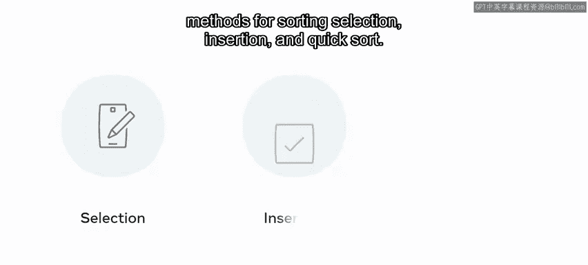
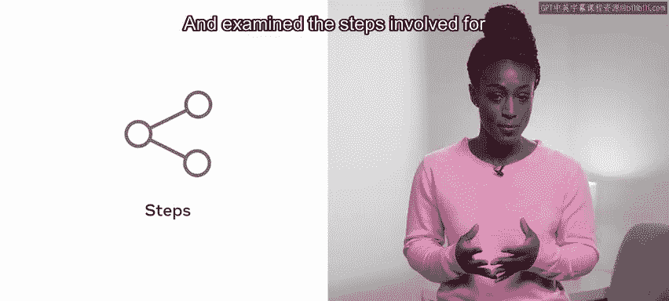
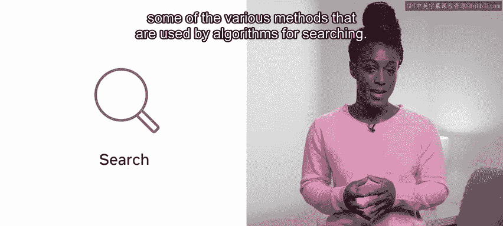
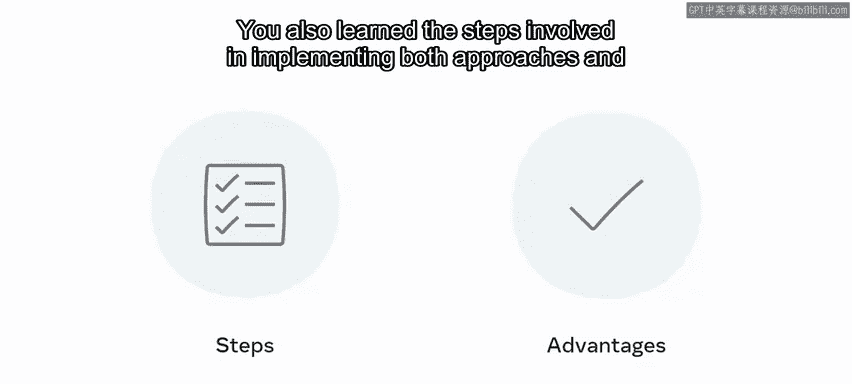
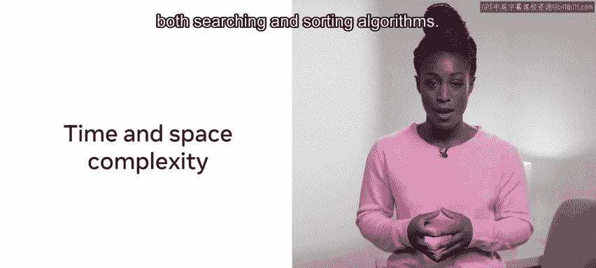
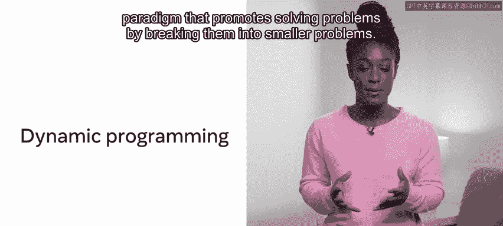
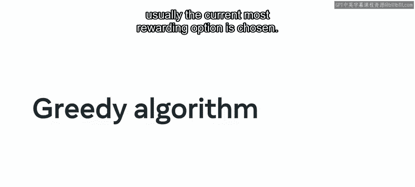
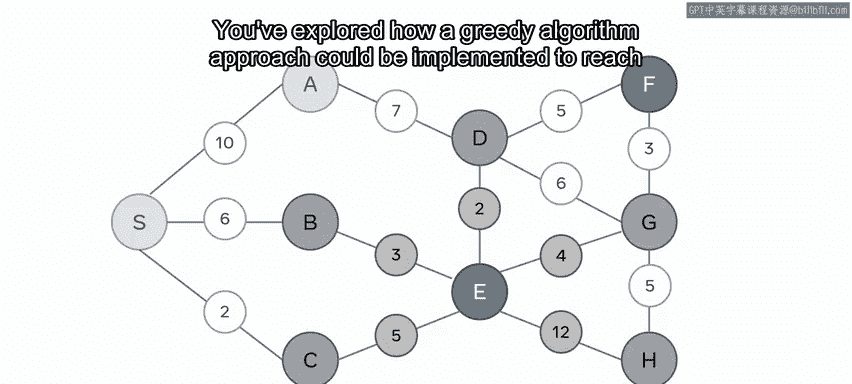
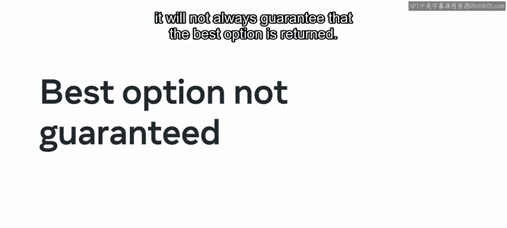

# 前端开发（React/UI、UX/毕业项目/代码评审）：P160：24_算法简介模块总结 🎯

在本节课中，我们将回顾“算法简介”模块的核心内容。我们将总结排序、搜索算法的基础知识，并探讨分治、递归、动态规划和贪心算法等关键算法范式。

---

## 模块回顾

恭喜你完成了“算法简介”模块的学习。现在，让我们花点时间回顾一下在这个模块中学到的知识。

我们首先从排序和搜索算法开始。排序是计算机科学中的基础操作，它对于高效的数据检索和处理至关重要。

### 排序算法

在本节中，我们学习了排序的重要性，并探讨了三种主要的排序方法：选择排序、插入排序和快速排序。

以下是这三种排序算法的核心思想：

*   **选择排序**：反复从未排序部分选择最小（或最大）元素，放到已排序序列的末尾。
*   **插入排序**：构建有序序列，对于未排序数据，在已排序序列中从后向前扫描，找到相应位置并插入。
*   **快速排序**：采用分治策略，选取一个“基准”元素，将数组分为比基准小和比基准大的两个子数组，然后递归地对子数组进行排序。

我们分析了每种算法排序数据的具体步骤，并探讨了它们在解决特定问题时的优缺点。重要的是，**没有一种排序算法能在所有场景下都提供最佳性能**，选择哪种算法取决于具体的数据特性和需求。

### 搜索算法

上一节我们介绍了排序，本节中我们来看看搜索算法。搜索算法是计算机科学的另一个基本概念，用于在数据结构中查找特定元素。

以下是两种核心的搜索方法：

*   **线性搜索**：顺序遍历数据结构中的每一个元素，直到找到目标元素或遍历完所有元素。
*   **二进制搜索（二分查找）**：要求数据已排序。在每次迭代中，将搜索空间对半分割，通过比较中间元素来缩小搜索范围。

我们还学习了实现这两种方法的步骤以及它们各自的优势。此外，我们深入探讨了搜索和排序算法的时间与空间复杂度，这是评估算法效率的关键指标。

### 算法范式

接下来，我们进入了关于算法范式的课程。这里我们学习了处理算法的不同高级策略。

首先，我们探讨了**分治**范式。在“分”的步骤中，将输入问题分解为更小的子问题；在“治”的步骤中，独立解决每个子问题；可选的最后一步“合”，则是将所有已解决的子问题结果合并。我们发现，分治技术为解决问题提供了一个有效的框架，并带来了诸多好处。

接着，我们探索了另一个重要的算法方法：**递归**。递归是指函数反复调用自身来解决规模更小的同类问题，直到满足某个退出条件。

实现递归解决方案需要满足三个要求：

1.  **基准情况**：递归终止的条件。
2.  **递减结构**：每次递归调用，问题规模都应向基准情况缩小。
3.  **递归调用**：函数调用自身。

然后，我们介绍了**动态规划**。这是一种通过将问题分解为更小的重叠子问题来求解的编程范式。我们探讨了**记忆化**的概念，即解决子问题并将其结果存储起来，以便在未来的搜索中节省时间。

计算动态规划解决方案的过程可以概括为：
1.  **确定目标函数**：描述最优结果是什么。
2.  **将问题分解为更小的步骤**（定义状态和状态转移方程）。
3.  **决定应用哪种动态规划方法**（如自顶向下的记忆化递归或自底向上的迭代）来实现目标。

最后，我们学习了**贪心算法**。与动态规划相比，贪心算法在每一步都做出当前看来最优的选择（局部最优），希望以此导致全局最优解。

我们探讨了如何实现贪心算法来解决问题，并认识到在选择贪心算法而非动态规划时存在权衡。虽然贪心算法的开销较低，编码实现也相对简单，但它**并不总能保证返回全局最优解**。

---

## 总结

本节课中，我们一起回顾了“算法简介”模块的全部内容。我们从基础的排序和搜索算法入手，理解了它们的工作原理和适用场景。随后，我们深入学习了分治、递归、动态规划和贪心算法这四种强大的算法范式，掌握了它们解决问题的核心思想和实现要点。

凭借你已获得的所有知识，在进入最后一个模块完成分级评估之前，只剩下完成本模块的最终测验了。你已经非常接近终点了。祝你好运，并享受接下来的学习旅程！🚀