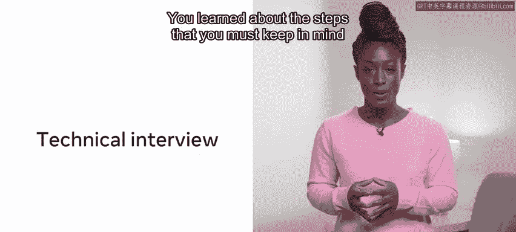
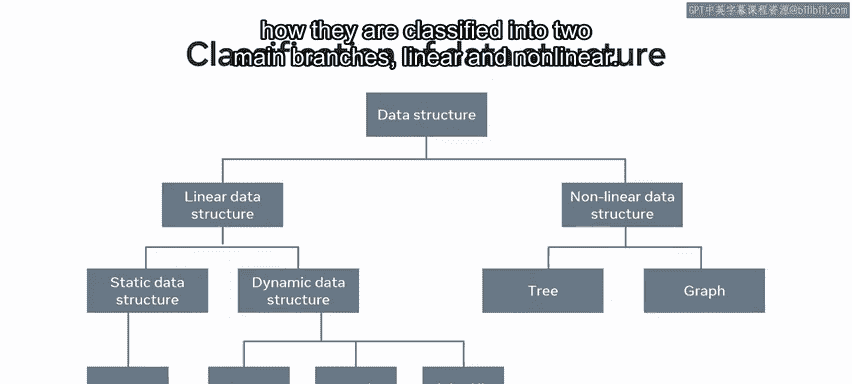
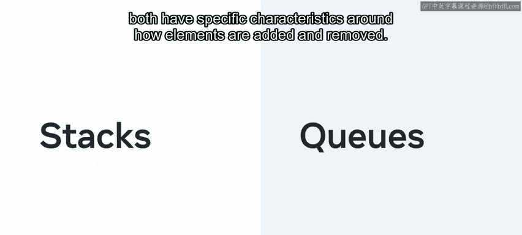
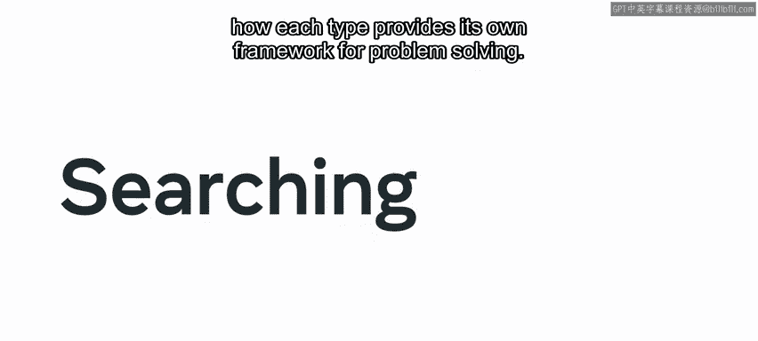
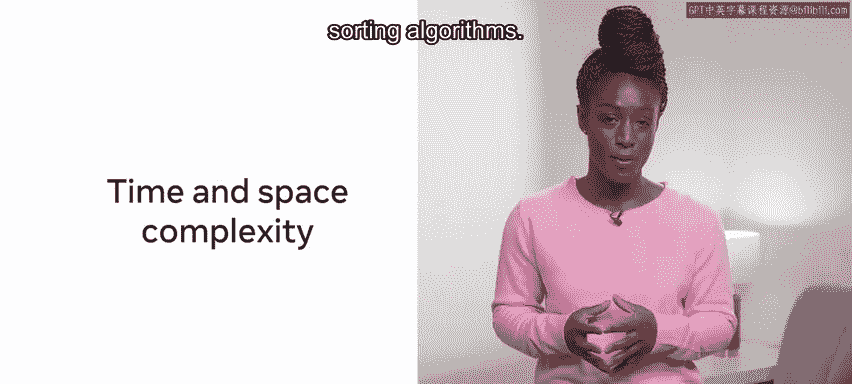
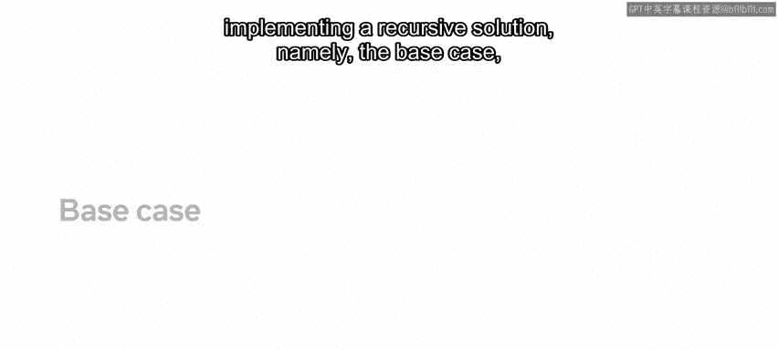
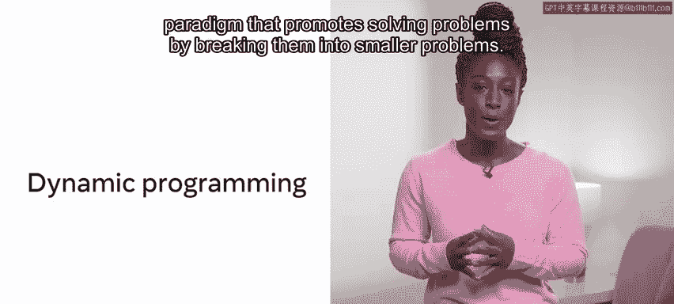
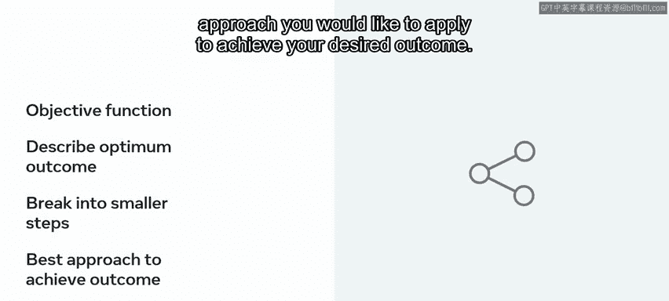
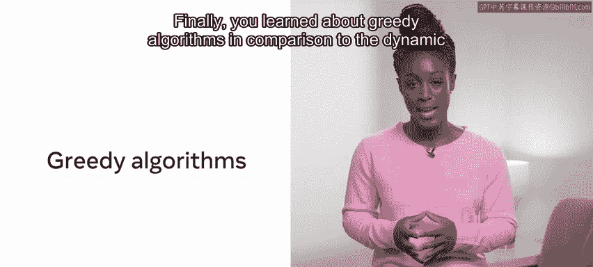
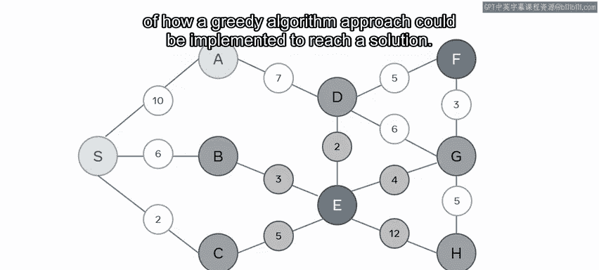

# 前端开发（React/UI、UX/毕业项目/code review）：P161：课程回顾

在本节课中，我们将回顾整个课程所涵盖的一系列核心概念与技能，这些内容旨在帮助你为技术编码面试做好充分准备。我们将系统性地梳理从面试准备、计算机科学基础、数据结构到算法的关键知识点。

## 模块一：编码面试准备

上一节我们介绍了课程的整体目标，本节中我们来看看第一个模块，它专注于帮助你理解并准备技术编码面试。

你首先了解了什么是技术编码面试，它可能包含的形式以及你可能遇到的不同面试类型。第一课的重点是技术编码面试，其主要目的是确认你是否具备履行岗位职责的技术能力。

以下是你在技术面试中必须牢记的步骤：
*   理解问题。
*   提出澄清性问题。
*   构思解决方案。
*   编写代码。
*   测试你的解决方案。

你了解到，使用合适的工具始终很重要，并且必须时刻考虑时间限制。你还探索了如何为编码面试做准备，以及第一印象的重要性，包括专注于沟通技巧，例如解释你的思维过程和处理错误。

你学习了**STAR方法**（情境、任务、行动、结果），并了解了如何在面试交流中利用它来展示你的能力。你还学习了如何使用**伪代码**来演示你如何得出解决方案，以及一些实用的解决方案设计技巧和如何测试你的解决方案。

## 模块二：计算机科学基础

在了解了面试准备后，接下来我们进入计算机科学基础部分，这为理解后续的数据结构和算法奠定了基础。

你首先学习了二进制，了解了十进制（B10）和二进制（B2）之间的区别。然后你发现了**位置记数法**，即利用数字的位置来表示递增的数值。接着，你探索了计算机内存的关键组件及其工作原理。

你现在应该已经知道，为了更好地理解内存的各个层级，并能够描述它们之间的差异。你学习了**传输速率**，即计算机将内存转移到缓存进行处理的速度。

随后，你转向了**时间复杂度**，学习了如何通过完成任务所需的时间来评估时间效率或衡量性能。你发现了**大O表示法**，这是一种用于确定算法效率的度量标准。

你探索了**空间复杂度**，这本质上是计算结果所需的空间。任何关于空间复杂度的决策不仅基于算法的速度，还基于给定解决方案将使用多少内存容量。在速度与紧凑性之间，总是需要做出权衡选择。

## 模块三：数据结构

掌握了计算机科学基础后，我们进入数据结构模块，这是组织和管理数据的核心。

你学习了数据结构，范围从基本的数据结构如**字符串**、**布尔值**或**数组**，到更高级的数据结构如**集合**、**图**和**堆**，并了解了每种数据结构带来的特定优势和限制。你探索了所有类型的数据结构，以及它们如何被分类为两个主要分支：**线性**和**非线性**。

接下来，你被介绍了**栈**和**队列**，这两种抽象数据结构在元素的添加和移除方式上都有特定的特性。当你学习队列时，你了解到队列与栈非常相似，它们往往具有相同的方法（创建、插入、移除和检查状态）。但与栈不同，队列基于**先进先出（FIFO）** 的原则工作。

最后，你了解到**树**是一种强大的数据结构，它在添加和搜索值方面提供了极大的灵活性。随后，你继续研究了一些高级数据结构，即**哈希表**、**堆**和**图**。

你探索了堆，发现了堆如何用于将元素从最不重要到最重要进行组织，以及通过限制堆的功能，如何可以提高效率。

最后，你研究了图。这种结构图示了一个由**节点**（表示目的地）和**边**（显示每个节点如何与另一个节点相关联）组成的图。节点之间存在值，意味着这是一个**加权图**。没有箭头存在，意味着这是一个**无向图**，与**有向图**相对，无向图没有优先顺序。

你了解到，在有向图中，如果边是单向的，则连接被认为是**弱连接**。然而，如果两个节点之间有双向连接，则被称为**强连接**。

## 模块四：算法

在掌握了数据结构之后，我们进入最后一个模块：算法。这是解决问题的具体方法和步骤。

你首先探索了**排序算法**，并了解到使用已排序的数据或能够对自己的数据进行排序可以显著节省时间。你发现了排序的重要性，并探索了三种主要的排序方法：**选择排序**、**插入排序**和**快速排序**。

接下来，你继续探索**搜索算法**，并了解了每种类型如何为其解决问题提供自己的框架。你探索了两种核心的搜索方法：**线性搜索**和**二分搜索**。线性搜索遍历给定数据结构中的每一项，直到找到特定项；而二分搜索在每次迭代中将搜索空间减半。

你还深入了解了搜索和排序算法中的时间和空间复杂度。随后，你进入了最后一课，在那里你被介绍了如何使用算法。

在这里，你学习了处理算法的不同方法。首先，你探索了**分治范式**。你了解到，在“分”的步骤中，输入被分割成更小的段并单独处理。在“治”的步骤中，解决与给定段相关的每个任务。可选的最后一步“合”是组合所有已解决的段。

接下来，你探索了另一个重要的算法方法：**递归**。递归是指一个函数反复调用自身处理问题的较小实例，直到满足某个退出条件。你了解到实现递归解决方案有三个要求，即**基本情况**、**递减结构**和**递归调用**。

然后，你被介绍了**动态规划**，这是一种通过将问题分解为更小问题来解决问题的编程范式。你检查了计算动态规划解决方案所涉及的过程。本质上，这可以概括为：首先，确定**目标函数**，即描述最佳结果是什么。接下来，将问题分解为更小的步骤，然后决定你希望应用哪种方法来实现期望的结果。

最后，你学习了**贪心算法**。与动态规划方法相比，贪心方法会查看解决方案列表并实施局部优化。通常，会选择当前回报最高的选项。你查看了一个示例，了解如何实现贪心算法方法来达成解决方案。虽然贪心算法的开销低且编码解决方案相当简单，但它并不总是保证返回最佳选项。因此，在选择贪心方法而非动态方法时存在权衡。

## 总结

在本节课中，我们一起回顾了整个课程涵盖的众多重要概念和方法。这是一个真正的成就，它也应该为你可能参加的任何潜在编码面试做好准备。在结束课程之前，你只剩下完成最终的课程测验。祝你好运。