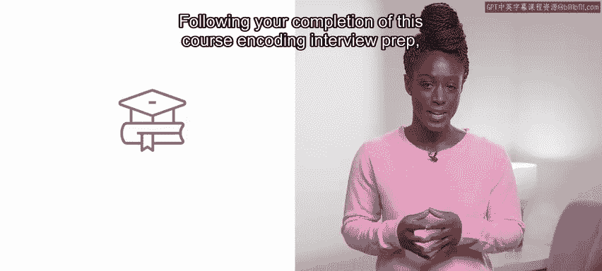
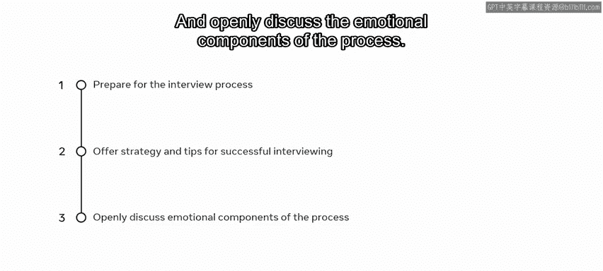
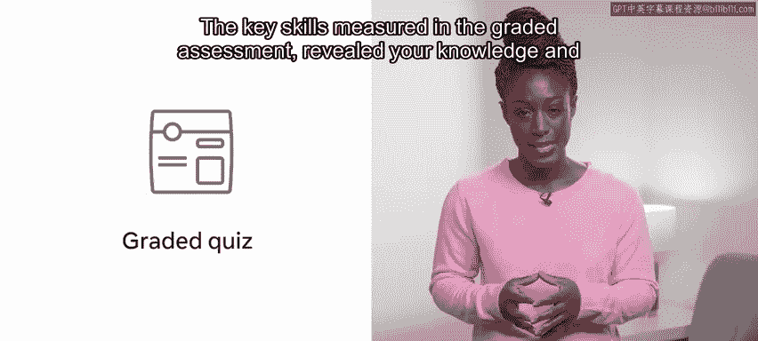
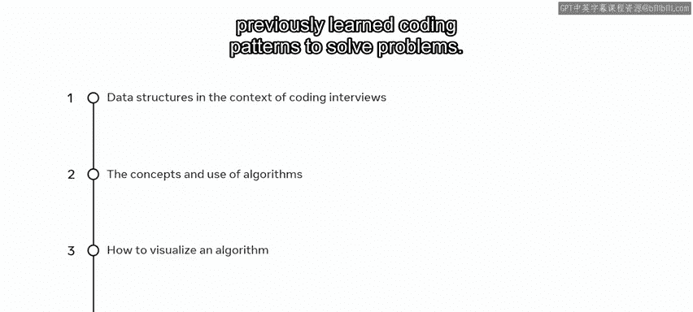
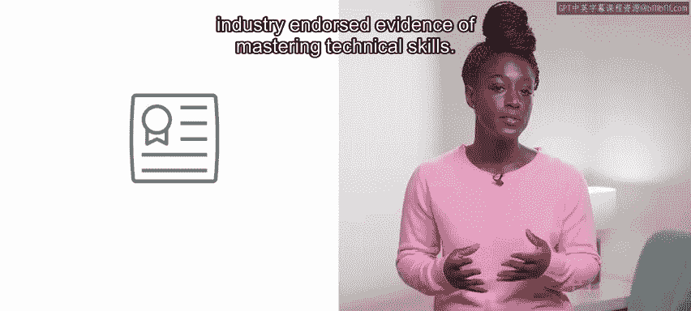

# 前端开发（React/UI、UX/毕业项目/代码评审）：P162：26_课程总结

在本节课中，我们将对编码面试准备课程进行全面的回顾与总结。我们将梳理你已掌握的核心技能，并为你未来的学习和职业发展提供方向。

你已经完成了这门编码面试准备课程。

你付出了巨大的努力，并在此过程中积累了丰富的知识。

你在开发者的成长道路上取得了显著的进步。

现在，你应该已经理解了编码面试独特且具有挑战性的方面。具体来说，你应该已经为面试做好了充分准备，掌握了一些面试软技能，这些技能将帮助你在参加编码面试时从容应对。你还掌握了计算机科学的基础知识以及一些解决问题的方法，可以应对面试中可能遇到的任何挑战。

---

## 课程核心收获

上一节我们回顾了你的整体进步，本节中我们来看看你在具体技能上的收获。

完成本课程后，你现在应该能够：

*   为整个面试流程做好准备。
*   提供成功面试的策略和技巧。
*   开放地讨论面试过程中的情绪因素。

---

## 评估所衡量的关键技能

在分级评估中，以下关键技能衡量了你对知识的理解和掌握程度：

以下是评估中涉及的核心能力领域：

*   **编码面试背景下的数据结构**：理解并应用各种数据结构。
*   **算法的概念与使用**：掌握核心算法思想及其实现。
*   **算法的可视化**：能够通过图示理解算法的执行过程。
*   **结合新旧编码模式解决问题**：灵活运用已知和新的编程模式来应对挑战。

---

## 成就与未来方向

恭喜你，你已经成功完成了本专业的所有课程。在此阶段，你可以考虑注册其他课程、专业或证书路径。

证书是全球公认且行业认可的、掌握技术技能的证明。无论你是刚起步的技术专业人士、学生还是商业用户，你所完成的课程以及作品集中的一系列实践项目都将证明你作为开发者的知识和能力。

这些成就可以用来向潜在雇主展示你的技能。它不仅向雇主表明你具有自我驱动力和创新精神，也充分体现了你个人的特质以及新获得的知识。

到目前为止，你做得非常出色，应该为自己的进步感到自豪。你迄今为止获得的经验将向潜在雇主证明，你积极主动、能力出众，并且不畏惧学习新事物。

---

再次祝贺你完成本课程，并祝你在接下来的学习旅程中一切顺利。

在本节课中，我们一起回顾了整个编码面试准备课程的要点，总结了你在软技能、计算机科学基础、问题解决方法以及具体技术能力上的成长。我们明确了课程评估的核心技能，并为你未来的持续学习和职业发展指明了方向。请带着这份收获与自信，继续你的开发者之旅。