# Meta《前端开发（React／UI、UX／毕业项目／code review）｜Meta Front-End Developer》中英字幕 - P16：15_事件类型.zh_en - GPT中英字幕课程资源 - BV1uJ4m1e7HT

By now you're probably familiar with events in JavaScript。

 recall that events are the process by which JavaScript interacts with HTML and can occur when the user or the browser manipulates a page。

They provide enhanced interactive experiences such as responding to mouse clicks。

 movements or keyboard commands。

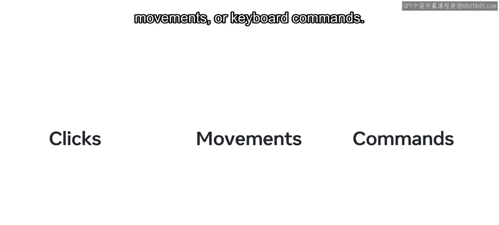

Because events usually rely on some sort of interaction。

 they need to wait and listen in the background for that interaction to occur before they can be triggered。

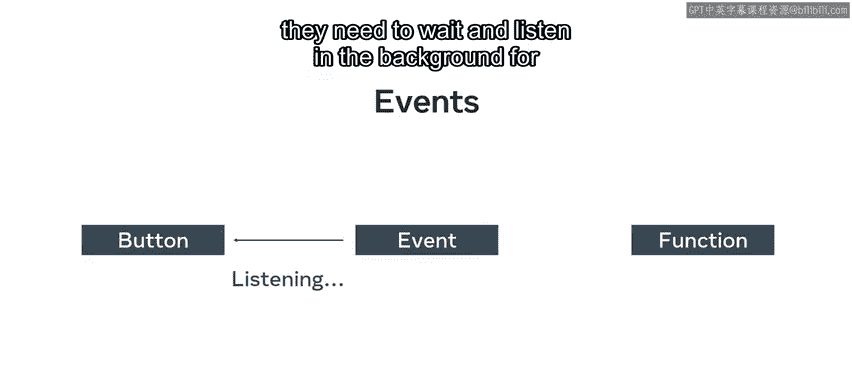

Every HTML element contains a set of events that developers can access by using HTML attributes commonly referred to as event listeners。

For example， it's a common feature of a website or app to have a button that when clicked。

 causes something to happen。

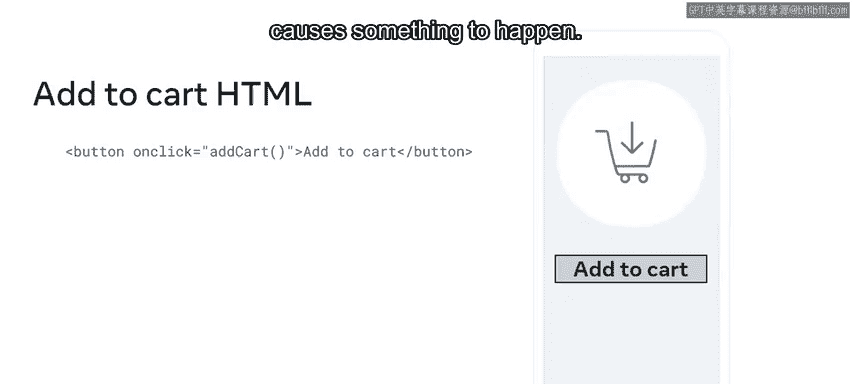

This action is an example of an event and is accomplished with either event listener methods or by defining specific JavaScript functions。

Developers can use events to execute JavaScript code in response to an action based on user interactivity like clicking a button。

 this process by which the HTML button communicates to the JavaScript event handler to execute some code in response to the event action is known as triggering。

For example， you might want to listen for a click event on an add to CAt button once you capture such an event。

 you might want to run some JavaScript code。

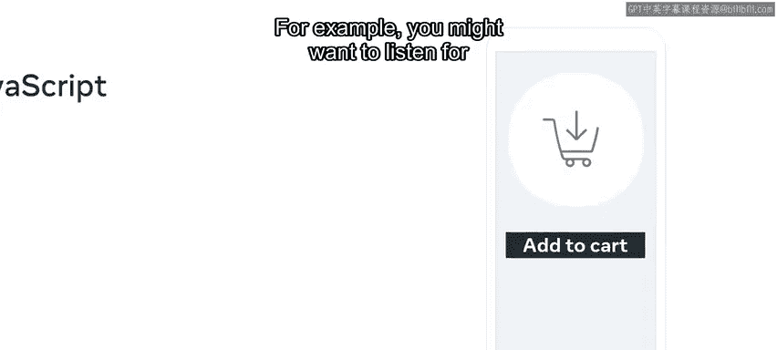

In this example， add a circle with a number one in the shopping cart to indicate one item has been added。

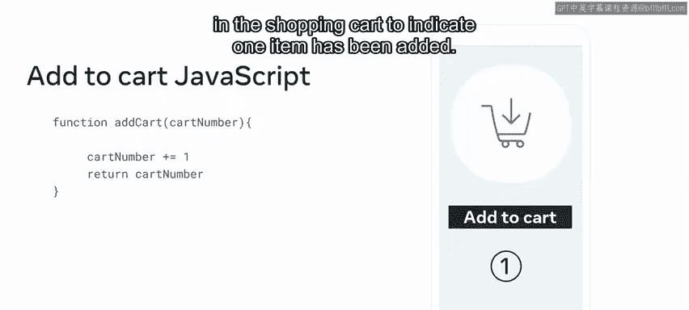

If the same event gets triggered or fired again， our event handling code then handles the event by updating the count in the circle next to the shopping cart icon。

The circle then displays the number two to indicate that there are two items in the cart。

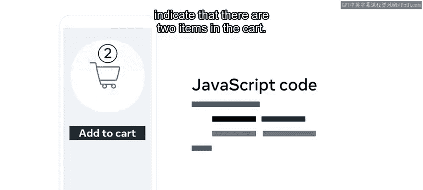

Events are a powerful tool or make up part of the document object model。😡。

As an aspiring react developer， you'll need to know how to work with events as they are handled a bit differently。

By the end of this video， you'll be able to identify the broad types of events available in reactact and describe some of the most commonly used ones。

You'll also know how to explain the event handling process in react at a high level。

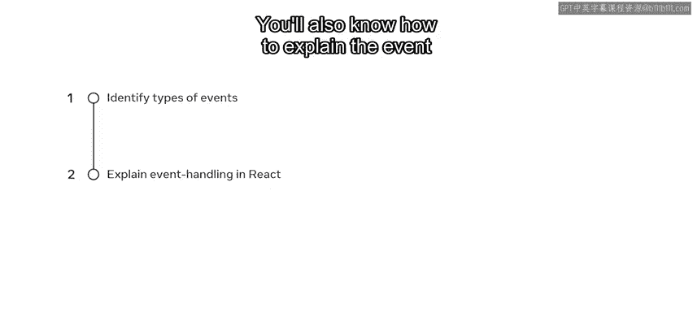

In Re code， events are handled using JSX event attributes。

 which are very similar to HTML event attributes that you may be familiar with。For example。

 the click handling attribute in HTML is the onclick attributes with all the letters lowercase。😊。

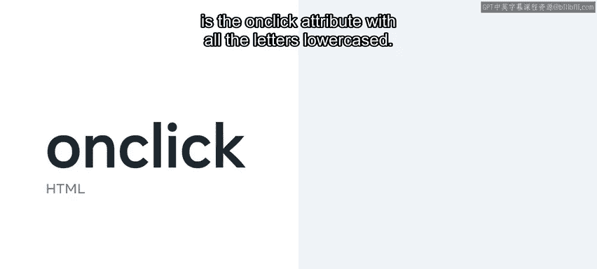

The equivalent click handling attribute in Re JSX is the Caml Caste on the click attribute。

Remember that Caml case means that the first letter is lowercase and the separation of words is indicated with a capital letter rather than a space。

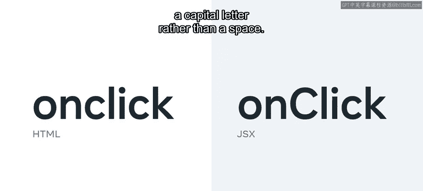

There are many events supported in react， which can be divided into several groups。

Those groups include clipboard events。

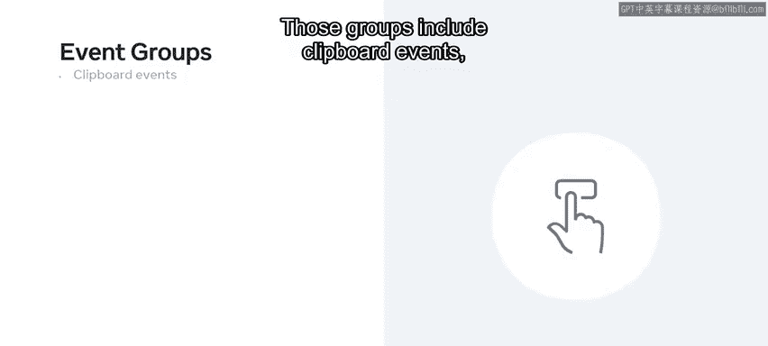

Composition events。Keyboard events and many more。

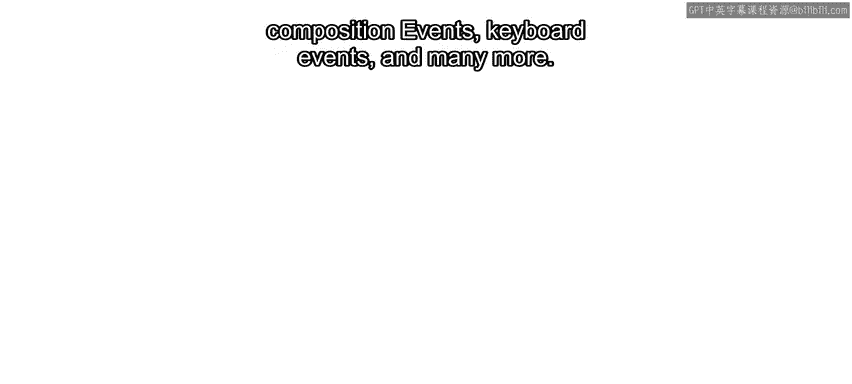

Each group usually holds Moport events for example。

 supported mouse events include oncl on context menu。

 on doublecl and several others you'll also find that the clipboard group has the useful event on copy on cut and on paste There are far too many events to cover here but you can find a complete list in the additional reading。

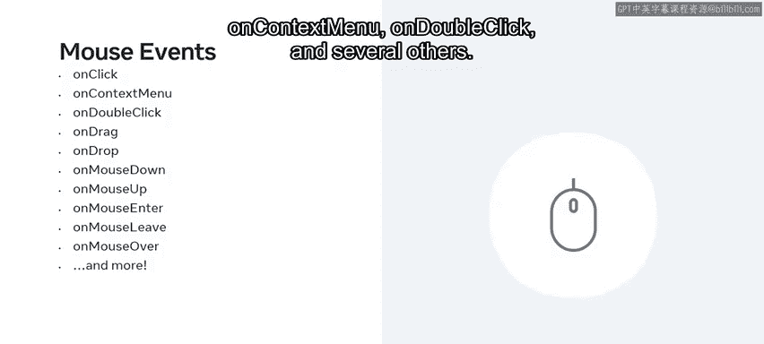

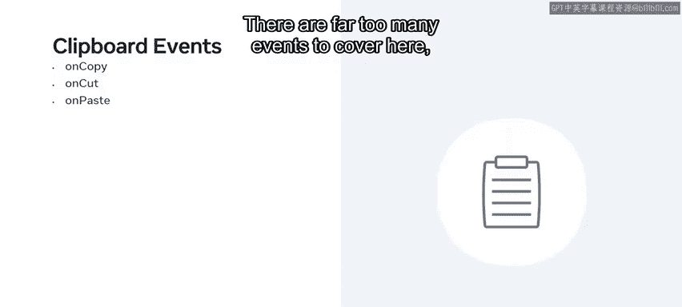

The large number of event types that are accessible in react may seem overwhelming at first。

 but note that it's actually the browser that comes of these features as the various devices that we use to access the internet have given rise to many ways for users to interact with websites This means these events are not specific to react and it's probably not necessary to learn about all of these events。

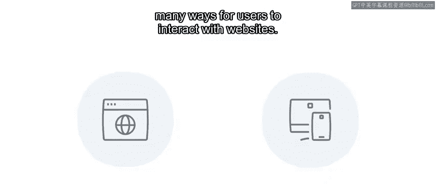

Also， keep in mind that many of these events are related to specific use cases。For example。

 several of the mouse events are limited to the drag and Drop API In other words。

 at this point in your learning journey， your focus should be on understanding the overall event handling process and what capabilities events can open up to you。

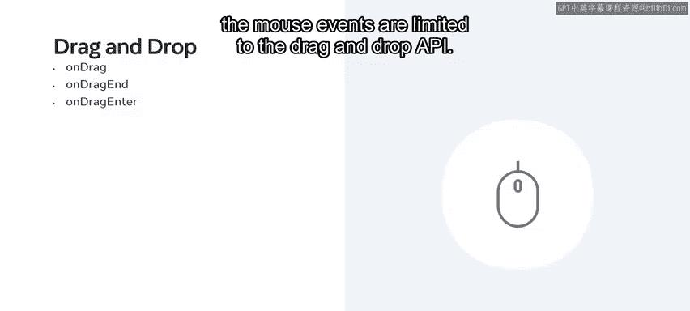

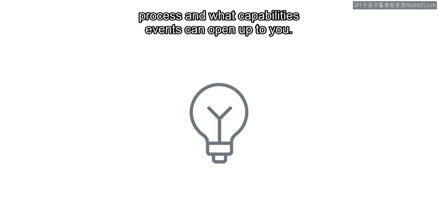

In this video you learned about the types of events available in react and how they came to be Next you'll explore specific examples and build the skills to use events confidently for various situations。

