# Meta前端开发课程：P18：处理程序语法 🎬

在本节课中，我们将要学习事件处理程序在HTML、原生JavaScript以及React中的不同语法和实现方式。理解这些差异对于编写高效、可维护的React应用至关重要。

## 事件处理程序概述

每次你点击或轻触一个按钮、滚动页面或关闭一个无聊的通知时，你都在浏览器中产生事件。为了让这些事件产生实际效果，你需要使用事件处理程序来执行相应的操作。例如，假设你使用一个按钮来打开菜单：点击按钮是**事件**，`onclick`是**事件处理程序**，而打开菜单则是事件触发的**动作**。

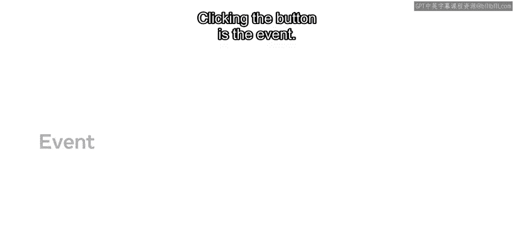

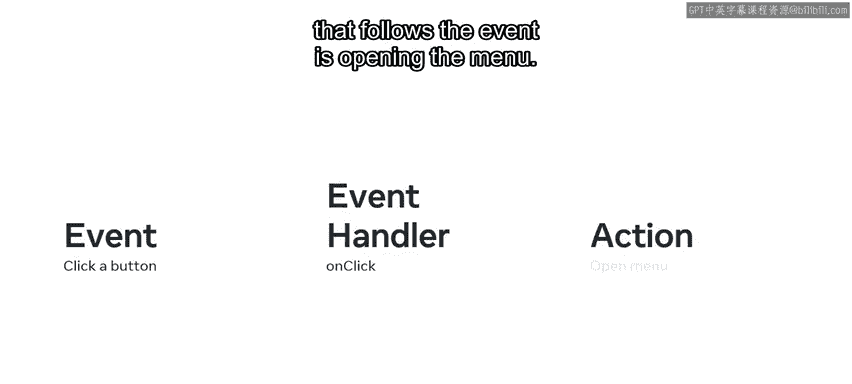

在React代码中添加事件处理程序有几种不同的方法，各有优势，因此你需要熟悉每一种。

## HTML中的事件处理

假设你是一名正在开发React应用的开发者，需要创建一个在用户点击时触发事件的按钮。让我们先看看在纯HTML中如何实现此功能。

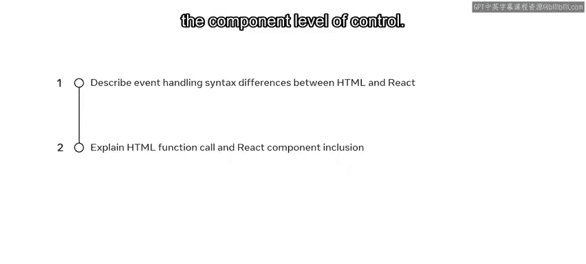

以下是实现此功能的HTML代码示例：

```html
<button id="jsBtn" onclick="clickHandler()">Click Me</button>
```

这段代码包含一个ID为`jsBtn`的HTML属性，以及一个事件处理属性`onclick`。虽然这个HTML代码看起来相当直接，但对于此类场景，更推荐使用JavaScript来处理。原因我们稍后会探讨。

## JavaScript中的事件处理

在原生JavaScript中实现等效功能主要包含两个步骤。

首先，你需要使用JavaScript连接到你想监听事件的特定HTML元素。在上一个例子中，HTML元素是`jsBtn`，这标志着它是允许JavaScript控制HTML结构的目标元素。

其次，一旦你通过JavaScript获得了对HTML元素的访问权，你就可以在`document`对象上使用内置的`addEventListener`方法来附加特定的事件监听器。

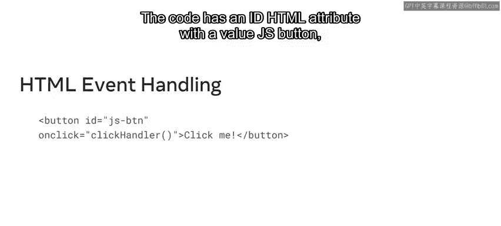

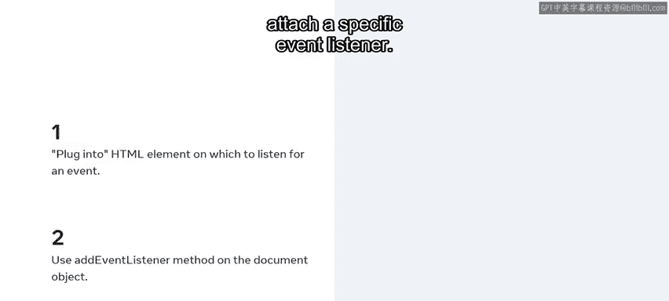

将这个方法应用到之前的例子中，HTML部分被移除了，但代码本身变得稍微复杂一些。

以下是具体的JavaScript代码：

```javascript
const jsBtn = document.getElementById('jsBtn');
jsBtn.addEventListener('click', clickHandler);
```

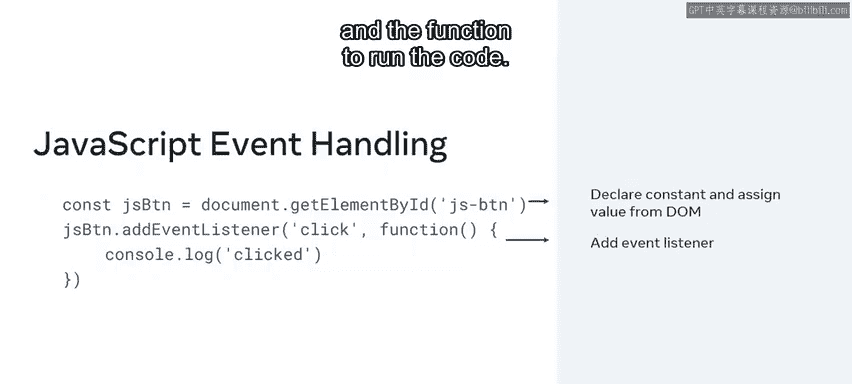

具体来说，你需要先声明一个名为`jsBtn`的常量，并为其分配从DOM获取的值。然后，你需要添加点击监听器事件以及要运行的函数。

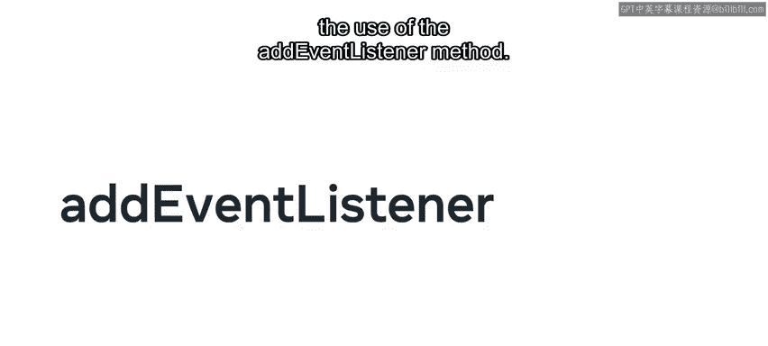

## React中的事件处理

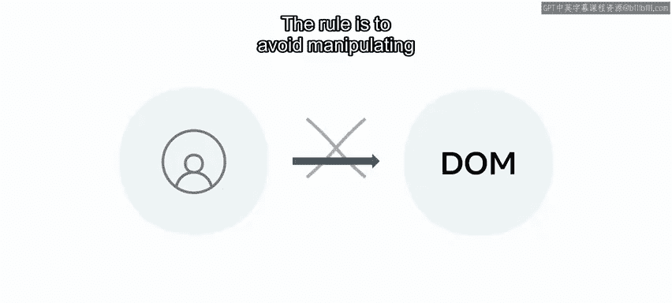


回到React，语法上最大的区别在于**不使用**`addEventListener`方法。

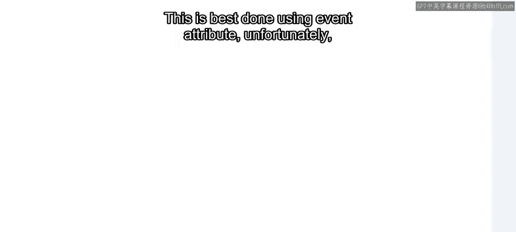

在React中，规则是尽可能避免直接操作DOM。你应该以声明式的方式设置一切，这意味着你向React描述更新，并让它处理其余的事情。

这最好通过使用事件属性来完成。幸运的是，HTML事件属性和JSX事件属性之间存在一一映射关系，这使得学习React事件处理变得更容易。

React中的事件处理总体上与HTML非常相似，但请注意，在React的事件处理属性中**没有函数调用语法**。换句话说，在纯JavaScript中，你需要将一个事件处理函数的**调用**作为值传递给`onclick`事件；而在React中，你**不应该调用**函数，而是只传递对事件处理函数的**引用**。

为了说明这一点，让我们比较一下HTML点击处理事件与其React JSX等效项的语法。

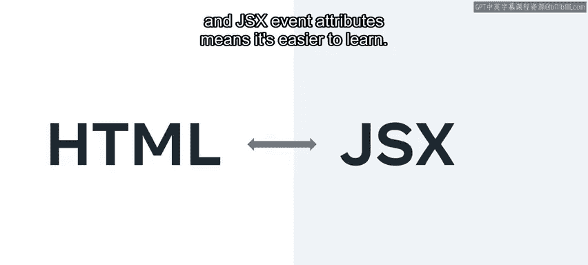

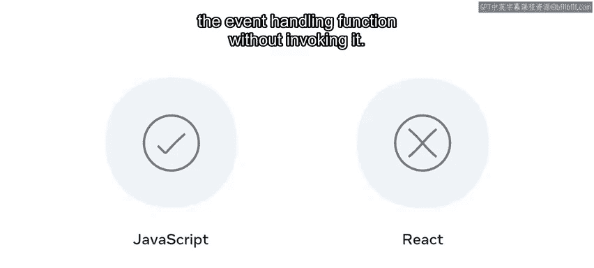

在HTML中，你提供以`on`开头的事件处理属性，并附加事件名称（全小写）。在等号后面，你使用一对双引号，在双引号分隔符内，你**调用**将要运行的函数。

```html
<button onclick="clickHandler()">Click</button>
```

与HTML相反，在React中，你提供以`on`开头的事件处理属性，并附加事件名称，其中每个单词的首字母大写。在等号后面，你使用JSX表达式分隔符（即开头和结尾的花括号`{}`），在花括号分隔符内，你添加要运行的函数的**名称**，确保不要调用它。

```jsx
<button onClick={clickHandler}>Click</button>
```

## 将函数声明作为Props传递

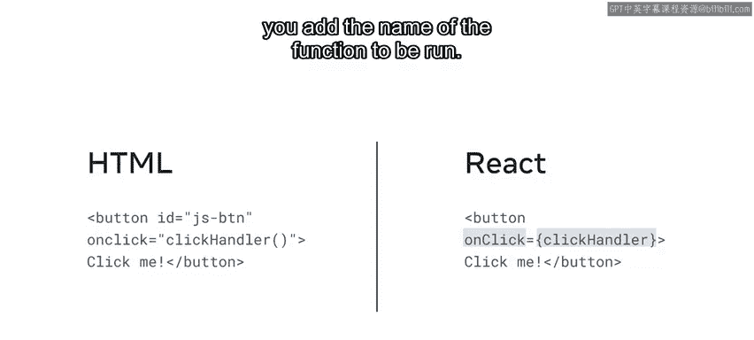

React独有的另一个特性是能够将函数声明作为Props传递。

例如，在一个`App`组件中，假设你想要渲染一个名为`Counter`的子组件。你可以使用一个Prop将一些数据从`App`组件传递到`Counter`组件。在这种情况下，让我们使用一个`onClick` Prop来传递你希望`Counter`组件接收的数据。

```jsx
function App() {
  const handleClick = () => {
    console.log('Button clicked in App');
  };

  return <Counter onClick={handleClick} />;
}
```

## 总结

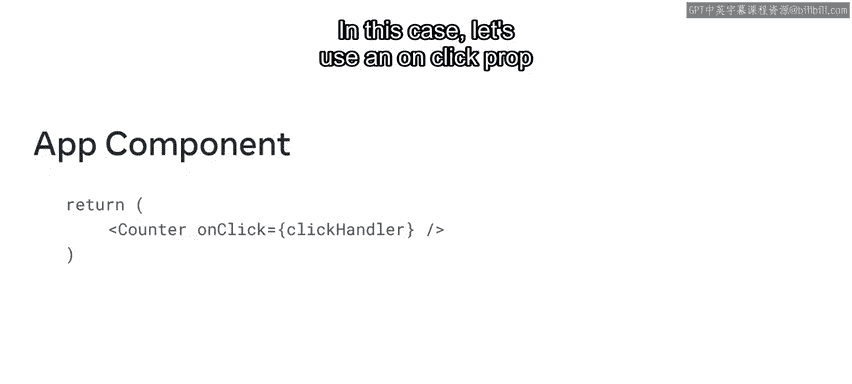

本节课中我们一起学习了如何区分HTML、JavaScript和React中的事件处理语法。你了解了在HTML中直接使用`onclick`属性，在原生JavaScript中使用`addEventListener`方法，以及在React中使用JSX事件属性（如`onClick`）并传递函数引用的方式。记住，React鼓励声明式编程，避免直接操作DOM，这是其事件处理模型的核心思想。下次当你在网页上点击按钮、关闭通知或浏览内容时，你将理解这些事件背后都有某种形式的事件处理程序在支持。