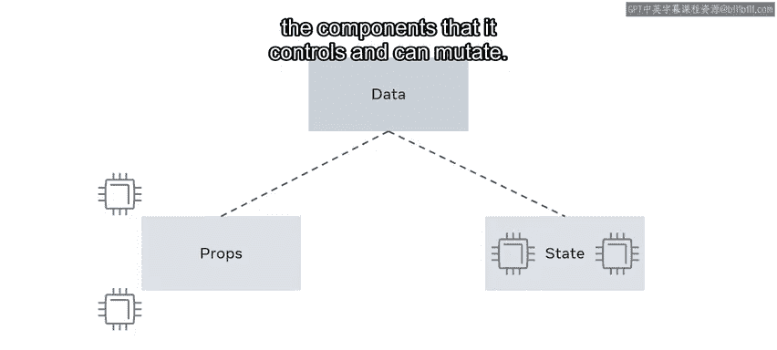
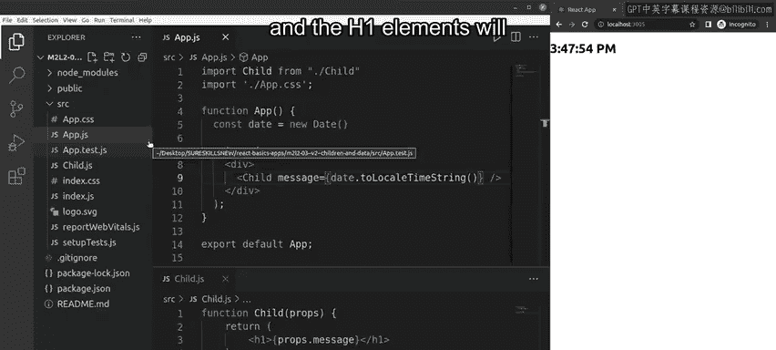

# Meta《前端开发（React／UI、UX／毕业项目／code review）｜Meta Front-End Developer》中英字幕 - P21：20_子组件和数据.zh_en - GPT中英字幕课程资源 - BV1uJ4m1e7HT

In this video， you're going to learn about dataflow in react JS In this case。

 data flow is in one direction only。Immediately， a question springs to mind。

 why is one way flow in react important？Let me tell you。

This type of data flow ensures that the data is moving from top to bottom through the component hierarchy。

It also ensures that changes are transmitted through the system。

You'll cover this in more detail later for now in this video。

 you will also learn how to showcase the use of stateless and stateful examples by focusing on data flow。

😊，Imagine that data is money and that money is controlled by your employer。

This money can be considered props。This money props is passed to you and becomes your money state。

The money props always flow from your employer to you， never in the opposite direction。In react。

 data is passed down from a parent component to a child component via props。

A child component can't mutate or change its props， it can only read them and rerender。

This means that the data comes from the parent and is just consumed in the child component。However。

 if this was always the case， then all you'd have in a react app is separate pieces of the dom。

 acting as component templates to be filled up with the data they receive。😊，While this works great。

 there'd be almost no interactivity。😊，You've learned about passing data to a child's components using props。

However， there's another way to work with data in react components and that data is referred to as state。

All the data in react can be divided into prop data and state data。

Props data is data outside the components that it receives and works with， but cannot mutate。

State data is data inside the component that it controlleds and can mutate it also helps to think of it like this。

The prop data belongs to the parent that renders the component。

The state data belongs to the component itself。To demonstrate this。

 let's open up VS code and work through an example。I've built a new app using createreate React app。

 I have two files created， app。js and childd。js。The app。

js file defines the app components using a class definition instead of a function。When it's created。

 it initializes its state with a current date。😡，The render function then renders a component called childil。

The child component has a prop named message defined and its value is set as the current dates from the component state converted to a string format。

 which includes the hours， minutes and seconds of the date In the Chil。 JS file。

 the component renders the message prop in an H1 element。Now when I run the app。

 the state of the app component flows its data down to the child component props and the H1 element will display the current date and time。

Well done， you have now learned how children and data flows in react JS。

 and you should also be able to showcase the use of stateless and stateful examples by focusing on data flow。

