# Meta《前端开发（React／UI、UX／毕业项目／code review）｜Meta Front-End Developer》中英字幕 - P23：22_什么是状态.zh_en - GPT中英字幕课程资源 - BV1uJ4m1e7HT

Consider the different modes in an alarm clock and the situations you would use them in。

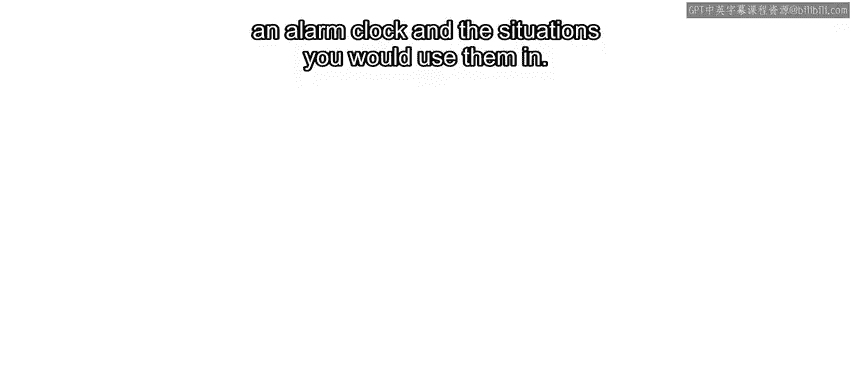

Typically you have alarm on for setting a time to wake up。

 alarm off for when this feature is not needed， and snooze for sneaking in a few extra minutes of sleep。

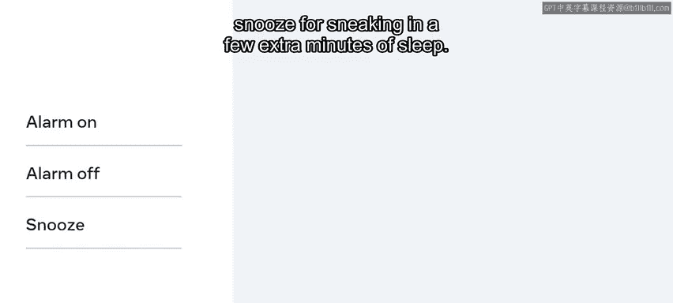

Setting these modes doesn't require adding anything extra to your clock they are built in features that can be set with a push of a button。

If you create this feature in a react app， you could create a component named C and then pass in the status values via props。

Recall that Props is a feature of react that essentially allows you to hold information about the UI in the browser。

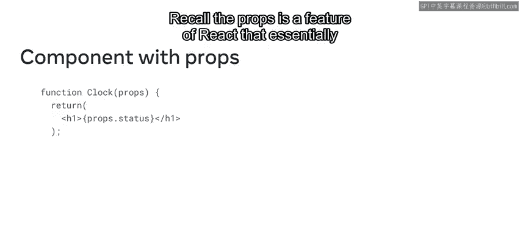

In React you also have another way to do this by using a similar concept called state。

 which also allows you to easily change how the component behaves in order to suit a given need By the end of this video you'll be able to describe what state is in react and why developers use it to control what is displayed in the browser from a component。

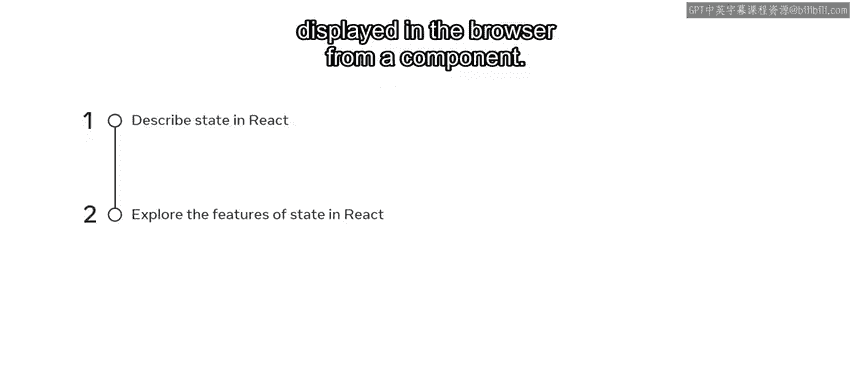

It helps to think of state as a component's internal data that determines the current behavior of a component。

And it's often used to store data that affects the behavior of a component。

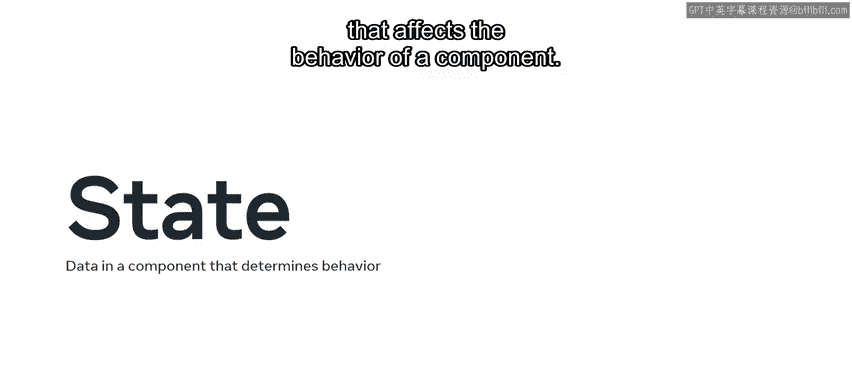

State is important because it allows components to stay in sync with each other and ensure that your app behaves as intended。

😊。

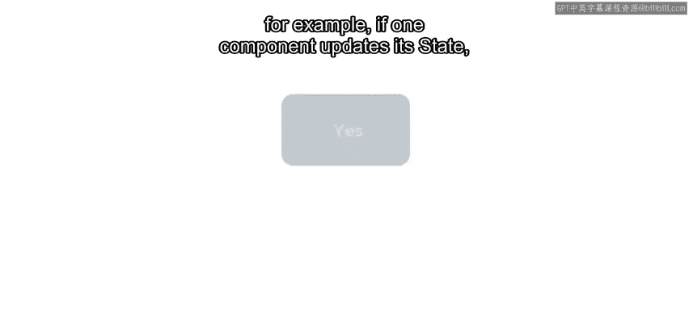

For example， if one component updates its state， all other components that depend on that state will automatically update too。

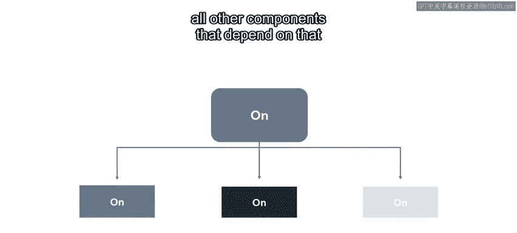

This means that a component sends its state to its children by using props。

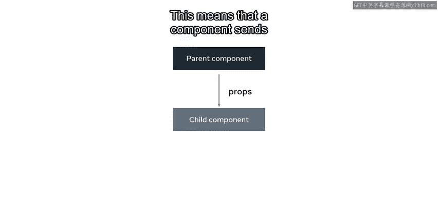

If the child components have their own grandchild components。

 then the child components might have some states that they send us props to those grandchild components。

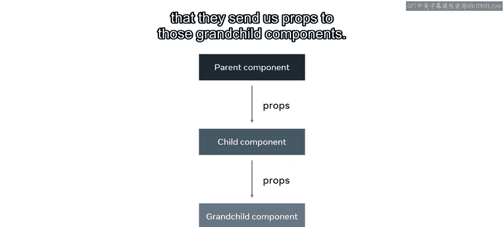

In react， state is kept in a state of variables， the main way to change state is to alter these variables。

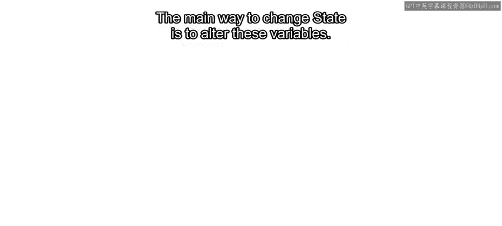

When a component is created， it gets an initial state。

 the state is used to initialize the component's properties。😊。

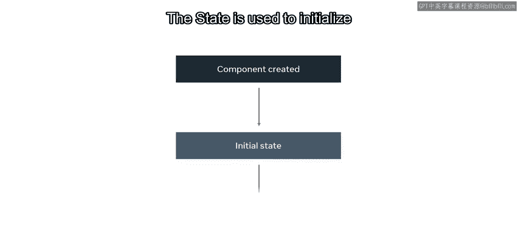

Components can be either stateful or stateless， but what exactly does that mean？

To gain a better understanding， let's explore an example of each。

First is an app component with no state defined。It performs a single action which is to render the text a stateless component。

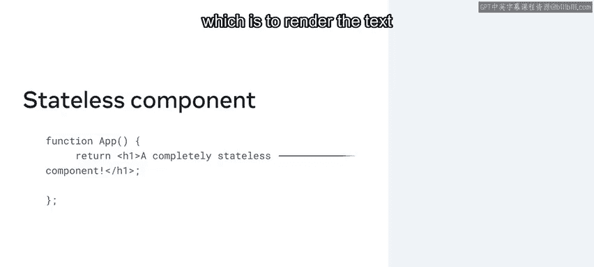

And then you have a stateful function component。

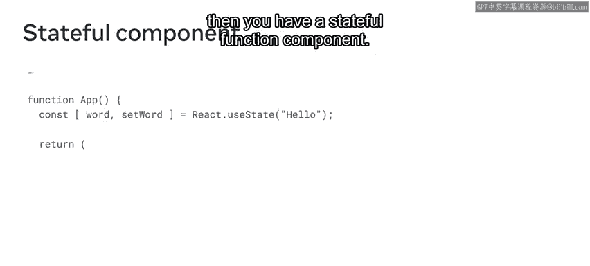

This component also renders some text， but it references a variable to do so。

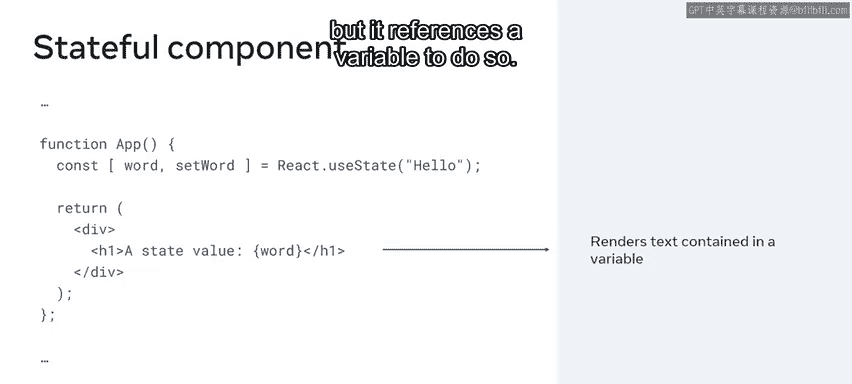

You'll explore how that works a little later for now。

 notice the syntax used in the first line of the apps function body。

If you're familiar with how array de works in plain JavaScript。

 this line of code might already make sense to you， but to make things clear。

 consider an example array called fruitruits， which contains the three strings， apple， pear and plum。

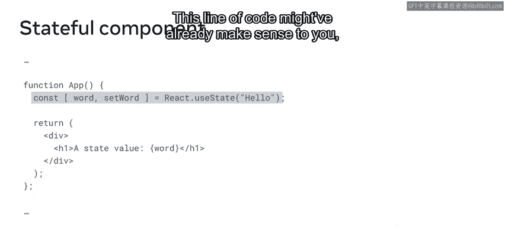

With its ES6 version， JavaScript introduced the concept of array destruct。

 which allows you to assign several variables from the array using a single line of code。

In other words， you can assign apple， pear， and plum to the fruit one。

 fruit two and fruit three variables quickly instead of one at a time。

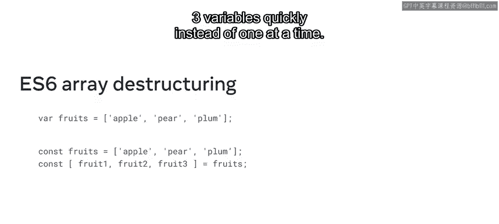

With this in mind， let's come back to that line in the stateful component。

Notice that the syntax used is similar to the array destruct example you just examined。

 but with an interesting bit of code。React dot use state hooks allow developers to hook into some otherwise inaccessible functionality。

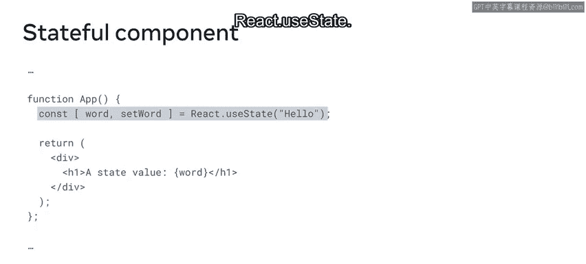

For example， to access the state object， you would use the Use state hook。

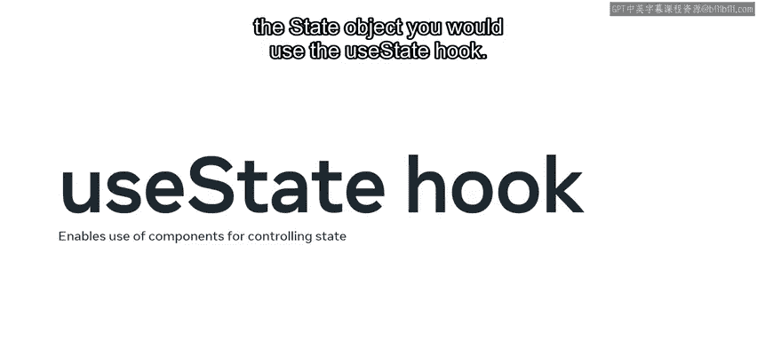

To better understand what is being destructured in the app component。

 let's call a console log to the U State hook。

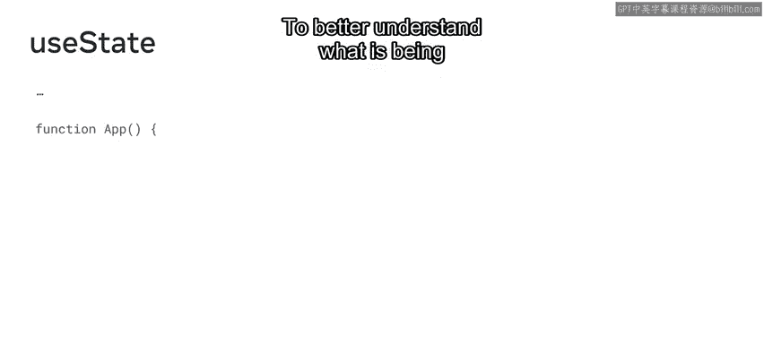

The output reveals an array holding two things， the string hello， and a function。

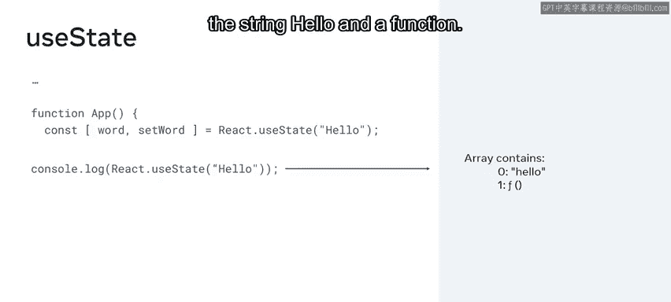

In this case， Hello is the state value assigned to the word state variable the function is a built in one that is not declared。

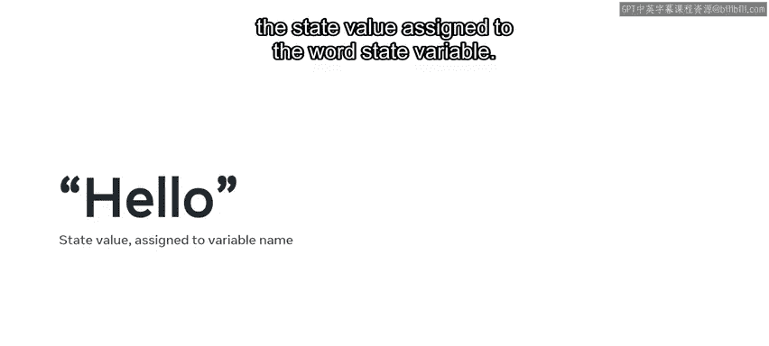

The function can be destructured with any name you'd like， but there is a convention to follow。

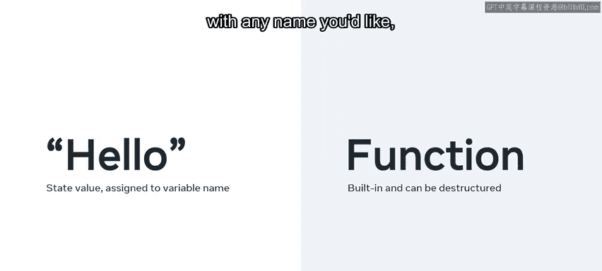

If you set the state's variable name to be greet， then the de structured state function should be set greet This is because the second destructured variable is a function that will be used to update the state of variable。

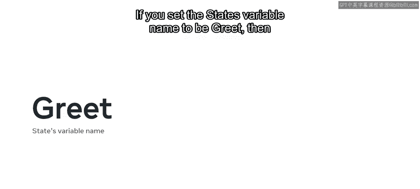

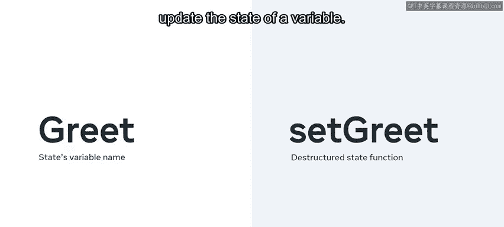

So let's examine an updated version of this stateful function component。😊。

Notice that the set group variable is not actually run， that is something that is done elsewhere。

Later in this course， you'll learn about how you can extend this code with a clickable button to update the state。

😊。

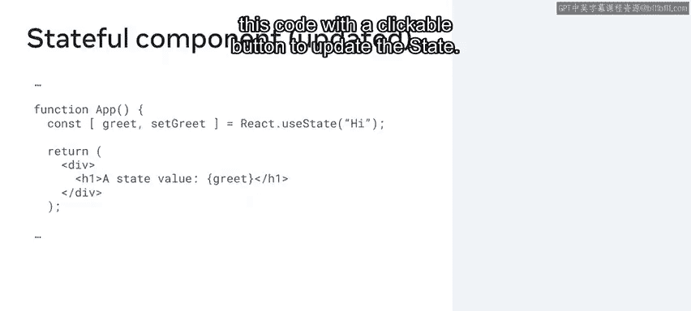

In this video you learned about state in Re， specifically the characteristics of stateful and stateless components in an app。

😊。