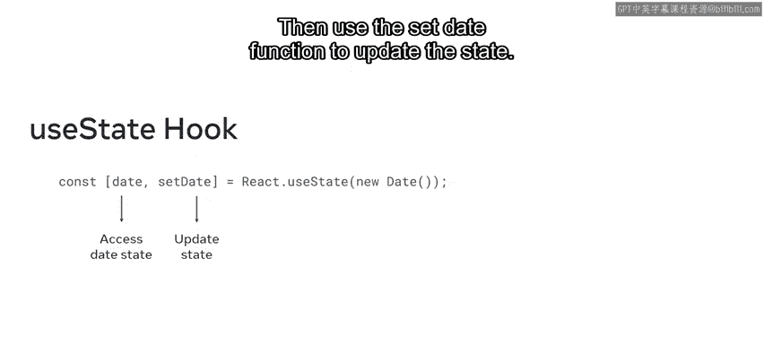
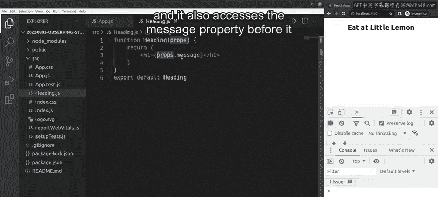

# Meta《前端开发（React／UI、UX／毕业项目／code review）｜Meta Front-End Developer》中英字幕 - P24：23_观察状态.zh_en - GPT中英字幕课程资源 - BV1uJ4m1e7HT

Why do we use state in Re because it's one way to deal with data in our react apps？

State is a powerful tool in react that developers use to manage data that is likely to change in an application。

Recall that the state data is internal to the component itself。

 this allows the component to rerender based on the changes in the state data and present the newest updates to the user。

With that in mind， let's explore how you can update a components with the use state hook that you encountered earlier。

The U state hook allows a component to define and track state。It does this with two arguments。

 the first of which accesses state and the second of which updates it with a function。For example。

 you can use the date variable to access the date state。

 then use the set date function to update the state。

To help you understand how useful the use state hook can be。

 you're now going to explore an example that demonstrate how to use it to observe and manipulate the state of a component。

Let's observe an app that was made for a Mediterranean restaurant called Little Lemon。

It has a header child component which receives the props and the object。

It also accesses the message property before it returns it and renders it as an H1 element。

In the parent app JS component， I import the heading component and I set the word as a state variable set to the string of eat For now。

 I ignore the comment after the eat string。In the return statement。

 I wrapped the heading component in a single div。I pass the message prop of word plus。

 and then in double quote，at little lemon all wrapped in an opening and closing curly brace。

You already know that an opening and a closing curly brace signifies a JSX expression。

 which means that all the code inside of those curly braces will be evaluated as regular JavaScript。

The JavaScriptscript engine takes the word eat and concatenate it to the words at Little Lemon。Thus。

 in the browser window， I get the wordsE at Little Lemon。

If I want to update the value of the word state variable to something else like drink。

 I can use the set word function directly to help me achieve this however。

 when I save the change and run my code the app does not work this is because one can't use the state setting variable from your state directly。

Instead of updating it directly， I can update it based on a click event。😊。

So I have another element called button and on click is equal to handle click。

I now set another function， which I'll name handle click。Inside the handle click function definition。

 I run set Word to drink， I click file saveve All and wait for the app to compile。

Now when I click the click here button， I get drink at Little Lemon。To observe and update state。

 you can use these state setting functions and state variables using the state hook。

 but you must make sure that you use event handling attributes in JSX synyntax or some other approaches。

 which you'll learn more about later。In this video you have learned about state change basics in react。

 including how to apply the use state syntax to observe and manipulate state in components。

 well done。