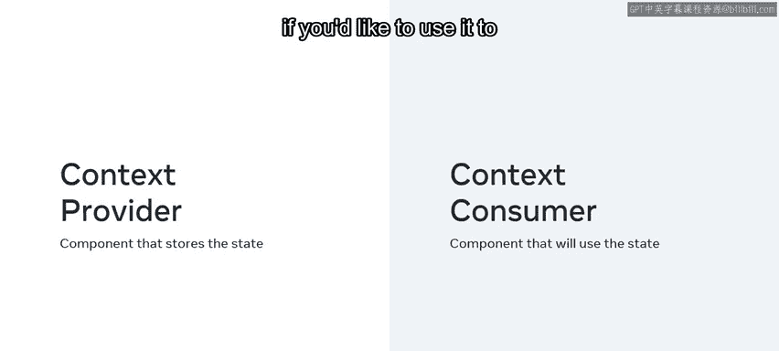
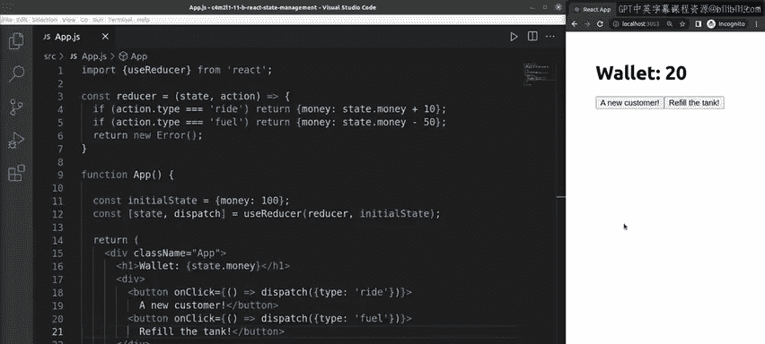

# Meta《前端开发（React／UI、UX／毕业项目／code review）｜Meta Front-End Developer》中英字幕 - P26：25_React 状态管理.zh_en - GPT中英字幕课程资源 - BV1uJ4m1e7HT

During this course， you've probably learned a few approaches for managing states between a parent component and a child component。

But have you wondered how well these approaches still apply for more complex apps with multiple levels of components？

Fortunately， there are tools available to help you do just that。By the end of this video。

 you will understand how context API can be used to manage states more efficiently across multiple levels of components。

You'll also be able to perform basic state management using the Use context and user reducer hooks found in contextt API。

By this point you're probably familiar with the practice of passing state from one component to another by using props。

 while passing props helps to manage state， it is like taking a bus and going through each stop before you get off at the end。

In comparison， using the context API is like teleporting to your destination instantly。

It's a way to bypass the redundant passing of data through multiple levels of components。

Remember that API stands for Ap programming Inter。An API provides a predefined set of ways you can interact with some code。

The contextt API thus provides a streamlined way to work with context in React to set it up。

 you need to add a piece of code that will be your context provider and is also where the state will be stored。

When a component needs to use the state， it becomes a context consumer。

Now let's examine a simple app that utilizes the context API to control state。In my app JS file。

 I'll use some code for a starter setup and you can also find this file in the additional resources if you'd like to use it to practice working with context API。

In the app component， I have import statements for Meals Pro and Mes list。

The mealss provider provides context state data and gives it to all the components it wraps inside the app component。

Currently， it wraps two components， the meals list components and the counter components。

 which are between the div tags of the return statement。

The MEs provide a component holds all the states which is organized with the help of the context API First I set the Me context variable using the reactact dot createate context function。

Next， I declare the Today's meals array， which contains several food items saved as strings。

I then code the meals provider as an ES6 function that accepts the children' value。

This value holds everything that will we wrapped into the Nis provider component when it gets rendered inside the app component。

The children value is just returned from the mealss provider wrapped into the meals context dot provider JSX El。

The Me context dot provider JSX element comes with the value attribute and this value attribute gets assigned to the Me object。

 which is the value I set to the use state variable earlier。

Before exporting the Ns provider component at the bottom of the file。

 I'm also setting the Use Mes list context variable to the React dot Use context call and passing it to the Mes context as its single argument。

This makes it easier for me to destructure the meals object from the use Mes list context variable。

Finally， in the Me list component， I'm accessing the context date by importing the Use Me list context from the Mes Pro file。

Let's break down how this component works in more detail。First。

 I'm destructuring the meals property from the object returned from the use Mes list context call。

The original object has a single property named Me。

 which hold an array of three meal strings Once I destructure the meals property from that object。

 all I have left is the array of three strings saved in the meals variable which allows me to map over the meals value where I'm rendering an H2 for each member of the meals array。

This code is probably more complex than most of what you have encountered。

Don't worry if it takes time for you to understand how it works just remember the important part that this setup gives you a nice starting point for working with the context API。

And lastly， let's examine the counter componentent。

Note that it gets the context data in the same way that the Me list component does。

This is the usefulness of having a centralized state store。

It allows me to simply reach into the state provider directly from whatever component needs it without having to do prop drilling or lifting up state。

Next， let me show you how the use reducer hook works。Let's move on to the Use reducer hook。

You can think of it as a superpowered use state。While the use state hook starts with an initial state。

 the use reducer also gets a reducer function in addition to the initial state。

Let me illustrate that with a code example。Let's say I have a Rshare app that represents the amount of money in my wallet。

The initial state is a value of 100， and the action of picking up a customer increases the value while the action of refueling my vehicle decreases it。

😊，I've applied a reducer function which takes in the state and the action。

Instead of using set states like in the Use state hook。

 I use the dispatch method of the Use reducer hook。

 which accepts an object literal with a single property type。

 set to a matching action dot type whose behavior is defined inside the reducer function Now when I interact with this app in the browser。

 I can increase the money value by clicking the a new customer button or decrease it by clicking the refill the tank button。

In this video， you learned how the use context and use reducer hooks can be used to manage states more efficiently across multiple levels of components。

