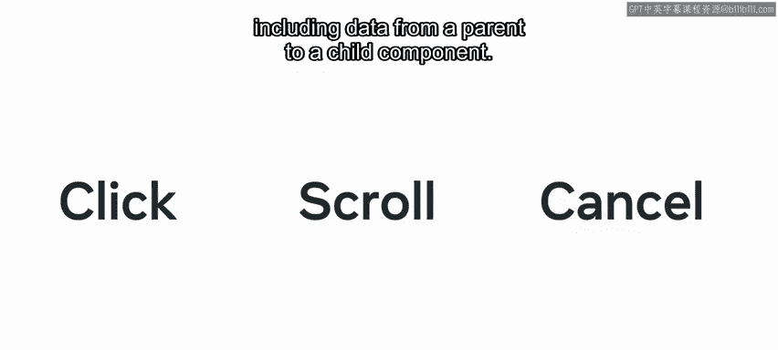
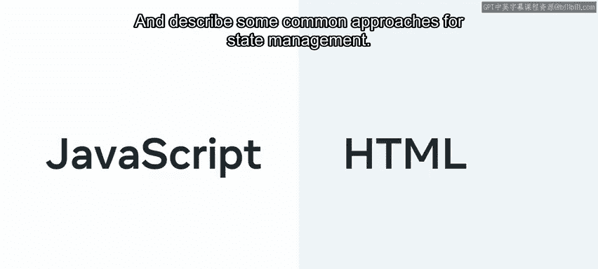
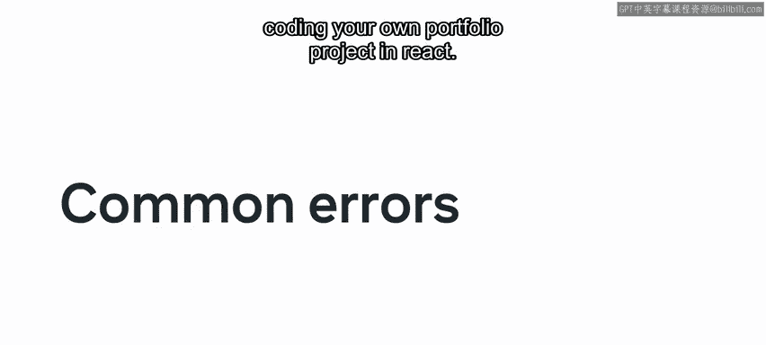
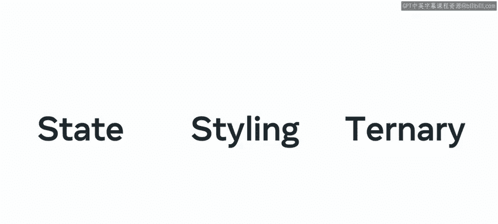
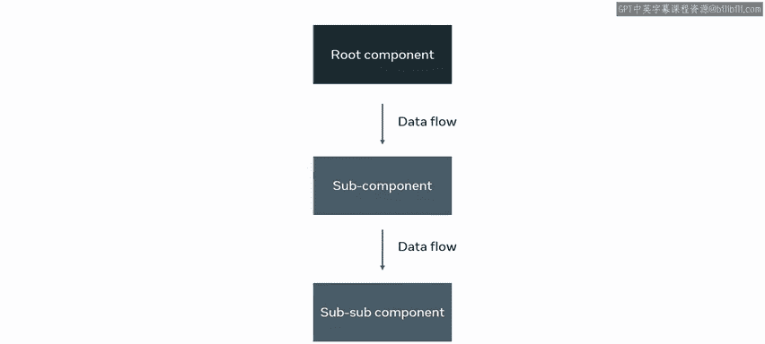
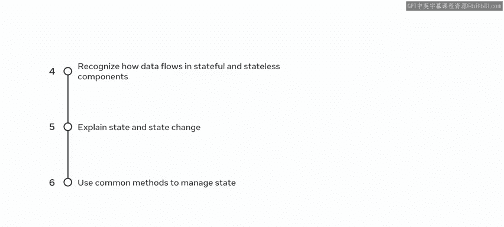

# React 数据与状态：模块总结

在本模块中，我们探讨了 React 中的数据与状态概念。现在，是时候回顾一下你获得的关键知识与技能了。

模块二概述了状态与状态管理的概念及实际应用。在这个过程中，你学习了如何处理事件，以及如何动态更改网页内容。

## 第一课：动态事件及其在 React 中的处理

上一节我们介绍了模块的整体目标，本节中我们来看看第一课的核心内容。第一课是关于动态事件以及如何在 React 中处理它们。

你现在知道，每次点击或轻触按钮、滚动页面时，浏览器都会产生事件。事件是 JavaScript 与 HTML 交互的桥梁。你学习了如何识别事件类型，以及如何使用组件来处理它们。

React 可以处理大多数与 HTML 相同的事件，但 React 的处理方式有所不同。这意味着在运行事件驱动的 React 代码时，你可能会遇到不熟悉的错误。因此，你学习了与事件相关的常见错误及其处理方法。你还学习了在 HTML 和 React 中使用事件处理程序的语法差异，以便能够使用不同类型的语法编写事件处理代码。

另一个重要主题是 React 事件处理程序中嵌入表达式的不同方式。以下是几种主要方法：

*   使用内联匿名 ES5 函数。
*   使用内联匿名 ES6 函数。
*   使用单独的函数声明。
*   使用单独的函数表达式。

之后，你继续学习了所有事件处理概念如何与状态、样式以及三元表达式的使用协同工作。为了测试你处理动态事件的技能，你完成了一个不计分的实验，通过构建一个简单的猜数字游戏来练习事件处理。

第一课到此结束。

## 第二课：数据与事件

在模块的这一部分，你学习了 React 的数据流层次结构，即数据如何从父组件流向子组件。

React 数据流是单向的。它从根组件开始，可以流向多个嵌套层级，从根组件到子组件，再到孙组件，依此类推。

这种数据流确保了数据通过组件层次结构自上而下移动。它也确保了变化能够在系统中传递。

接下来，你学习了状态及其与组件行为的关系。React 中的所有数据可以分为 **props 数据**和 **state 数据**。

*   **Props 数据** 是组件外部接收并使用的数据，组件不能改变它。
*   **State 数据** 是组件内部控制的数据，组件可以改变它。

跨组件跟踪状态可能很困难，这正是 React Hooks 的用武之地。Hooks 是函数。Hooks 的一个关键好处是解决了跨组件不必要的代码重复问题。例如，你可以使用 `useState` Hook 来跟踪任何类型的数据，它可以是字符串、数字、数组、布尔值或对象。Hooks 的最大好处是为代码提供了可读性和简洁性。

你还学习了一些常见的状态管理方法。例如，如何使用 Context API 来更高效地跨多个组件层级管理状态。你学习了如何使用 Context API 中的 `useContext` 和 `useReducer` Hooks 来执行基本的状态管理。

此后，你了解了有状态组件和无状态组件，并学习了如何根据给定需求选择最佳类型。

*   **有状态组件** 将状态作为内部数据持有，其状态会根据应用的构建方式（通常是用户操作的结果）而改变。
*   **无状态组件** 不存储状态，任何更改都必须通过 props 继承。

你学习了一些规则来决定组件应该是无状态还是有状态：

*   当你的组件不需要维护自身状态即可工作时，使用无状态组件。
*   当你的组件需要维护自身状态才能工作时，使用有状态组件。

最后，你完成了一个不计分的实验，测试了你在 React 中管理状态的能力。

## 模块总结与展望

完成本模块后，你现在能够：

*   识别与事件相关的一些常见错误，并使用处理它们所需的语法。
*   使用事件动态更改网页内容。
*   解释 React 中数据的层次化流动。
*   识别数据在有状态和无状态组件中的流动方式。
*   解释状态和状态变化的概念与本质。
*   使用常见方法在 React 中管理状态。

在接下来的模块中，你将学习如何处理链接和路由，以及在 React 中使用资源。这将为你最终使用 React 编写自己的作品集项目做好准备。

非常棒，你在成为 React 开发者的道路上取得了巨大进步。