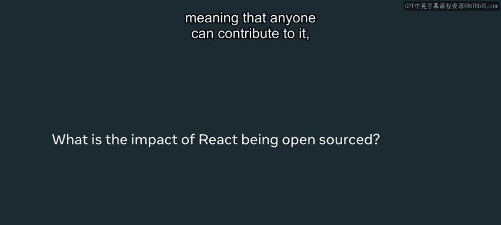
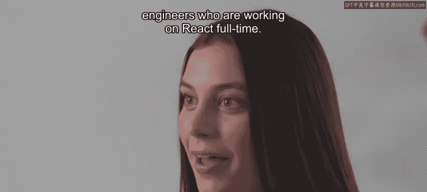
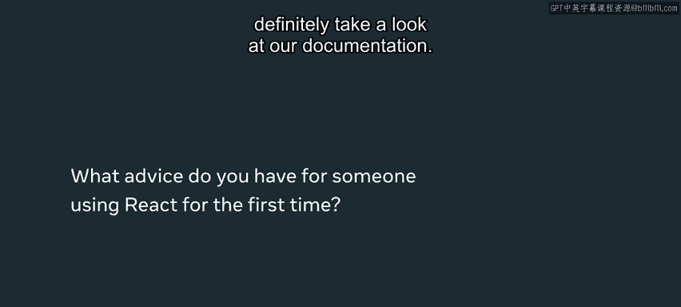

# Meta《前端开发（React／UI、UX／毕业项目／code review）｜Meta Front-End Developer》中英字幕 - P2：1_现实世界中如何使用 React.zh_en - GPT中英字幕课程资源 - BV1uJ4m1e7HT

My team uses Re and we use a lot of new and experimental features that the reactact team is building Facebook。

com is like a demonstration of all the new and cool features that react engineers are working on so when we rewrote the website we were actually using a lot of like unreleased features and kind of experimenting with a lot of new things that the react team is building which was really cool to kind of use it first。

Yeah。My name is Katie and I'm a software engineer on the reactact App team at Meta and we work on building a variety of new features for Facebookbook。

com There are plenty of reactbased apps that you've probably used before。

 Facebook and Instagram are two examples but Netflix， Airbnb。

 New York Times and a variety of other companies also use React for their websites as well so you've likely encountered it before。

These websites that tend to have really interactive UIs are more likely to be using something like React。

So Facebook do com had become really not performant and not modern looking After like the 10 or so years that we had been using it。

 we had squeezed all of the performance wins that we could out of Facebook do com。 So really。

 the only option at that point was to rewrite it on a different stack that was going to be a lot faster and a lot easier to build on。

 Basically， there was a need for having a really fast and responsive UI and react fills all of those needs。

 So this was like kind of like a shift in。😊，Thinking differently about how we build on web。

We actually rewrote our website a couple years ago to be completely react and so every engineer who's writing for Facebook co at metata is pretty much using react。

 I was there for like the middle of it to finally launching it So it was cool that a little bit of it was already written and we were getting prepared to show it to like real users I think like 40 engineers on our team were all working on building out this MVP of the redesigned Facebook co and we would work with a variety of product teams to get them to also rewrite their product on our new stack as well。

 I was a really big effort and it was also a really big risk。

 not all the teams that we talked to thought that we could ship this new version of Facebook co so we really had to prove that it was faster it obviously looked more modern but we had to prove that it would really help these product teams deliver the best version of their product that they could on web So react is open source meaning that anyone can contribute to it and those engineers。

are working fulltime on react but we also have developers who are at meta who are also contributing to react and that means that there's a really strong community around react and a lot of people are really excited to build on it and make improvements to it so if you ever have any questions or you have an idea about a certain feature or optimization or improvement there's really like a great opportunity to actually contribute to the react library itself so there's a react team at meta and this team is comprised of engineers who are working on react full time but there's also a group of developers outside of metata who are contributing to react as well I think the open source part of it is really cool just because there's such a community around react it's constantly being updated and maintained and there's always going to be someone available to like answer questions or to update documentation it's very current。

If you're using React for the first time definitely take a look at our documentation。

 there are a lot of conversations being had about Re online and we actually have our reactact conference every year where we talk about new features with React and you can just connect with a lot of react developers so there are plenty of opportunities to get involved in the react community and I think it makes building with Re even more rewarding if you kind of connect with the community as well。

