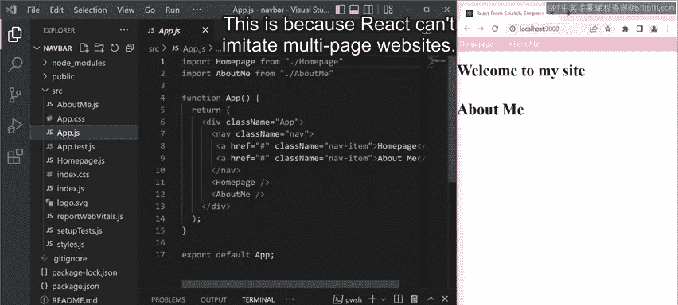
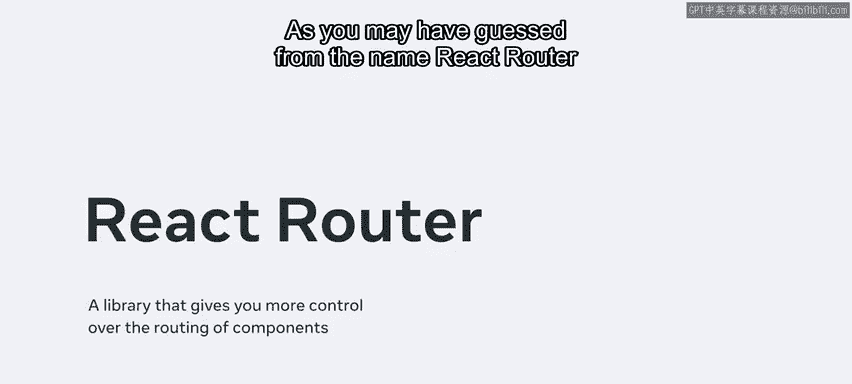
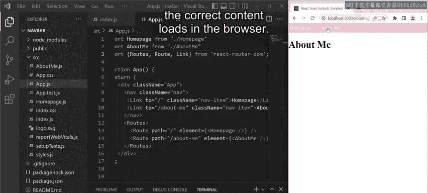
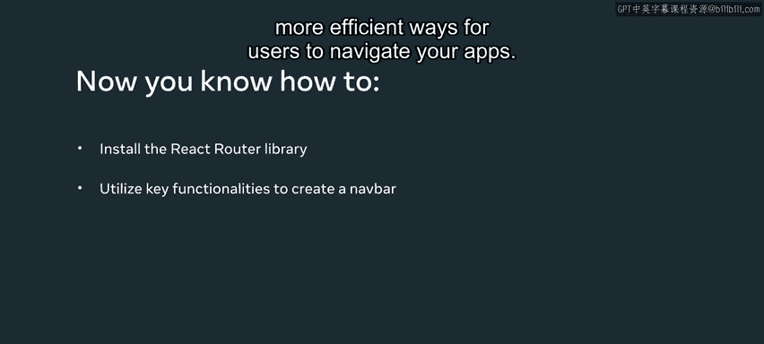

# Meta前端开发课程：P30：29_导航栏 🧭

在本节课中，我们将学习如何安装和使用 React Router 库，为你的 React 应用设置基本的导航功能。你将学会创建导航栏，并实现不同页面组件之间的切换。

---

## 概述

React 默认不支持多页面应用的路由功能。为了实现类似传统网站的多页面导航体验，我们需要借助一个名为 **React Router** 的第三方库。本节课将指导你完成 React Router 的安装，并利用其核心组件构建一个基础的导航栏。


## 检查初始应用

首先，我们来查看一个已经准备好的初始应用。这个应用包含两个组件：`HomePage` 和 `AboutMe`。


目前，`HomePage` 组件在页面上显示标题文本 “Welcome to my site”。`AboutMe` 组件则显示标题文本 “About me”。这两个组件都是 `App` 组件的子组件。

注意，`HomePage` 和 `AboutMe` 都被导入到 `App` 组件中，并使用 `<a>` 标签进行引用。然而，仅使用默认的 React 库，这些锚点标签无法按预期工作，因为 React 本身无法模拟多页面网站的行为。

## 安装 React Router

为了让导航生效，我们需要借助 **React Router** 库。顾名思义，React Router 为你提供了对组件路由的更多控制权。

我将使用 npm 命令来安装它：





```bash
npm i react-router-dom@6
```


为了确认安装成功，可以检查 `package.json` 文件。你会在 `dependencies` 部分找到一个新的条目：`"react-router-dom": "^6.3.0"`。

## 配置路由

现在 React Router 已经安装完毕，我们可以开始修复那些失效的链接了。

首先，访问 `index.js` 文件，并添加一条导入语句来引入 `BrowserRouter`：

```javascript
import { BrowserRouter } from ‘react-router-dom’;
```

导入之后，需要将 `App` JSX 元素包裹在 `<BrowserRouter>` 标签内：

```javascript
<BrowserRouter>
  <App />
</BrowserRouter>
```

完成这一步后，让我们回到 `App.js` 文件。在这里，我们需要从 `react-router-dom` 导入 `Routes` 和 `Route`：

```javascript
import { Routes, Route } from ‘react-router-dom’;
```

接着，需要用不同的代码替换原有的子 JSX 元素。以下是具体的步骤：

以下是配置路由的步骤：

1.  **配置首页路由**：将 `HomePage` 组件替换为 `<Route path=“/” element={<HomePage />} />`。注意，`<Route>` 标签是自闭合的，内部没有子元素。
2.  **配置“关于我”页面路由**：添加类似的一行代码，但在路径的斜杠后加上 `about-me`：`<Route path=“/about-me” element={<AboutMe />} />`。
3.  **包裹路由**：这两行代码需要被包裹在 `<Routes>` 标签内。

现在，如果我打开浏览器并输入其中一个路由的确切链接（例如 `/about-me`），我将只看到导航栏下方显示 `AboutMe` 组件的内容。反之，如果我从 URL 中移除 `about-me`（即打开由单个斜杠 `/` 表示的根路由），那么导航栏下方将显示来自 `HomePage` 组件的文本。

请注意，我通过将所有的 `<Route>` 包裹在 `<Routes>` JSX 元素中来对它们进行分组。同时，`<nav>` 标签位于 `<Routes>` 标签之外，这意味着导航栏独立于路由内容之外。

## 将锚点标签替换为 Link 组件

最后，我们需要将 `<a>` 标签替换为 React Router 的 `<Link>` 组件。这能确保点击链接时加载正确的组件，而不是简单地刷新整个页面。

因此，在 `App` 组件中：

*   首页的 `<a>` 标签变为：`<Link to=“/” className=“nav-item”>Home</Link>`
*   “关于我”页面的 `<a>` 标签变为：`<Link to=“/about-me” className=“nav-item”>About Me</Link>`

同时，需要从 `react-router-dom` 导入 `Link` 并保存更改：

```javascript
import { Link } from ‘react-router-dom’;
```

现在，当我点击导航栏中的任何一个链接时，浏览器中就会加载正确的内容。




## 总结

在本节课中，我们一起学习了如何安装 React Router 库，并利用其关键功能（如 `BrowserRouter`、`Routes`、`Route` 和 `Link`）来创建一个可工作的导航栏。你现在已经掌握了为用户提供应用内导航的基础方法，为学习更高效的导航模式做好了准备。



