# React 前端开发：P31：条件渲染 🎬

在本节课中，我们将要学习 React 中的一个核心概念——条件渲染。你将了解如何根据应用的状态或特定条件，动态地决定在用户界面上显示哪些组件。

---

现在你应该已经熟悉 React 能够动态改变网页内容这一概念。

例如，你已经发现，当一个 React 网站从主页文本切换到“关于我”文本时，它并非跳转到一个新页面，而是在渲染一个组件的同时停止渲染另一个组件。

虽然这很有用，但你需要给 React 非常具体的指令，告诉它应该渲染什么以及何时渲染。当你的组件需要响应诸如点击之类的事件时，这可能会增加另一层复杂性。

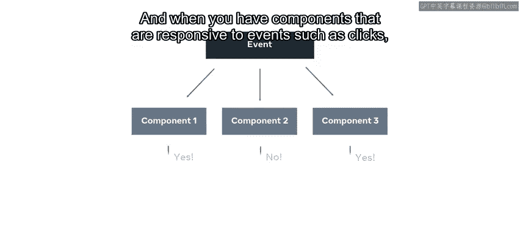

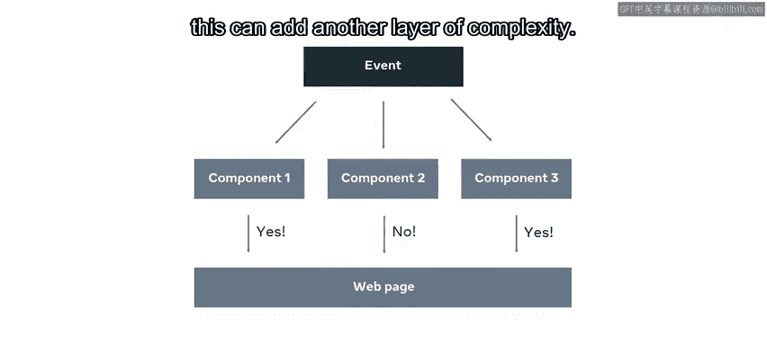


幸运的是，有几种编写逻辑的方法可以确保这个过程顺利进行，并减少你的工作量。

在本视频结束时，你将从高层次理解条件渲染，并知道如何使用三元运算符来设置它。

---

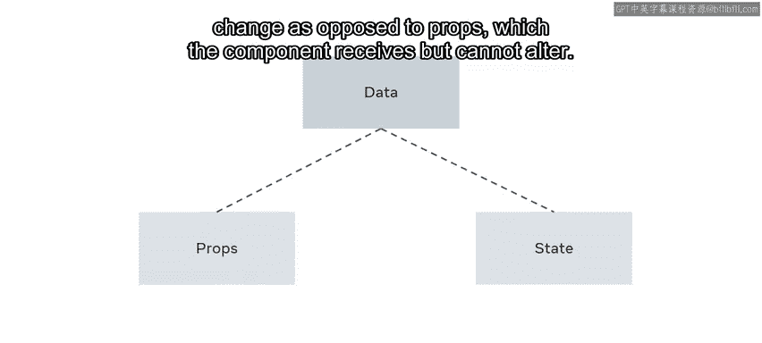

## 状态与条件渲染

上一节我们提到了动态渲染的概念，本节中我们来看看实现它的基础——状态。

回想一下，**状态** 是一个组件的内部数据，该组件可以控制或更改它；而 **属性** 则是组件接收但无法更改的数据。


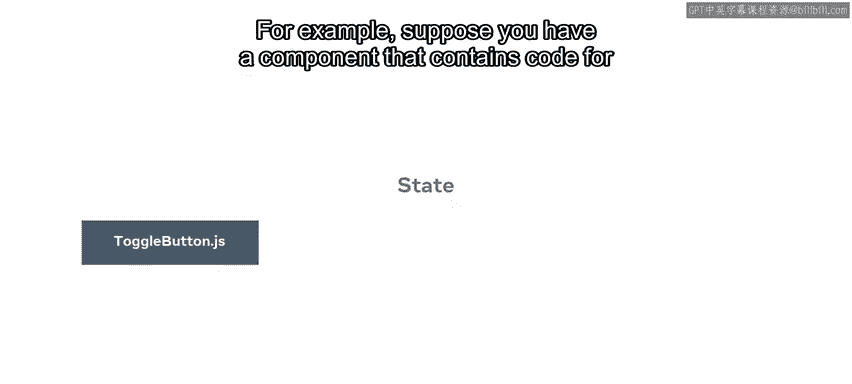

在应用中，你可以根据特定状态数据是否具有特定值，来有条件地渲染组件。

换句话说，当你在主应用组件中编写渲染逻辑时，你需要引用其他组件的状态。

例如，假设你有一个组件，其中包含一个用于显示侧边栏的按钮代码。

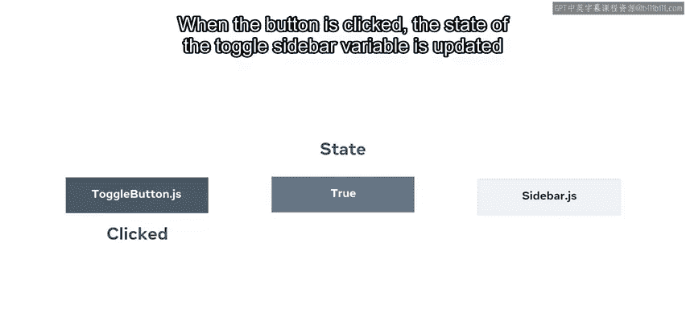


该按钮控制着 `toggleSidebar` 变量的状态，其初始值设为 `false`。当按钮被点击时，`toggleSidebar` 变量的状态被更新为 `true`，侧边栏组件随之显示。


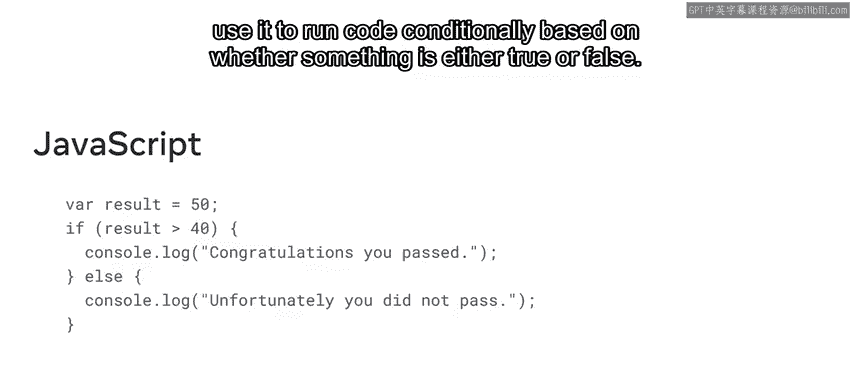

为了实现这一点，React 利用了 JavaScript 中已有的条件概念和语法。

---

## 使用三元运算符


我们已经了解了状态如何驱动渲染，现在让我们看看实现条件渲染的一种简洁语法。

例如，回想一下 JavaScript 中的条件 `if` 语句，开发者用它来根据某条件是真是假，有条件地运行代码。


为了演示条件渲染的实际应用，我们首先考虑一个示例生产力应用。

根据访问时设备的日期，该应用会显示两条消息中的一条：在工作日，消息显示“完成任务”；在周末，则显示“好好休息”。

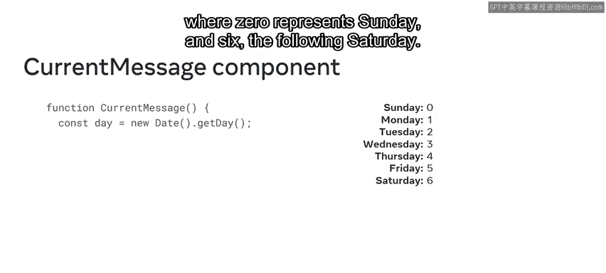


作为开发者，你有几种方法可以在 React 中实现此功能。但在本视频中，你将重点学习使用 **三元运算符** 来编写简化的 if-else 条件。

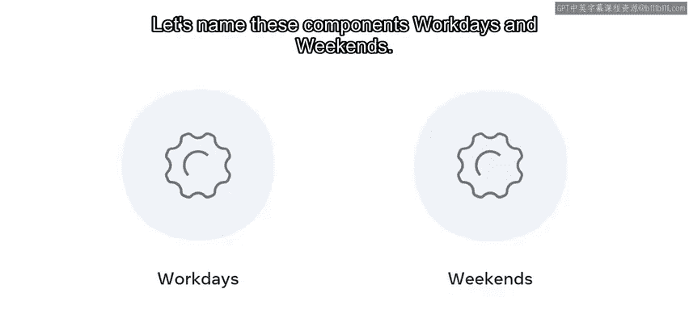

以下是实现步骤：

1.  首先，创建一个名为 `CurrentMessage` 的组件。该组件使用 JavaScript 内置的 `Date` 函数和 `getDay` 方法，将星期几存储为一个数字，其中 0 代表周日，6 代表下周六。
    ```javascript
    const day = new Date().getDay(); // 返回 0（周日）到 6（周六）的数字
    ```
2.  接下来，创建两个组件，分别包含要显示的一条消息。我们将这些组件命名为 `Workday` 和 `Weekend`。
    ```javascript
    function Workday() {
      return <h1>Get it done!</h1>;
    }
    function Weekend() {
      return <h1>Get some rest!</h1>;
    }
    ```
3.  `CurrentMessage` 组件需要根据 `getDay` 函数调用返回的值，来渲染相应的组件。

    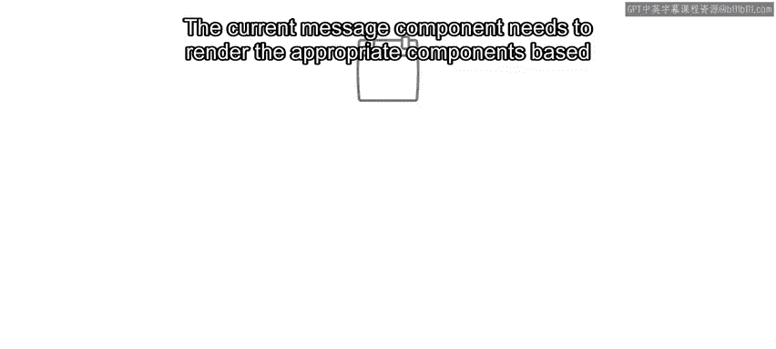


让我们设置条件来实现这一点。

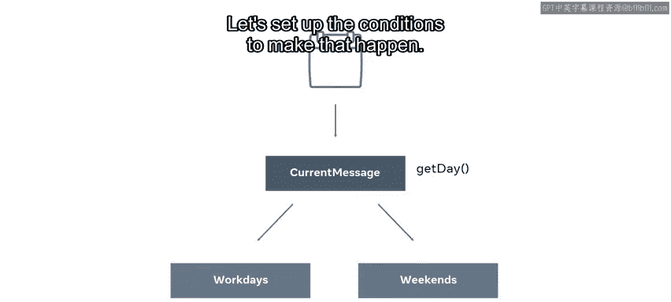


回想一下，三元运算符接受三个部分：

*   **条件**：在本例中，使用逻辑与运算符 `&&`。该条件检查 `day` 变量中存储的值是否大于等于 1 且小于等于 5（即周一至周五）。
*   **问号符号 `?`**：后面跟着如果条件评估为 `true` 时要执行的表达式。在本例中，渲染 `Workday` 组件。
*   **冒号符号 `:`**：代表如果条件评估为 `false` 时要执行的代码。如果发生这种情况，则渲染 `Weekend` 组件。

在条件中使用逻辑与运算符意味着两个表达式都必须返回 `true`，才能渲染 `Workday` 组件，否则将渲染 `Weekend` 组件。

```javascript
function CurrentMessage() {
 const day = new Date().getDay();
 return (
   <div>
     {day >= 1 && day <= 5 ? <Workday /> : <Weekend />}
   </div>
 );
}
```

---

## 一个更简单的例子

虽然使用三元运算符是你在 React 代码中会看到的常见模式，但如果你是 React 新手，可能难以理解发生了什么。

所以让我们参考一个使用布尔值的更简单版本。

在这个示例组件 `IsItSummerYet` 中，变量 `summer` 被设置为 `true`。

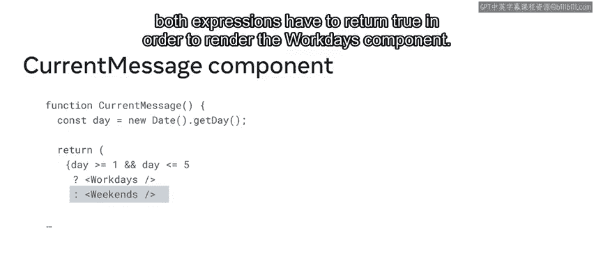

```javascript
function IsItSummerYet() {
  const summer = true;
  return (
    <div>
      {summer ? "Let's go to the beach!" : "Better stay indoors."}
    </div>
  );
}
```

三元运算符的工作原理是：如果问号前的条件为 `true`，则返回问号后的表达式；否则，返回冒号后的表达式。

因此，由于变量 `summer` 评估为 `true`，渲染此组件将返回字符串 “Let‘s go to the beach!”。

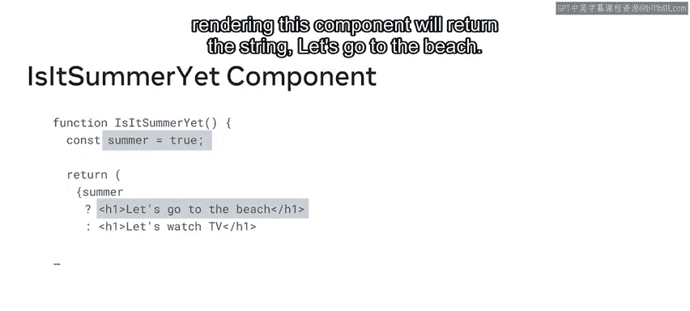

---


## 总结

本节课中我们一起学习了 React 中的条件渲染。你了解了如何根据组件的状态来动态控制 UI 的显示内容，并重点掌握了使用 **三元运算符** 来实现简洁的条件渲染逻辑。通过结合 JavaScript 的条件语法与 React 的组件模型，你可以构建出能够智能响应数据和用户交互的动态应用。