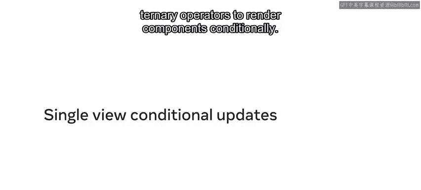
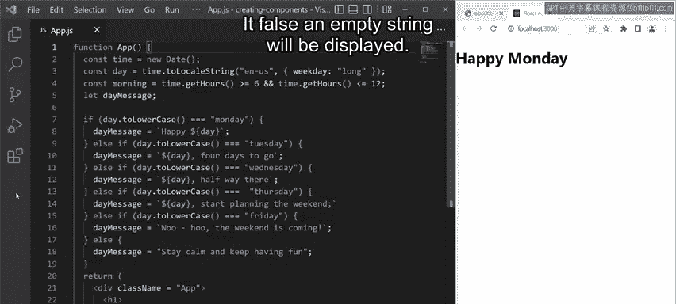
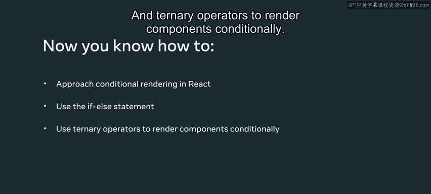

# Meta《前端开发（React／UI、UX／毕业项目／code review）｜Meta Front-End Developer》中英字幕 - P32：31_单视图条件更新.zh_en - GPT中英字幕课程资源 - BV1uJ4m1e7HT

By the end of this video， you'll be able to describe the various approaches to conditional rendering and reactact。

 and you'll be able to use the FL statements and turnernary operators to render components conditionally。

I use the Cate React app to build a starter React app。

 I'll go through the code in this customized starter app to demonstrate some conditional rendering and practice。

The goal of my app is to use the local computers time and based on the return values。

 output various messages inside the same return statement， all wrapped in a single div element。

Specifically， I want to code a small app that displays a message for a given workday。

 And if it's morning time， ask the user if they've had their breakfast yet。

 I start my app component code by declaring a time variable。

 and assigning the call to the date constructor to it。 I then set the day variable。

 And I use the builtin to locale string function that exists on the date object to specify the locale as English US。

 I also specify the weekday value as long， which displays the days as full words such as Monday。

 Tuesday， Wednesday and so on。 Next， I declare a morning variable that stores a Boolean value based on whether the current time is greater than or equal to 6。

 and less than or equal to 12。 Finally， I declare a day message variable。

 but I'm not assigning any value to it yet。To generate a dynamic message。

 I use an FL statement passing at the value of the day variable。

 I also make all the characters in the day variables string lowercase with the help of the built in to lower case function。

Based on the value stored in the day variable， I then assign a specific string to the day message variable。

 For example， if it's a Monday， the day message variable store a string that reads Happy Monday。

 If it's a Tuesday， the string reads Tuesday， four days to go。

After I've covered all the possibilities from Monday to Friday。

 I add the L statement with a string value for all the other possibilities。

 The string reads stay calm and keep having fun。 This brings me to the return statement。

 and the return statement， I have a single heading H1。 and inside of it。

 I'm accessing the string values stored inside the day message variable。 Additionally。

 I use a ternary operator to conditionally evaluate the morning variable。 If true。

 I output a string that reads。 Have you had breakfast yet。

 This string is placed inside a heading2 element。 If falls an empty string will be displayed。😊。

Notice the output of this code。 Happy Monday。 If I change the get hours value from 12 to 19 and save my code。

 notice that a new message is displayed underneath the heading that reads。

 have you had breakfast yet。That's all it takes to build quite a dynamic component that conditionally renders various kinds of strings in its return statement In this video。

 you learn about the various approaches to conditional rendering in react using the FL statement and turnernary operators to render components conditionally。

