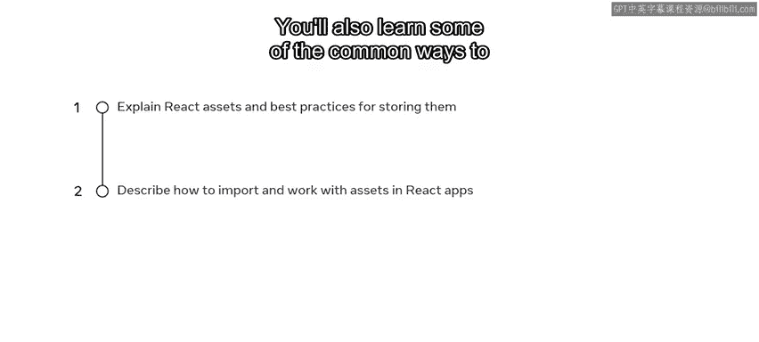
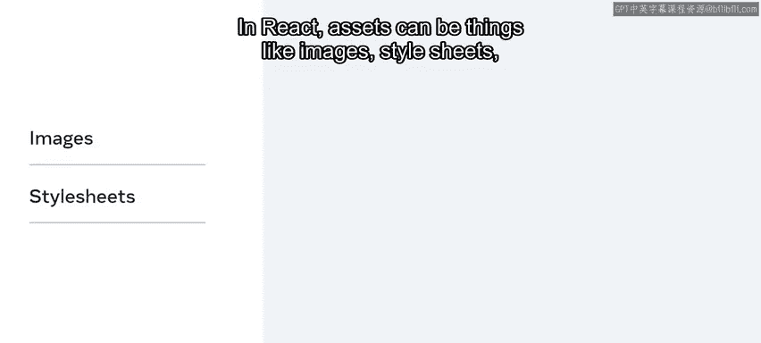
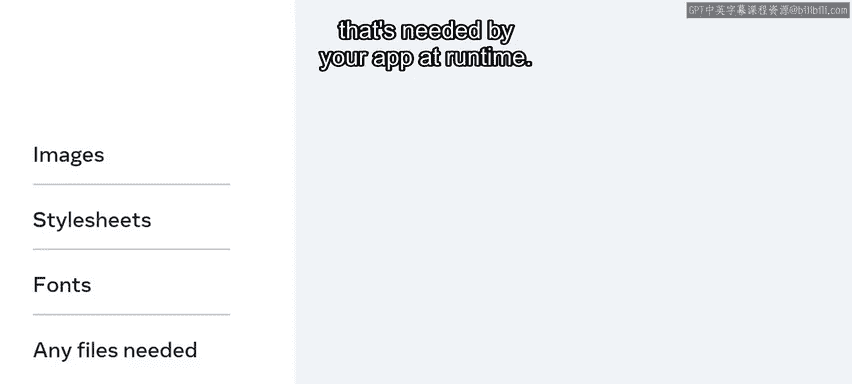
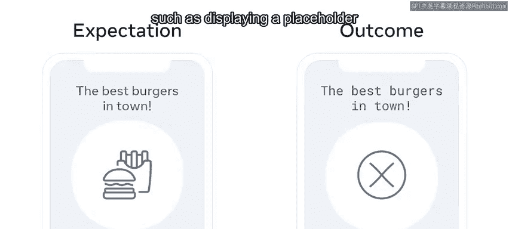
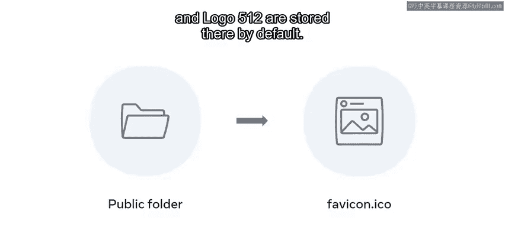
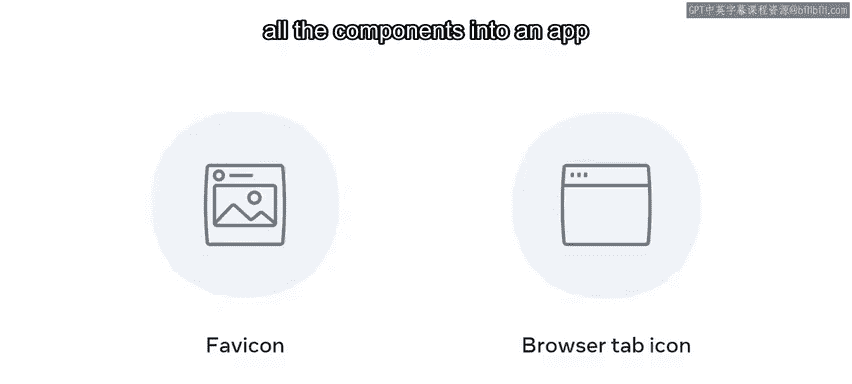
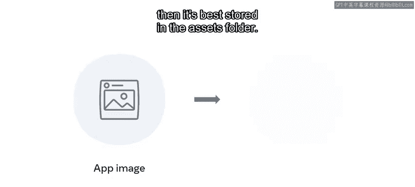
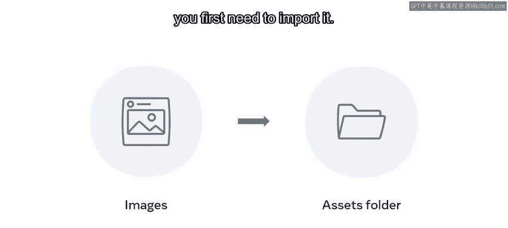
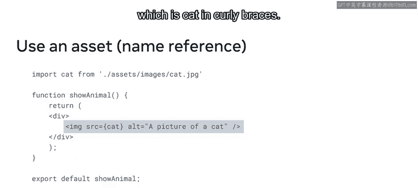
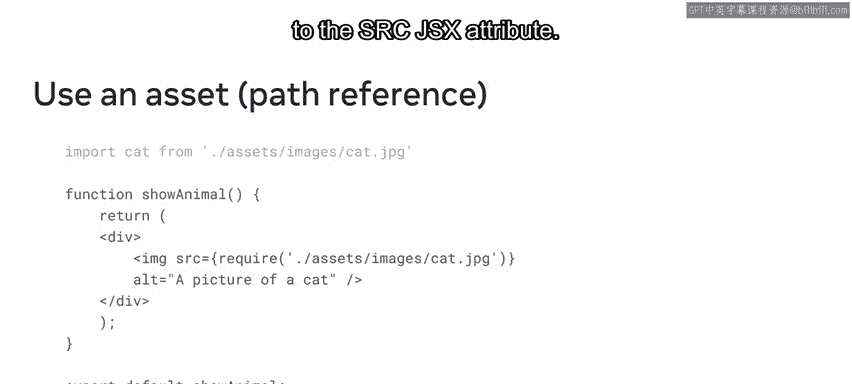

# Meta前端开发课程：P33：什么是资源及其存放位置 📁

在本节课中，我们将要学习React应用中的“资源”概念，了解它们是什么，以及如何在项目中有效地组织和管理这些资源。资源是让你的应用变得生动有趣的关键元素。

---

## 什么是资源？📦




上一节我们介绍了React组件和文本内容，但一个完整的应用远不止于此。本节中我们来看看什么是“资源”。

在React中，资源指的是应用在运行时所需的各种文件。具体来说，资源可以包括：

*   图像
*   样式表
*   字体
*   媒体文件（如视频、音频）





**资源** 就是你的React应用为了按预期工作而需要访问的所有文件。


例如，你的应用代码可能指定了要显示特定的图片或使用特定的字体。如果这些文件在应用运行时不可用，应用就可能出现意外行为，比如显示占位符或使用默认字体。因此，确保组件能够方便地访问到这些资源至关重要。

---


## 资源存放在何处？🗂️




了解了资源的定义后，我们来看看如何组织它们。一个常见的做法是在项目的 `src` 文件夹内创建一个名为 `assets` 的文件夹，并将应用的所有资源文件存放在那里。

```
your-react-app/
├── public/
└── src/
    ├── assets/       <-- 存放资源文件的推荐位置
    │   ├── logo.png
    │   └── banner.jpg
    ├── components/
    └── App.js
```

有些资源也可以放在 `public` 文件夹中。例如，在默认的React项目安装中，你会发现 `favicon.ico` 和 `logo512.png` 等图片默认就存储在那里。




关于资源存储位置的一般规则是：**如果你的应用在编译时不需要某个文件，就可以将其放在 `public` 文件夹中。**

举例来说，`favicon.ico` 存放在 `public` 文件夹，是因为没有哪个React组件依赖于它。换句话说，React在将你的所有组件编译成可以在本地浏览器中运行的应用程序时，并不需要使用这个文件。


然而，假设你有一张图片需要被导入到某个应用组件中，那么最好将它存储在 `src/assets` 文件夹里。



---


## 如何在组件中使用资源？🖼️



现在你已经熟悉了React中资源的概念和存放位置，让我们探索一下如何在组件中使用它们。

假设你正在开发一个帮助人们在当地领养动物的应用。你已经构建了大部分组件，现在需要将动物收容所提供的动物照片添加到应用中。为此，你已经在React应用的 `src` 目录下创建了 `assets` 文件夹，并将收到的图片放了进去。


要将资源文件添加到组件，你首先需要导入它。这可以通过 `import` 语句完成。


例如，假设这个组件将显示一张猫的图片。以下是导入和使用图片的步骤：

1.  **导入资源**：使用 `import` 关键字，后跟你为资源指定的变量名（例如 `cat`），然后是 `from` 关键字和资源的相对路径。
2.  **在JSX中使用**：在组件的返回语句中，使用 `` 标签，并将其 `src` 属性设置为用花括号 `{}` 包裹的变量名。



以下是具体代码示例：

```jsx
// 第一步：导入图片资源
import cat from './assets/cat.jpg';

function CatComponent() {
  // 第二步：在JSX中使用
  return (
    <div>
      
    </div>
  );
}

export default CatComponent;
```


除了使用 `import` 语句，你还可以直接在JSX中通过相对路径引用资源。这可以通过 `require` 关键字实现，同样需要用花括号 `{}` 将其包裹起来作为JSX表达式。



```jsx
function CatComponent() {
  return (
    <div>
      {/* 使用 require 语法直接引用路径 */}
      
    </div>
  );
}

export default CatComponent;
```


需要注意的是，使用 `require` 方法时，你不再需要顶部的 `import` 语句。这是因为你直接在赋值给 `src` 属性的JSX表达式中使用了 `require` 语法。

---



## 总结 📝

本节课中我们一起学习了React中“资源”的核心概念。我们了解到资源是应用运行所需的图像、字体等文件，并掌握了在项目中组织资源的最佳实践：将编译依赖的资源放在 `src/assets` 文件夹，而将独立文件（如网站图标）放在 `public` 文件夹。最后，我们实践了在React组件中导入和使用图片资源的两种常见方法：使用 `import` 语句或 `require` 语法。掌握这些知识将帮助你构建内容更丰富、体验更完整的React应用。