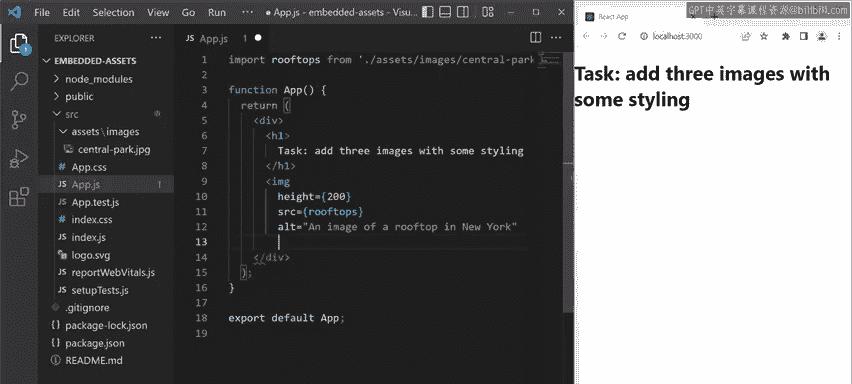
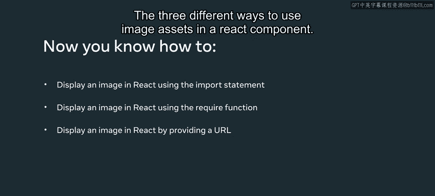

# Meta《前端开发（React／UI、UX／毕业项目／code review）｜Meta Front-End Developer》中英字幕 - P34：33_使用嵌入式资源.zh_en - GPT中英字幕课程资源 - BV1uJ4m1e7HT

In this video， I'll demonstrate various ways of displaying images。

 You'll learn three different ways to display an image and react app specifically by using the import statement。

 using the required function to set the file path， or by providing an image URL to demonstrate how you can work with embedded assets。

 I've created a basic app called embedded assets in my app source folder， I added the asset folder。

 which also contains an image folder。

Notice I've added one JPEG image to the images folder named Central Park to view the code of the app component。

 I click on the app do Js file。Notice that the starting code of my app component just under some text that describes the task at hand。

 which is to display three images with some styling。For this。

 I'm going to demonstrate the three distinct ways to import images and react。

 The first way is to use the import method， and I want to demonstrate how you set a name for your imported image。

To import the image file Central Park， I type importm rooftops and then dot forward slash to provide a relative path to the file enclosed in double codes。

In this example， my file is in the images folder inside the assets folder。Next。

 I'll render this image as an image tag。 in my code。

 I use the height attribute to limit the size of the image by making its height exactly 200 pixels。

I'm setting the source attribute to the value of rooftops， which contains the path to the image file。

 Finally， for best practice， I add an alt attribute with a basic description of the image。

I save my file and notice that my image now displays in the browser。Okay。

 so that's one way to import an image using the import statement。

 The second way to import an image is by using the require keyword to do this。

 I create this image with an image tag like I did before。 Again。

 I limit the size of the image by making a type exactly 200 pixels。 But this time。

 I set the source attribute to require。 I pass in the relative path of the image to the required function。

 The path is passed in as a string data type。 So that's why the path is enclosed in double codes。

 Once again to finish my image code。 I add a description of the image to the alt attribute。

 I save my code and the second image now appears。Notice that with this approach。

 I don't have to import the image， I just require it and provide the string with the relative path to the image。

Now， I'll demonstrate the third way to import an image asset by loading an image file hosted on the Internet。

 instead of a local file。 this time， I want to display a random image URL from a photo hosting website to do this。

 I create a variable by typing cont， then the variable name。

 random image URL that I use the equals operator followed by the URL for the random image。

 I can now add my third image element inside the return statement to do this。

 I add random image URL to the source attribute。So there you have it。

 but are three different ways to use image assets in a react component。

