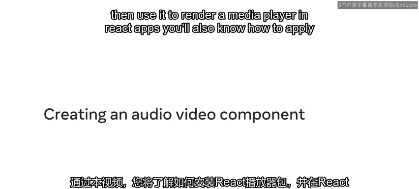
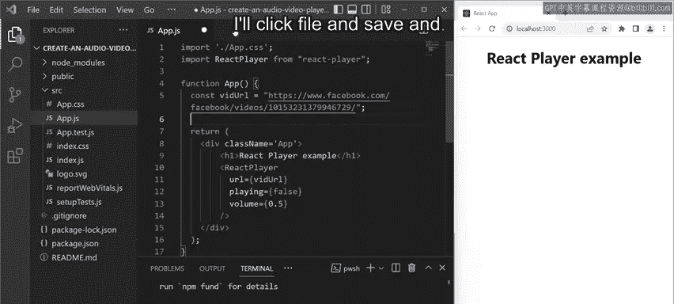
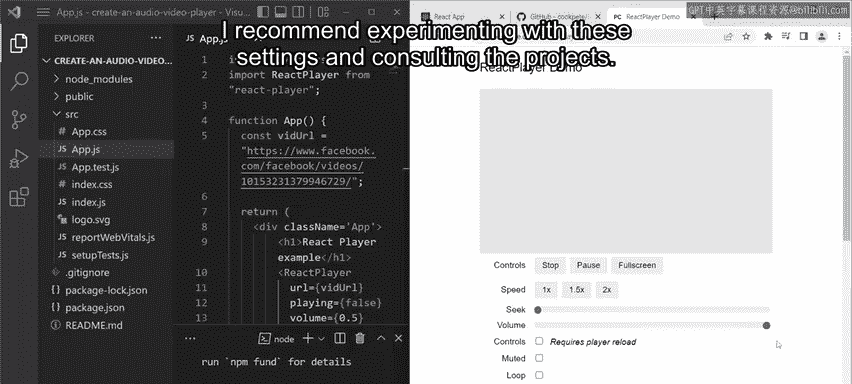
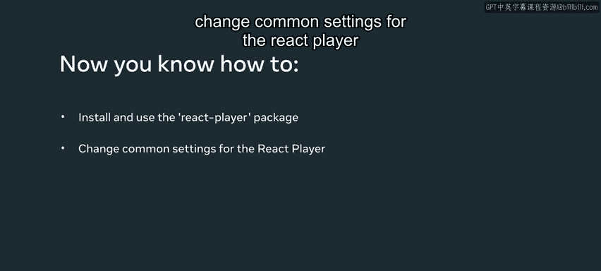

# Meta《前端开发（React／UI、UX／毕业项目／code review）｜Meta Front-End Developer》中英字幕 - P36：35_创建音频-视频组件.zh_en - GPT中英字幕课程资源 - BV1uJ4m1e7HT

By the end of this video， you will know how to install the react player package and then use it to render a media player in react apps。

 You'll also know how to apply several common settings in react player。

 such as automatic playback and the starting volume。

 Let's examine another app that I've created using create react app。 Currently， it's pretty basic。

 and only renders an H1 heading that reads react player example。

 Let's make that heading through by adding in a video player。

The first step of this process is to install the react player module。

 and the second step is to import it into my app component。To install the module。

 I'll run the command NPM install react player。Once it has finished installing。

 the module becomes available to any component in my project， but only if I import it。

 so I'll use the command import react player from followed by react player and double quotes。

Now I'm ready to add the imported react player package as a component and render it from the app component。

I also want to preset a few settings for the player specifically to ensure that the video doesn't play automatically on the page loads and to have the starting volume at 50% of the maximum To do that。

 I add some attributes to the react player tag， playingguing equals， and then false in curly braces。

And volume equals， followed by 0。5 in curly braces for a complete list of settings。

 you can refer to the react player's Github documentation。

You may have noticed that the react component also contains the line URL equals VU URL。

 This refers to the web link for the video which hasn't been set up yet。

 So let's add that link to the VD URL URL variable。Now that everything is set up。

 I'll click fileile and saveve and then verify that everything works as expected in the browser。

I can play the video， use the built in controls， and the video starts at half the volume。

 So seem that everything is correct。 Finally， you can find the projects Github URL at Github dot com slash cook Peteat with a capital C and a capital P slash react dash player。

This page contains an about section on the right in which you'll find a link to the live demo。

On the linked page， you can select from several video sources and change the video settings such as playback speed。

 light mode， loop and more。If you would like to know more about the react player。

 I recommend experimenting with these settings and consulting the project's GitHub documentation。

In this video， you learn how to install and use the react player package and change common settings for the react player。

