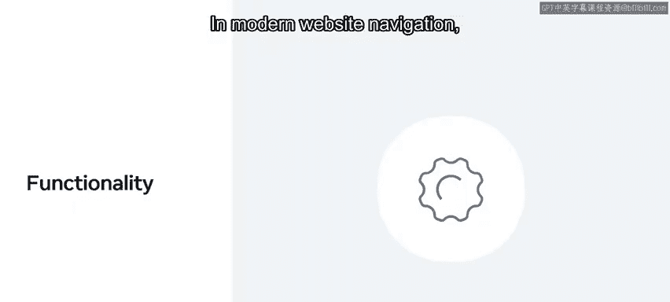
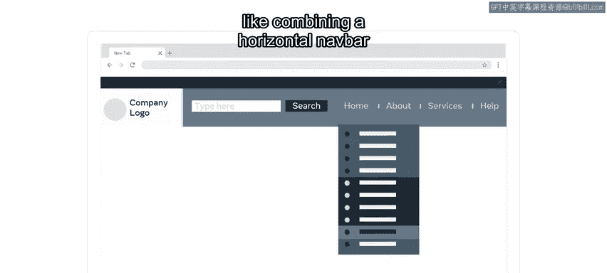
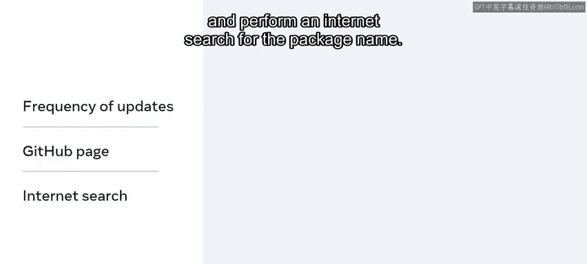
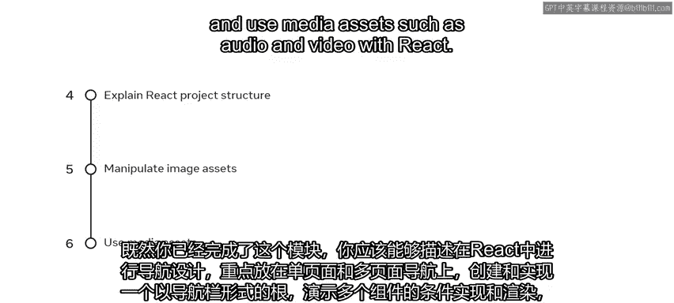

# 前端开发：P37：导航、更新与资源模块总结 🎯

在本节课中，我们将总结在 React.js 中设置导航、更新和使用资源模块的关键知识与技能。我们将回顾单页与多页导航的基础、条件渲染，以及如何在 React 项目中有效管理和使用各类资源。

## 导航基础与路由 🧭

上一节我们介绍了模块的整体目标，本节中我们来看看导航的基础概念。网站导航是任何网站中允许用户从单一组件浏览不同页面或链接的部分。


在现代网站导航中，用户界面的核心在于功能性。



以下是常见的导航组件示例：
*   水平导航栏（Navbar）

大多数网站拥有更复杂的导航界面，会在单个组件中结合多种导航方式。
*   例如，将水平导航栏与下拉菜单项结合使用。



你了解到，使用 React 构建的网站导航与使用 HTML 和 CSS 构建的网站存在关键区别。React 驱动的网页称为单页应用程序（SPA），整个应用加载在一个单一的 `div` 中，因此用户并非像在 HTML 文件中使用超链接那样访问不同的页面。

这是因为单页应用程序（SPA）有其特殊的锚标签和链接实现方式，营造出加载不同页面的错觉。

为了实现多页网站的效果，你需要将 React Router 库添加到你的 React 项目中。你练习了使用它来为网页创建和实现基本导航路由。

在本次未评分的实验中，你使用了名为“Navbar”的课程项目代码，并需要向现有代码中添加另一个链接。

## 条件渲染 ⚙️


在掌握了基础导航后，React 需要能够动态更改网页内容，这就引入了条件渲染的概念。

作为本部分内容，你学习了如何使用三元运算符来设置条件渲染，以编写简化的 if-else 条件语句。

**示例代码：**
```jsx
{isLoggedIn ? <WelcomeMessage /> : <LoginPrompt />}
```

## 在 React 中使用资源 🖼️

上一节我们探讨了如何根据条件改变内容，本节中我们来看看如何在 React 应用中管理和使用各类资源文件。

资源是指你的应用在运行时需要的文件，如图像、样式表、字体、视频或音频。你学习了开发者如何在 React 中组织资源，以及一些导入资源文件的常用方法。

以下是组织资源的常见方式：
*   在 `src` 文件夹内添加一个 `assets` 文件夹，并将所有应用资源存放在那里。
*   一些资源也可以放置在 `public` 文件夹中。

资源存储的一般规则是：如果你的应用在没有该资源的情况下也能编译，则可以将其保存在 `public` 文件夹中。


在本模块的这一部分，你学习了如何使用嵌入式资源，了解了嵌入资源的优点和缺点，以及在使用资源密集型应用时固有的权衡。

在本次课程的第一次未评分实验中，你学习了如何添加已存在于 `src` 文件夹的 `assets` 文件夹中的图像。更重要的是，你还进一步学习了如何在应用中使用音频和视频资源。

## 处理音频与视频资源 🔊🎬

为了在应用中集成多媒体，你需要掌握处理音频和视频资源的方法。



你学习了在处理音频和视频文件时，如何寻找合适的 React 包来使用。

以下是向应用添加视频的三种方法：
*   使用 `<video>` 元素提供本地视频。
*   使用嵌入的第三方视频。
*   使用第三方 NPM 包来简化向应用添加视频的过程。

此外，你学习了如何决定使用哪个软件包。
*   检查更新频率。
*   查看包的 GitHub 页面。
*   在互联网上搜索该包名。


为了帮助你熟悉使用此类包，你学习了如何安装 `react-player` 包，并使用它在 React 应用中渲染媒体播放器。你还学习了如何应用自动播放和起始音量等常见设置。

本模块最后一个未评分实验是完成一个已构建的应用，该应用的界面允许访问者通过按下按钮来播放鸟叫声。

## 总结与展望 🏁



现在你已经完成了本模块的学习，你应该能够：
*   描述以单页和多页导航为重点的 React 导航设计。
*   以导航栏的形式创建并实现路由。
*   演示多个组件的条件实现和渲染。
*   根据嵌入式或引用式资源，解释 React 项目的文件夹结构。
*   演示如何使用引用路径操作图像资源。
*   在 React 中使用音频和视频等媒体资源。

恭喜！你现在已经涵盖了 React 中的大部分基本概念，可以完成本模块的测验并查看本模块的额外资源了。

在本课程结束前，只剩下一个模块。在下一个模块中，你将通过构建一个计算器应用来完成一个 React 迷你项目，从而应用你所学的知识。