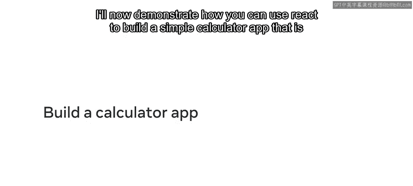
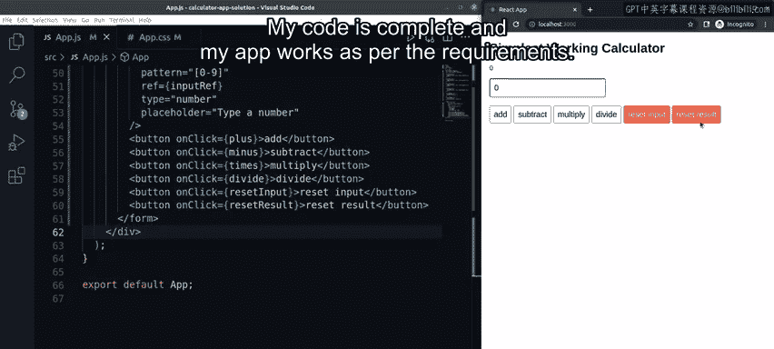

# React 计算器应用构建教程：P39：38_范例-构建计算器应用程序

在本节课中，我们将学习如何使用 React 构建一个简单的计算器应用程序。这个应用将能够执行加法、减法、乘法和除法运算。我们将从修复一个不完整的代码开始，逐步添加缺失的功能，最终完成一个功能齐全的计算器。




## 修复初始编译问题

首先，我们有一段不完整的代码，它在编译时会遇到问题。第一个问题是 `useRef` 未定义。为了解决这个问题，我们需要从 React 中导入 `useRef` 钩子。

```javascript
import { useRef } from 'react';
```

导入后，我们保存并重新编译代码。

接下来，我们遇到了第二个问题：`useState` 钩子也未定义。同样地，我们需要导入它。

```javascript
import { useState, useRef } from 'react';
```

再次保存并重新编译后，所有的编译问题都应该得到解决。现在，应用的结构已经存在，但它目前只能执行加法运算。我们需要为其添加减法、乘法和除法的功能。

## 构建运算功能函数

上一节我们修复了代码的编译问题，本节中我们来看看如何构建核心的运算功能。我们将以现有的加法函数为模板，来创建其他运算函数。

以下是加法函数的原始代码：

```javascript
function plus(e) {
  e.preventDefault();
  setResult((result) => result + Number(inputRef.current.value));
}
```

这个函数执行了三个关键操作：
1.  阻止表单的默认提交行为。
2.  调用一个用于更新状态变量的函数。
3.  将当前输入框的值加到之前的结果上。

我们可以将此代码作为模板，复制并粘贴到其他已创建的函数框架中，然后进行修改。

*   **减法函数 (`minus`)**: 将更新逻辑从加法改为减法。
    ```javascript
    function minus(e) {
      e.preventDefault();
      setResult((result) => result - Number(inputRef.current.value));
    }
    ```
*   **乘法函数 (`times`)**: 将更新逻辑改为乘法。
    ```javascript
    function times(e) {
      e.preventDefault();
      setResult((result) => result * Number(inputRef.current.value));
    }
    ```
*   **除法函数 (`divide`)**: 将更新逻辑改为除法。
    ```javascript
    function divide(e) {
      e.preventDefault();
      setResult((result) => result / Number(inputRef.current.value));
    }
    ```

## 实现重置功能

除了基本运算，一个完整的计算器还需要重置功能。我们有两个重置函数：`resetInput` 用于清空输入框，`resetResult` 用于将计算结果归零。

以下是这两个函数的实现方式：

*   **`resetInput` 函数**: 此函数阻止默认事件后，直接通过引用将输入框的值设置为 `0`。
    ```javascript
    function resetInput(e) {
      e.preventDefault();
      inputRef.current.value = 0;
    }
    ```
*   **`resetResult` 函数**: 此函数采用另一种方法，它通过将之前的结果值乘以 `0` 来将其归零。这展示了 `setState` 函数如何使用前一个状态值。
    ```javascript
    function resetResult(e) {
      e.preventDefault();
      setResult((prevValue) => prevValue * 0);
    }
    ```

## 完善UI与交互

功能函数准备就绪后，我们需要完善用户界面，将结果显示出来并添加触发这些功能的按钮。

首先，在 App 组件的 `return` 语句中，我们需要添加一个地方来显示当前的计算结果。我们可以通过一个 JSX 表达式来实现。

```jsx
<div>当前总数：{result}</div>
```

接下来，我们需要添加按钮来触发我们编写的各个函数。以下是需要添加的按钮组件示例，每个按钮都绑定到对应的 `onClick` 事件。

```jsx
<button onClick={plus}>+</button>
<button onClick={minus}>-</button>
<button onClick={times}>*</button>
<button onClick={divide}>/</button>
<button onClick={resetInput}>重置输入</button>
<button onClick={resetResult}>重置结果</button>
```

## 测试应用程序

所有代码修改完成后，保存文件。现在可以测试我们的应用程序了。

1.  在输入框中输入数字 `2`，然后点击 **+ (加)** 按钮。结果显示会从 `0` 变为 `2`。再次点击 **+** 按钮，结果会更新为 `4`。
2.  在输入框中输入数字 `1`，然后点击 **- (减)** 按钮。结果会从 `4` 变为 `3`。
3.  在输入框中输入数字 `10`，然后点击 **\* (乘)** 按钮。结果会从 `3` 变为 `30`。
4.  在输入框中输入数字 `6`，然后点击 **/ (除)** 按钮。结果会从 `30` 变为 `5`。
5.  点击 **重置输入** 按钮，输入框的值会被设置为 `0`。
6.  点击 **重置结果** 按钮，计算结果会被清零，重新变回 `0`。

至此，代码已完成，应用程序的功能符合所有要求。



## 总结


本节课中我们一起学习了如何使用 React 构建一个功能完整的计算器应用。我们从修复基础的导入错误开始，然后以加法函数为模板，逐步创建了减法、乘法和除法函数。我们还实现了分别用于清空输入框和重置计算结果的功能。最后，我们通过 JSX 将结果展示在界面上，并绑定了按钮的点击事件来触发对应的功能函数。通过这个练习，我们实践了 React 中状态管理 (`useState`)、DOM 引用 (`useRef`)、事件处理以及组件渲染的核心概念。