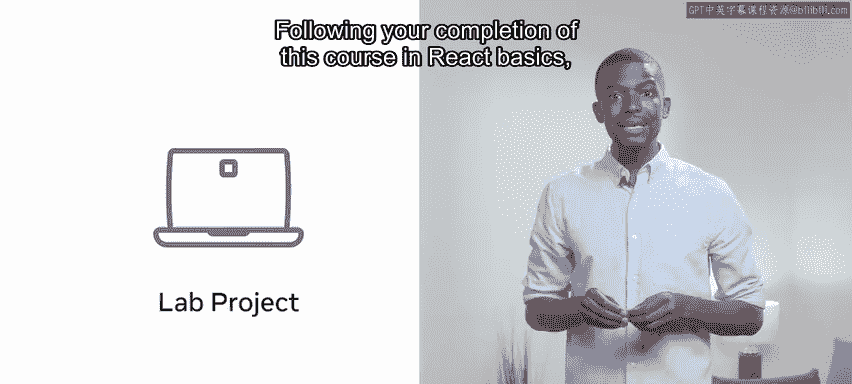
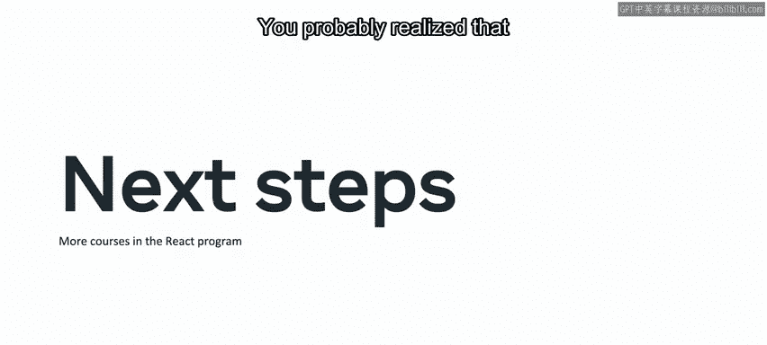
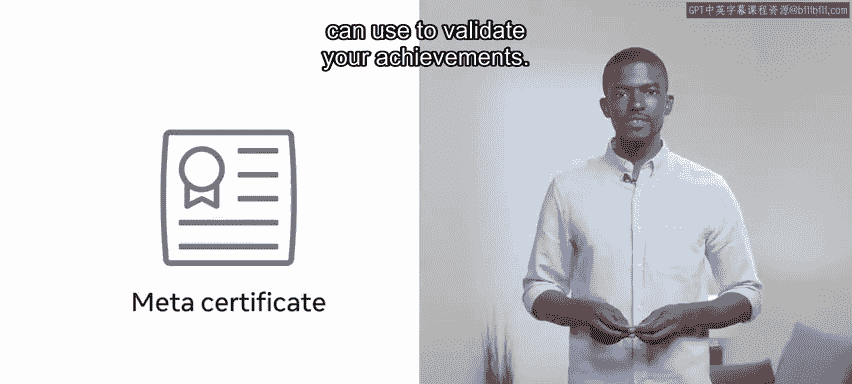
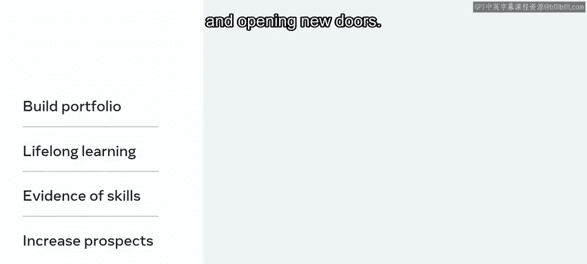

# Meta《前端开发（React／UI、UX／毕业项目／code review）｜Meta Front-End Developer》中英字幕 - P40：39_恭喜你完成了 React 基础.zh_en - GPT中英字幕课程资源 - BV1uJ4m1e7HT

You've reached the end of this react basics course。

 you've worked hard to get here and developed a lot of new skills along the way。

 you're making great progress on your react journey。

You were able to demonstrate some of this learning along with your practical react basic skill set in the lab project。

Following your completion of this course in Re basicss。

 you should now be able to create a simple calculator app。

Your calculator should be able to perform the four basic mathematical operations。Addition。

 subtraction， multiplication and division。The lab not only gave you the practical experience you needed。

 but it also has another important benefit。😊，You now have a fully operational calculator built in react that you can reference within your portfolio。

This serves to demonstrate your skills to potential employers。

And not only does it show employees that you are self driven and innovative。

 but it also speaks volumes about you as an individual， as well as your newly obtained knowledge。

So what are the next steps？In this course， you were introduced to several key topics that can help you on your learning journey。

You probably realize that there's still more for you to learn。😡。

As you continue through the program， you'll develop your skill set。

So if you found this course helpful and want to discover more。

 then why not register for the next course？And once you've successfully completed all the courses in this program。

 you'll receive a certificate that you can use to validate your achievements。

Depending on your goals， you may choose to go deep with advanced role based certifications or take other fundamental courses once you earn this certificate。

Receiving a certificates on completion of the overarching program is one way to build your qualification portfolio The certificates also demonstrates your commitments to lifelong learning。

 serving as industry endorses to evidence of your technical skills growing your qualification portfolio means increasing your career prospects and opening new doors。

Thank you。 It's been a pleasure to embark on this journey of discover with you。

 Best of luck in the future。😊。