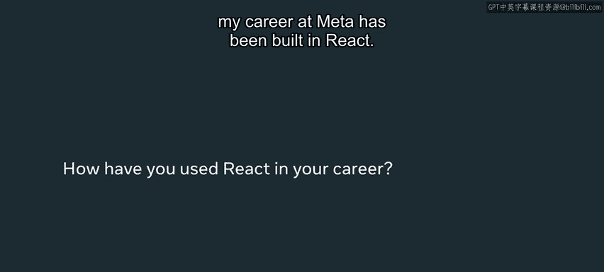
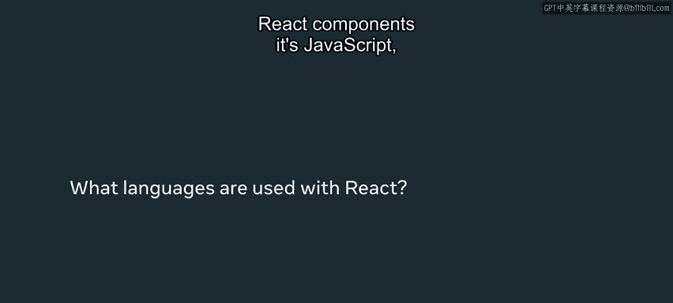
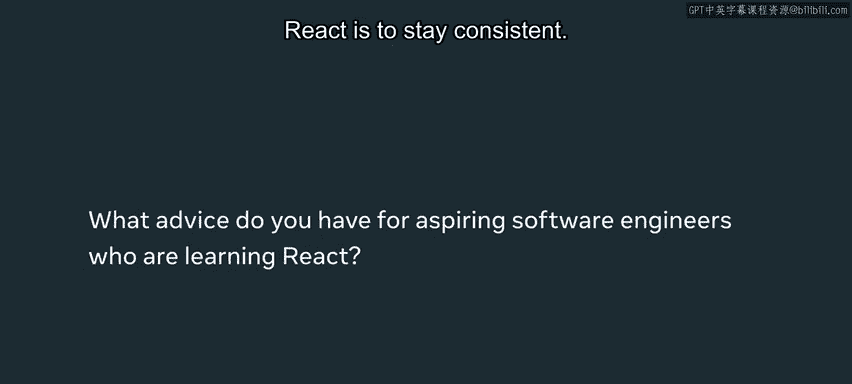

# Meta前端开发课程：P43：React与职业机会 🚀

在本节课中，我们将探讨React框架的流行度、其应用场景以及相关的职业机会。我们将了解为什么React如此重要，它如何被用于构建现代Web和移动应用，以及掌握这项技能对开发者职业生涯的意义。

---

## React的流行度与行业地位

上一节我们介绍了课程背景，本节中我们来看看React在行业中的实际地位。

“React”这个关键词的搜索热度超过了“橙汁”和“可再生能源”等词汇。因此，React已成为一个非常广泛流行的框架，并且是当前许多公司在招聘新工程师时要求掌握的技能。

我的名字是Mortra，是Meta公司西雅图办公室的一名软件工程师。我在Meta职业生涯中构建的几乎所有东西都使用了React。如果你正在使用任何Meta的产品，无论是Facebook还是Instagram，你所点击的按钮、菜单以及进行的交互操作，其背后的事件和组件很可能都是由React框架处理的。我在Meta的职业生涯就是开发这类组件。无论你是在网页上发布照片还是发表评论，所有这些交互都是由幕后的React组件驱动的。

---

## React带来的开发体验变革

了解了React的普及程度后，我们来看看它给开发者带来了怎样的改变。

当我最初发现React时，我认为它非常酷，它让构建Web应用程序变得容易得多。这个框架极大地简化了我作为工程师的工作，使用它进行开发非常直观，并且更不容易出错。观察趋势图可以发现，在2018年，React的搜索量上升并超过了之前最流行的Web框架JQuery，成为了最热门的搜索关键词。因此，用React来替代一些跟不上行业发展速度的旧框架是合理的。

---

## React的技术生态与扩展应用

React不仅改变了Web开发，其技术栈和应用领域也在不断扩展。

创建React组件使用的主要语言是JavaScript。实际上，有多种风格的JavaScript可以与React一起使用。在Meta，我们使用**Flow**风格的JavaScript，这能确保我们在开发React组件过程中的类型安全。但构建React组件还有其他方式，行业中一种流行的方法是使用**TypeScript**。

除了在Web上使用React组件的不同方式，你实际上还可以使用React来开发移动端组件，例如用于Android和iOS平台。最近，React正在发布一种开发VR（虚拟现实）组件的方式，让人们能够使用与Web和移动端开发相同且一致的框架来开发虚拟现实应用。其理念是简化开发流程，让开发者能够创建复杂的虚拟现实应用，同时利用React的简洁性和友好性。这正是推动React在不同行业领域创建多种框架的动机。

---

## 掌握React的职业建议与总结

最后，我们来谈谈学习React对职业发展的价值，并给出一些学习建议。

目前，React已成为一项不可或缺的技能，几乎你构建的每一个应用和申请的每一份工作都可能需要它。掌握这项知识将对你的职业生涯大有裨益，同时学习使用这样的框架也会让你的开发工作变得更轻松。

以下是我给即将踏入React世界的你的一些建议：

*   **保持坚持**：起初它可能看起来有点复杂或令人不知所措，有些概念可能难以理解，但请坚持下去。
*   **提升价值**：学习这些原则会让你的工作更轻松，让你在未来对雇主更具吸引力。
*   **增强能力**：使用这个框架将极大地提升你构建可扩展Web应用的能力。

所以，请继续前进，不要让React中一些令人困惑的部分阻碍你。

---

**本节课总结**：我们一起学习了React框架在当今开发领域极高的流行度和行业需求，了解了它在Meta等公司产品中的核心作用。我们探讨了React如何简化开发、其主流的JavaScript技术变体（如Flow和TypeScript），以及它从Web扩展到移动端乃至VR领域的广阔生态。最后，我们明确了学习React对开发者职业生涯的重要性，并获得了坚持学习、克服困难、最终提升自身价值的实用建议。