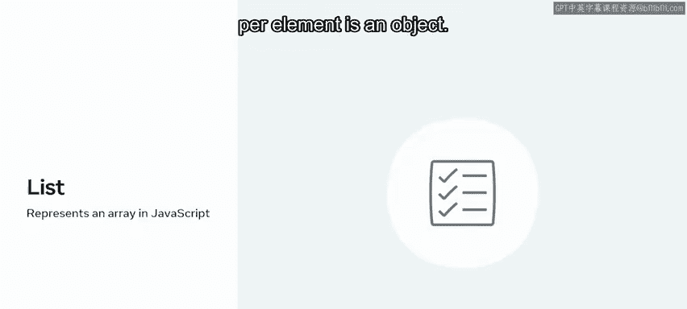
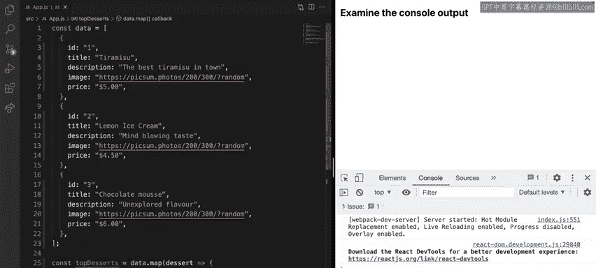
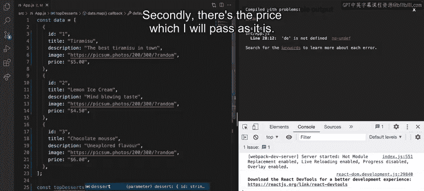
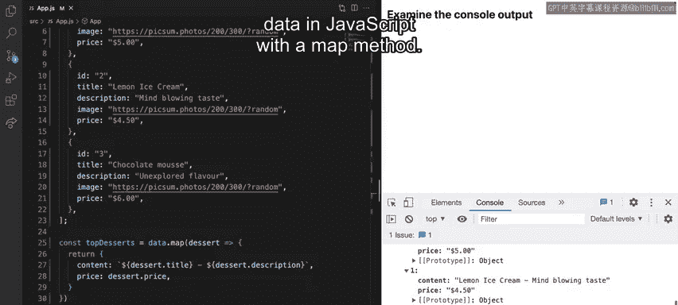

# 前端开发：P46：在 JavaScript 中转换列表 📋

在本节课中，我们将学习如何使用 JavaScript 中的 `map` 方法来处理和转换列表数据。列表是几乎所有应用程序中常见的元素，掌握如何操作它们是前端开发的重要技能。

你是否经常浏览各种应用程序？例如，你可能使用过点餐应用，滚动浏览不同的菜单以寻找喜欢的食物。这类列表在应用中极为常见，因此了解如何在 JavaScript 中操作它们至关重要。在向用户展示最终列表之前，你很可能需要转换其中的各种元素。

## 理解数据转换的需求

上一节我们介绍了列表在应用中的普遍性。本节中，我们来看看为何需要对数据进行转换。

想象一家名为“小柠檬”的餐厅希望展示其热门甜点列表。在 JavaScript 中，列表通常表现为数组。这些数组可以包含任何类型的数据，但每个元素最常见的是对象。

假设“小柠檬”使用外部服务来查询用户最常请求的甜点列表。然而，从第三方获取数据时，你通常会得到比所需更多的信息，并且数据的格式由第三方决定。



这意味着你可能需要编写更多代码来处理数据，以仅提取你需要的信息。这时，`map` 方法就派上用场了，它可以帮助你忽略屏幕上不想显示的内容，只提取用户关心的数据。接下来，让我们探索如何使用 `map` 方法来转换这个甜点列表。


## 认识 JavaScript 的 `map` 方法

在 JavaScript 中处理任何类型的项目列表时，你需要使用数组类型。JavaScript 提供了多种可与数组一起使用的方法来执行各种操作。要执行转换操作，你必须使用 `map` 方法。

回到“小柠檬”的例子，假设你有一个包含其最受欢迎甜点的列表，存储在一个名为 `data` 的变量中。每个甜点具有以下属性：`id`、`title`、`image`、`description` 和 `price`。

在这种情况下，你希望展示一个非常简单的甜点列表，其中包含一个名为 `content` 的属性。你可以通过合并 `title` 和 `description` 以及美味菜肴的 `price` 来创建这个属性。

## 使用 `map` 方法转换数据

首先，我将定义一个新变量，因为 `map` 方法总是返回一个新数组。让我们称这个新数组为 `topDesserts`。

接下来，我将对原始 `data` 数组应用 `map` 方法。目前，我将按原样返回数据，以便你可以检查 `map` 转换的基本结构。

以下是转换步骤的详细说明：

1.  **创建新数组**：`map` 方法会遍历原数组的每个元素，并返回一个新数组。
2.  **定义转换逻辑**：在 `map` 的回调函数中，指定如何转换每个元素。
3.  **构建新对象**：我希望新项目具有两个属性。第一个是 `content`，它将是 `title` 和 `description` 的组合。让我们使用破折号字符来分隔两者。第二个是 `price`，我将按原样传递它。
4.  **输出结果**：最后，我将使用 `console.log` 来展示我创建的新列表包含我最初预期的形状或格式。

以下是实现此转换的代码示例：

```javascript
const topDesserts = data.map(dessert => {
  return {
    content: `${dessert.title} - ${dessert.description}`,
    price: dessert.price
  };
});



console.log(topDesserts);
```




转换后的列表如下所示：




## 总结

本节课中，我们一起学习了如何使用 JavaScript 中的 `map` 方法来转换数据。这是一个简单而强大的工具，在处理来自外部提供者的数据时，你会发现自己会经常使用它。当用户在你的应用中体验到轻松导航和消费信息时，他们会感谢你所做的努力。