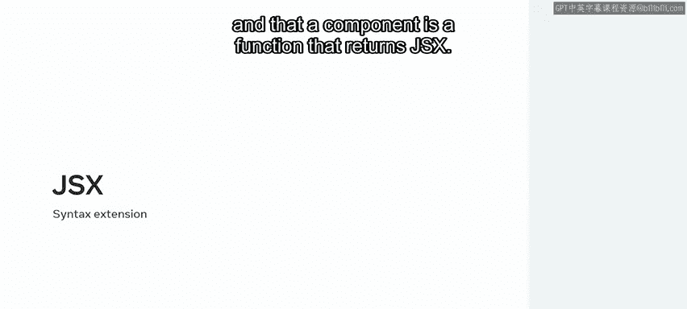
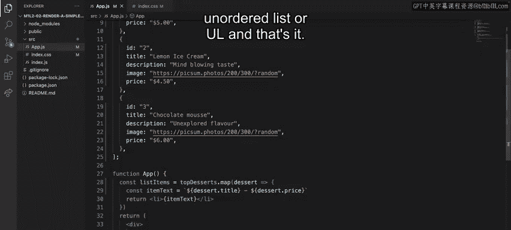
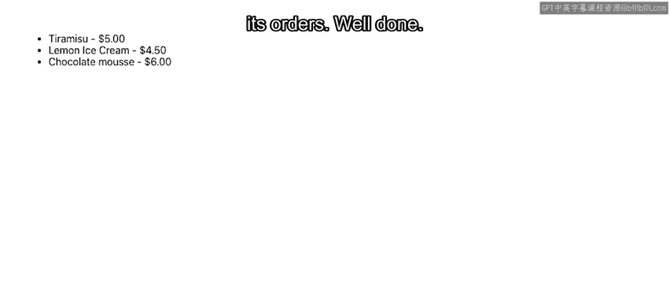

# React 前端开发：P47：渲染简单列表组件 📋

在本节课中，我们将学习如何使用 React 将一组数据项转换并渲染为一组 React 组件。我们将通过一个餐厅甜点列表的例子，掌握 `map` 函数与 JSX 语法结合使用的核心方法。

---

## 概述

你是否知道，使用 React 可以将任何项目列表转换为一组 React 组件？基于之前“小柠檬”餐厅甜点列表的例子，想象一下，餐厅希望在其网站上专门开辟一个区域，向在线访客展示其最佳甜点，以鼓励他们下单。本节视频将教你如何通过使用 `map` 函数和 JSX 语法，在 React 中显示这样的元素集合。

回顾一下，JSX 是 JavaScript 的一种特殊语法扩展，React 用它来描述用户界面（UI）。而组件是一个返回 JSX 的函数。



---


## 渲染列表的核心步骤

上一节我们介绍了 JSX 和组件的基本概念，本节中我们来看看如何具体渲染一个列表。

目标是展示“小柠檬”餐厅最佳甜点集合的一个简化版本，仅显示甜点的标题和价格。每个甜点对象具有以下属性：`id`、`title`、`image`、`description` 和 `price`。

### 第一步：使用 `map` 函数遍历数组

首先，创建一个名为 `listItems` 的新变量，用于存储转换操作的结果。我们将使用 JavaScript 的 `map` 函数遍历甜点数组。

```javascript
const listItems = desserts.map(dessert => {
  // 转换逻辑将在这里编写
});
```

你可能会想，在 `map` 函数内部应该返回什么。在传统的 JavaScript 中处理列表时，你可以返回任何数据类型。但在 JSX 中，你也可以将一个 React 组件作为应用于每个元素的转换结果返回。这在后续会非常有用，因为你可以直接将结果嵌入到返回的 JSX 中。

### 第二步：选择并返回 JSX 元素

同时回顾一下，默认情况下所有 HTML 标签都是组件，因此你可以利用所有已熟知的 HTML 语义化标签。对于列表项，最佳选择是列表项（`<li>`）语义标签。

目前，我们先返回一个空的列表项。

```javascript
const listItems = desserts.map(dessert => {
  return <li></li>;
});
```

### 第三步：构建列表项内容

因为目标是显示甜点的标题和价格，所以首先创建一个名为 `itemText` 的新变量来存储文本。

我们将使用破折号分隔标题和价格，并使用点符号从甜点对象中访问所需的属性（`title` 和 `price`）。

```javascript
const listItems = desserts.map(dessert => {
  const itemText = `${dessert.title} - ${dessert.price}`;
  return <li></li>;
});
```

由于这是一个将作为组件渲染方法一部分的 JSX 转换，你必须使用花括号 `{}` 来包裹你的数据。在本例中，就是每个列表项的文本，即变量 `itemText` 的值。

```javascript
const listItems = desserts.map(dessert => {
  const itemText = `${dessert.title} - ${dessert.price}`;
  return <li>{itemText}</li>;
});
```

### 第四步：在 JSX 中嵌入列表

最后一步是进入组件的渲染方法（或函数组件的返回值），将 `listItems` 嵌入到 HTML 列表包装器组件中，即无序列表（`<ul>`）。

```jsx
function DessertList() {
  const listItems = desserts.map(dessert => {
    const itemText = `${dessert.title} - ${dessert.price}`;
    return <li key={dessert.id}>{itemText}</li>; // 注意：添加了 key 属性
  });

  return (
    <ul>
      {listItems}
    </ul>
  );
}
```




就这样，甜点以一种简洁明了的方式显示出来了。这个改进版功能肯定能帮助“小柠檬”餐厅增加订单，做得很好。




---

## 总结

本节课中我们一起学习了如何使用 `map` 函数和 JSX 花括号 `{}` 的组合来转换和渲染元素集合。列表是应用开发的核心构建块之一，掌握这项技能让你在创建优秀应用的道路上又前进了一步。😊