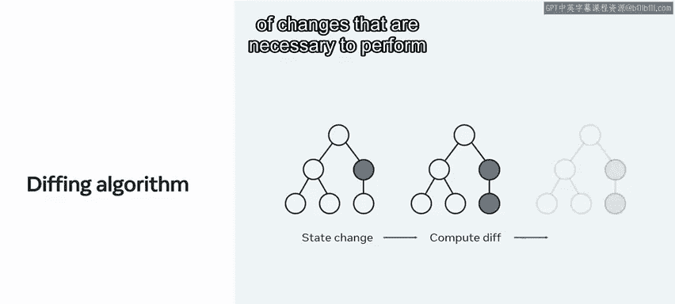

# Meta《前端开发（React／UI、UX／毕业项目／code review）｜Meta Front-End Developer》中英字幕 - P48：6_React 中的 key 是什么.zh_en - GPT中英字幕课程资源 - BV1uJ4m1e7HT

One important advantage of using react is its ability to automatically optimize updates in your user interfaces or Uiss。

 If react was a plane， it would use autopilot mode In most cases。

 letting you relax in the driver's seat。 But even with autopilot。

 you'll need to take action sometimes， like， for example。

 performing a specific manoeuvver to land the plane。 The same is true for react。

 as their scenarios where you as the developer would need to take extra steps to specify how react should behave when your Ui changes。

In this video， you will explore how to use keys as a way to do so when dealing with lists of elements。

 you will learn how to use keys to identify and distinguish elements in a list。

 how to determine the right key for your list items。

 as well as what using keys incorrectly means for your app's performance。

Because react as fast by default and designed with of the box performance in mind。

 you usually don't have to think about updates in your UIs。When computing a change。

 react applies its stiffing algorithm to calculate the minimum number of changes that are necessary to perform an update in your tree of components。

 Although this algorithm works perfectly most of the time， As mentioned earlier。

 there are some cases where react can't make important assumptions to find the most optimal path for an update。

 which means the developer will need to step in。

Let's explore one such example。

Imagine the drink section in the little Lemon On menu。

 where restaurant managers can add new drinks depending on the season。

When they add a new element at the end of the list， the diffing algorithm works well。

 Since react will match the two beer trees， match the two wine trees， and then insert the cider tree。

 However， when inserting a new element at the beginning of the list。

 the algorithm offers worse performance because react will mutate every child instead of realizing it can keep the beer and wine subtes intact。

😊，This inefficiency can be a problem。To solve this issue， react supports a key attribute。

 So what are keys keys are identifiers that help react， to determine which items have changed。

 are added or are removed。 They also instruct how to treat a specific element when an update occurs and whether its internal state should be preserved or not to illustrate adding a key to the last example can make the tree conversion efficient。

 That's because react now knows that the element with the key cider is the new one。

 and the elements with a keys beer and wine have just moved。

The general rule of thumb with keys is to use a stable identifier that is unique among its siblings。

 This allows react to reuse as many elements from the list as possible。

 avoiding unnecessary recreations， especially when their content is exactly the same。

 and the only thing that has changed is their position in the list。

The key used most often is a unique ID that comes from your data those IDs typically mirror a database ID。

 which is an ID given to an item in a database that by nature is guaranteed to be unique。

But what happens in cases where your data doesn't have any suitable ID or you are rendering a list that is not dependent on any server data in these scenarios。

 you may think that generating your own unique Is is sufficient。

 whether you do so via an external library or with a randomizer function like the built in math dot random function。

However， while that approach will indeed avoid any collisions in your keys。

 meaning that it will not produce two keys that are the same。

 it will not preserve the internal state of your list items。😊。

This is because when a re rendering occurs， those keys will be different， resulting in react。

 having to recreate your list from scratch。 As a last resort， you may use the item index。

 Since it determines the position of each element in the list。

 it guarantees the absence of duplicates。But indexes are not recommended for keys if the order of items may change。

 for example， in cases where your list has sorting capabilities or users can either add or remove items。

When used incorrect correctlyly， keys can negatively impact performance and may cause unexpected glitches in your UI when updating your lists。

 that's why it is very important to make a conscious decision about your key's implementation。😊。

You have now been introduced to keys in React and how to use them when dealing with lists of items such as using keys to distinguish between list elements。

 choosing the right key and the effects of incorrect usage of keys on app performance。

A primary takeaway is to always use a key that is guaranteed to be unique among its siblings。

 so use unique IDs from your data when possible。You can use indexes as a last resort。

 but don't forget that this approach will not work when the order of your list items is prone to change。

Next up， you'll have the opportunity to explore using keys withinlist components in practice bye for now。

