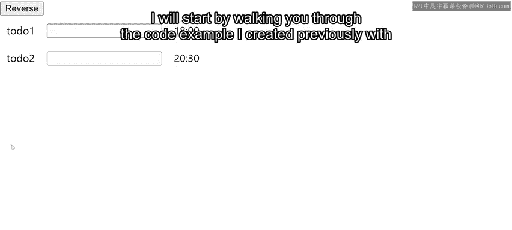
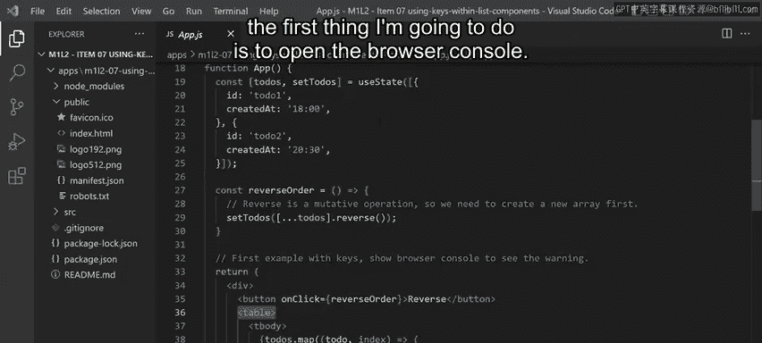
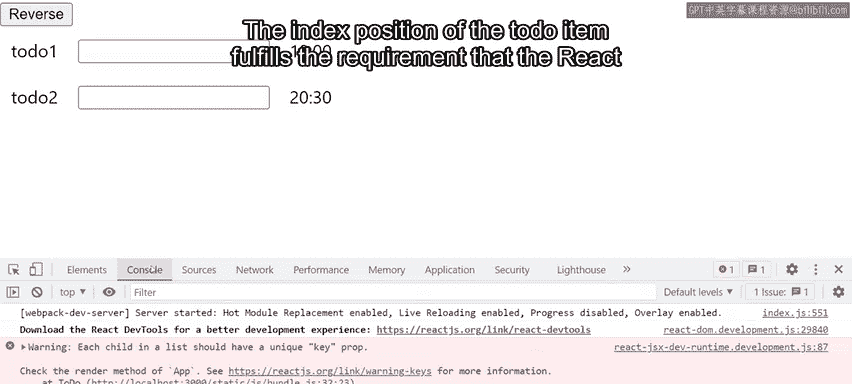
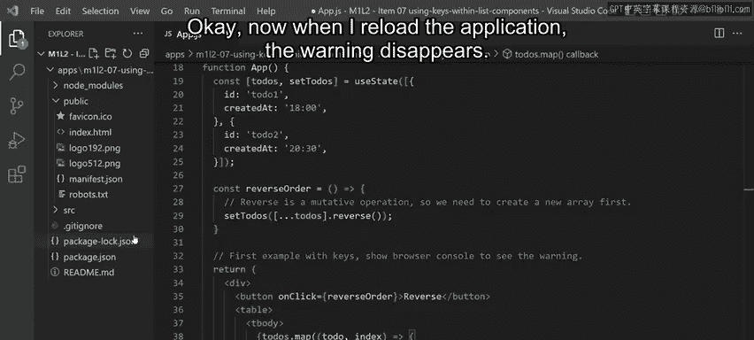
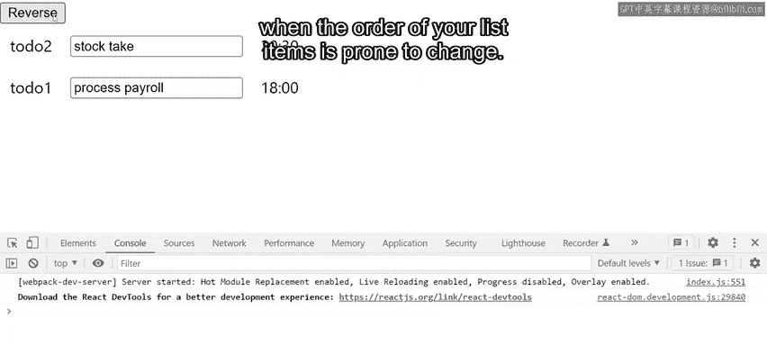
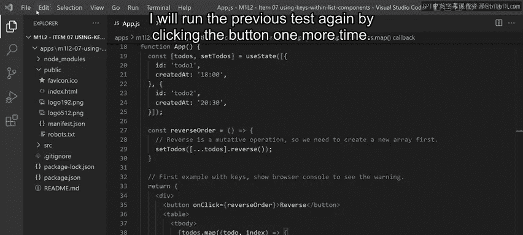
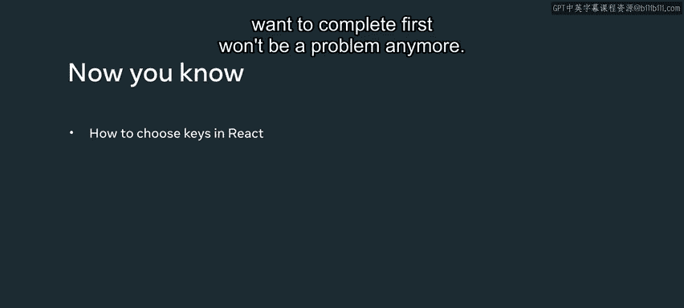

# Meta《前端开发（React／UI、UX／毕业项目／code review）｜Meta Front-End Developer》中英字幕 - P49：7_在列表组件中使用 key.zh_en - GPT中英字幕课程资源 - BV1uJ4m1e7HT

In this video， you will learn how to use keys correctly within list components in react through a practical example。

 Imagine that little lemon restaurant managers would like a separate application that keeps record of the tasks they need to do。

 In order to do that， I have built a very simple to do list app with two different editable to dos that are represented by a text inputs。

 as well as a button that will reverse the order of the todos。

 I will start by walking you through the code example I created previously with create reactact app。

 The todo component is basically a table row， which has an I。

 a text input to type of value and a date of creation。 Both Id and created ads are passed as props。

 whereas the input value state lives in the Dom node。 In other words。

 the text input is an uncontrolled component。

The main app component encompasses the whole interface displayed on the screen。

 La Todo's data model is a piece of state which is essentially an array of objects where each object contains an ID and a date of creation。

Then there is the reverse order function， which effectively changes the order of the todos。

 The reverse method from arrays is a mutative operation。

 That means that it modifies the original array rather than a copy to avoid mutating the react state。

 which is something you should never do。 It's important to make a copy of the array first。

 which I' am doing by using the E S6 spread operator。 Finally。

 when it comes to the JSx for the user interface， there is a wrapping div a button to reverse the order of the todos and a table where each table row is a to do task。

 Each todo instance receives an I and created at as props， which we are passing from the data model。

 Now， coming back to the app， the first thing I'm going to do is to open the browser console。

 a warning in red is displayed。 when you are running your application and development mode。

 Re as a great job of providing solutions to potential problems in your applications via contextual warnings as console errors。

The warning clearly states that each child in a list should have a unique key prop and that I need to check the render method of the app component。

The index position of the to do item fulfills the requirement that the react warning is asking about。

 so I'm going to use that。

Okay， now when I reload the application， the warning disappears。

However， I haven't tested the application yet， so let's type some to dos and explore what happens when I reverse the order。

For the first one， I will type stock take and for the second one， process payroll。

 Now I would like to reverse the order because the managers should do payroll first。Oh。

 that didn't work now， Did it。 The text inputs have not moved， but everything else has。 Well。

 you have just discovered one of the main problems when using indexes as keys when the order of your list items is prone to change。

 So what exactly is happening。 If I go back to the code and take a look at the JS X for each to do。

 When I reverse the order of the to dos， the I D and created at prop have changed。

 But the key is still the same because I'm using the index。

 since it's the same react is instructed to keep the internal state of that node。

 That's why the input state from the todo is preserved。 Now。

 how do you fix that coming back to the key requirements， it has to be something unique。

 but that correctly identifies each to do。 No matter what its position is in the list。 In this case。

 I can definitely use the I D property from the data model as my key。 After all。

 that is guaranteed to be unique per to do。

So now I'm going to implement that change and I will run the previous test again by clicking the button one more time。

 Great， this time it worked as intended， you have learned about choosing keys in your react code。

 you will come across collections of elements quite frequently and with your knowledge of keys。

 allowing your users to do the tasks they want to complete first won't be a problem anymore。

