# Meta《前端开发（React／UI、UX／毕业项目／code review）｜Meta Front-End Developer》中英字幕 - P4：3_React.js 概述.zh_en - GPT中英字幕课程资源 - BV1uJ4m1e7HT

Recall the concept of the single page application or SA for short。

This is a one pageage website to where some of the page's content changes based on user interaction SPAs differ from traditional websites where each webage needs to be loaded as the user navigates around the site this frequent reload can be considered inefficient as some of the same content such as logos。

 navigation and footers need to be loaded again。

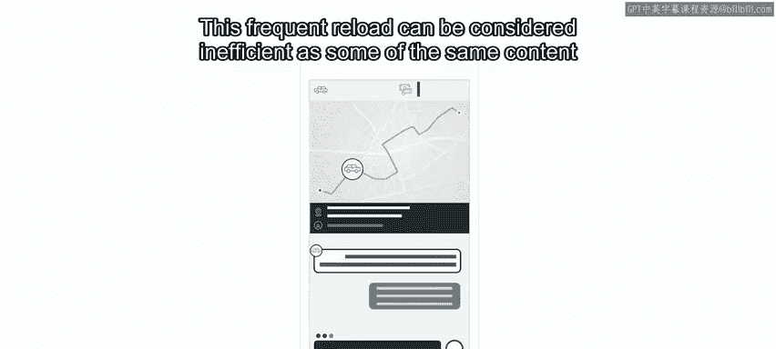

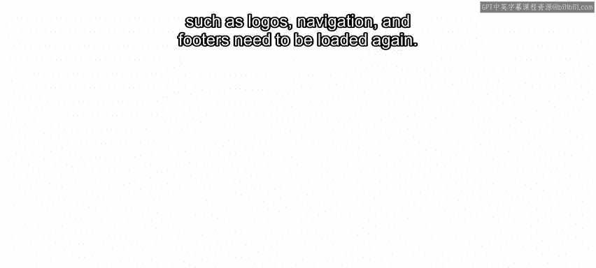

And one of the most popular ways to build an SPAA is with the reactact library for Meta React is used to run many of the world's most popular websites Often on these sites you'll type a search term into the site's input box the site then returns the relevant content or results but you might notice that even though the content has updated the site's URL doesn't change as SPA's only low to the content as required they can be ideal for businesses and enterprises who need a web app that offers rich user interfaces。

 speed， scalability and flexibility。

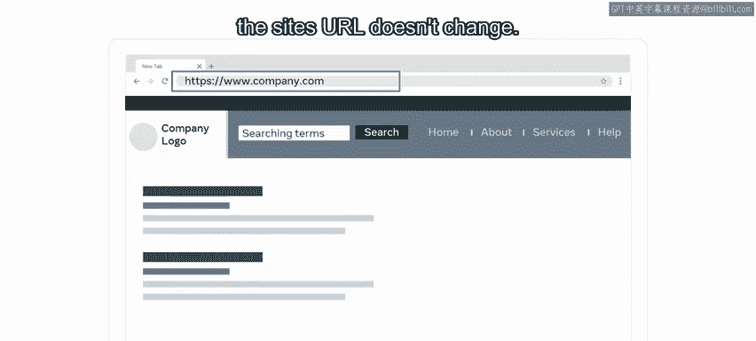

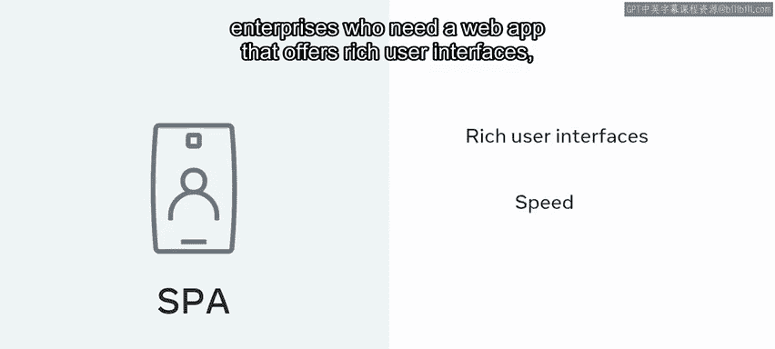

As an aspiring developer， you may feel like there are a lot of new concepts and processes to understand when working with React。

But you can be sure that you will have an opportunity to get familiar with and use them。

In this video， you will learn about the basics of react by exploring the concepts of the component based architecture。

 components， and the virtual dom。😊，Let's begin with components。

 one of the core building blocks of react。😡。

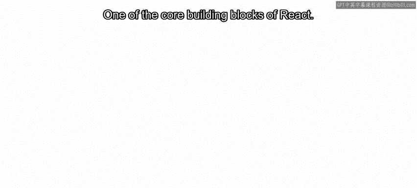

When Meta released the react library， it included the concept of something called componentent based architecture。

 this is essentially a design philosophy for building software based on reusable components of code。

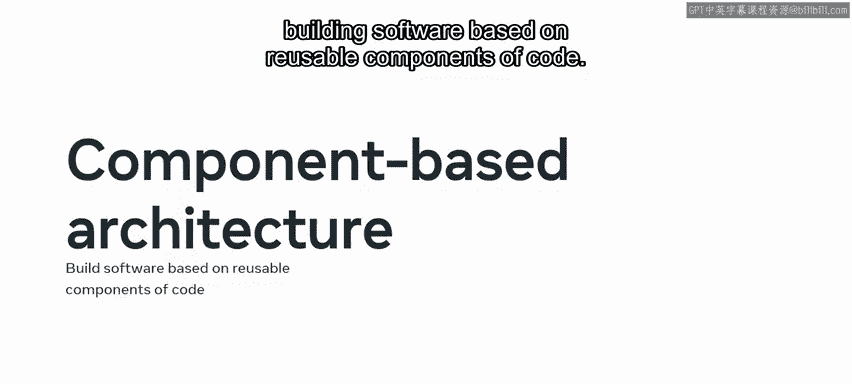

Each component consists of well defined functionality that can be inserted into an application without requiring modification of other components。

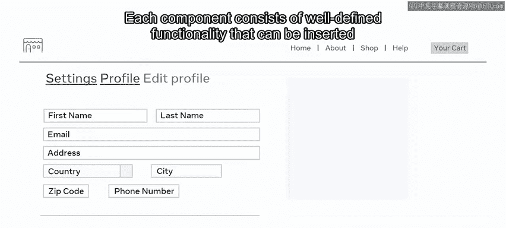

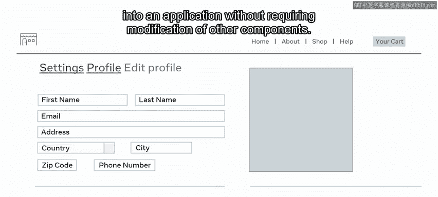

Because components are reusable， they can be used multiple times and easily inserted anywhere where needed。

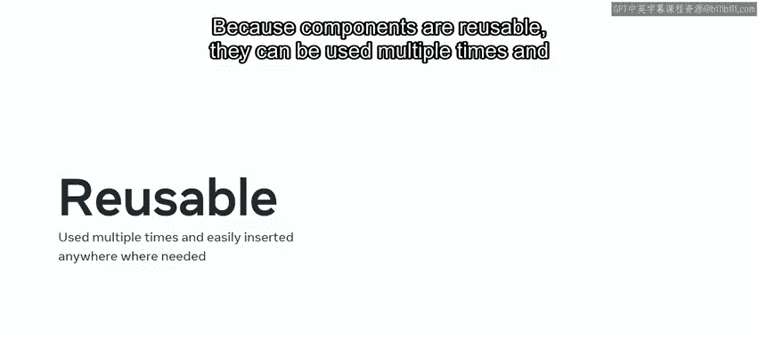

This results in components that can exist within the same space yet interact independently from each other One of the advantages of developing using components is that many developers can work on the same project without interfering with a code of other developers components。

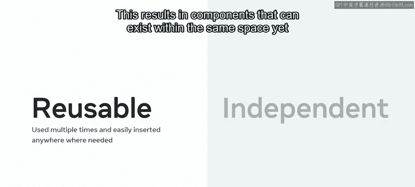

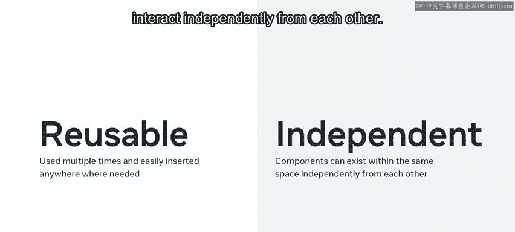

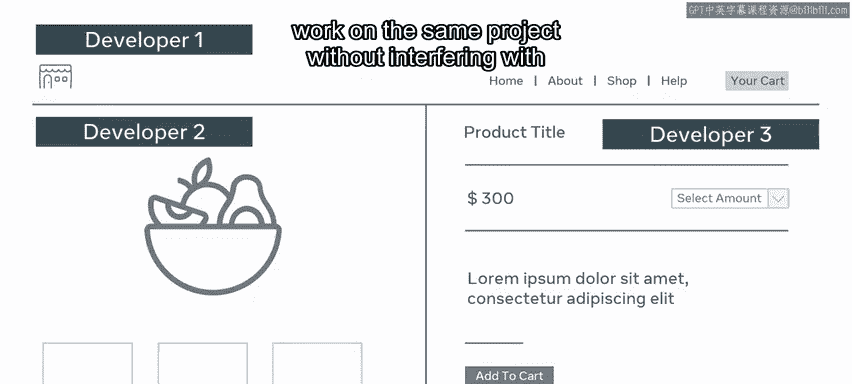

As you may recall， modern front end web development revolves around the concept of creating standalone parts of the user interface or UI for short。

Well， in react， these standalone paths are created using components which form the foundation of all UI design。

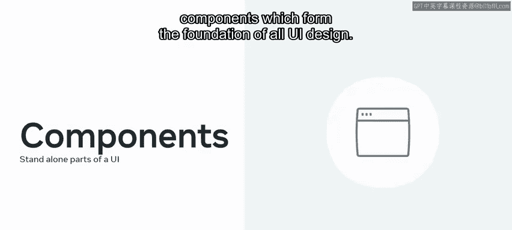

It's important to know that all UI is composed of simple components that can be combined into more complex components In fact。

 you can think of an entire website as just a collection of components。For example。

 consider the product checkout page of an Ecommerce web application。

 the page consists of three sections， a header， a payment section， and a sidebar。

The header section contains the company logo with a navigation menu and a button to view the shopping cart。

The payment section area contains a form where the user inputs their payment information。Finally。

 there's a sidebar with the order summary information。

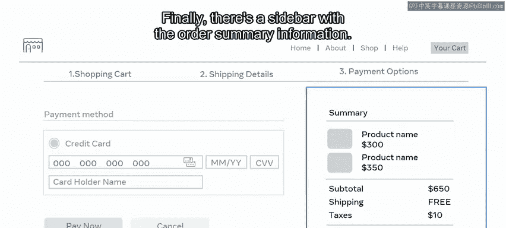

As the components are self contained， they have their own HTML。

 CSS and JavaScript logic for functionality for example。

 the payment section component has a JavaScript function that submits a payment when a button is clicked。

😊。

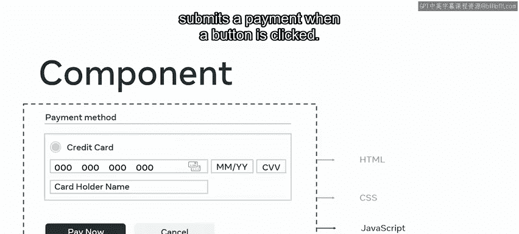

It's important to know that the use of components in website UI design is not limited to just react。

Many websites front end or UI are built on the foundations of components and composability。

But reactact is a powerful tool for streamlining the process of building components and composing them。

It performs these actions efficiently as components are rendered to the Dom without significantly impacting the browser's resources。

This is called componentent rendering and you'll learn more about this and its associated render method later。

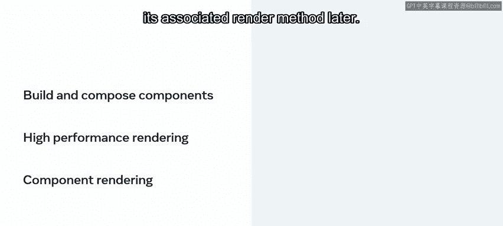

You may recall that the Dom is a logical tree la structure representing the HTML documents。

And it uses nodes to describe the various parts of the document。

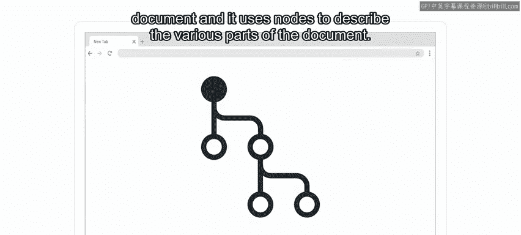

Before react， you could still build components style layouts。

 however it involved much more complicated DOm manipulation and code。

 making the layouts more complex and harder to work with。

This resulted in something known as spaghetti code。

 a term developers use in web developments to describe code that is complex。

 convoluted and difficult to understand like spaghetti React prevents this spaghetti code by avoiding any manipulation of the Dom。

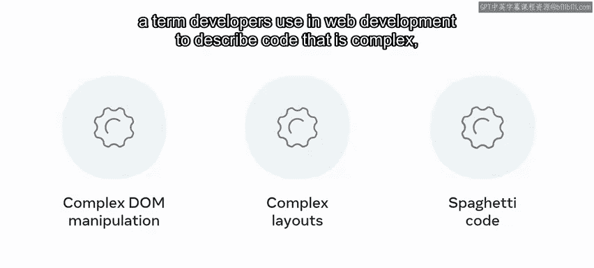

Instead， react provide something known as the virtual Dom。

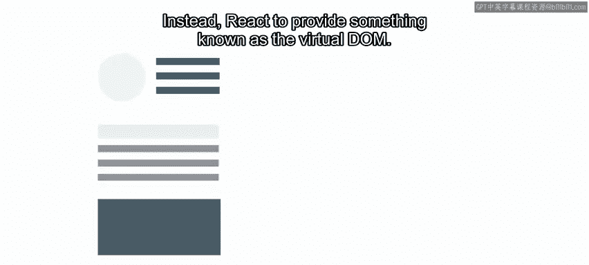

You may recall that this is an in memoryory representation or clone of the real Dom。

 which minimizes updates to the Dom itself， reactact users the virtual Dom to update the browser dom only when needed。

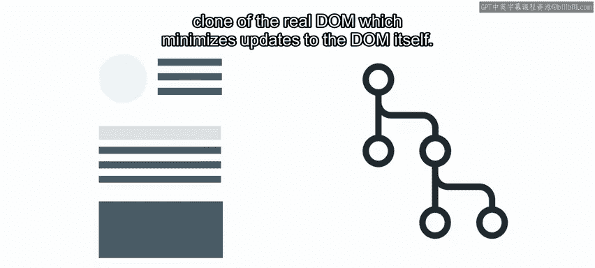

This ensures that the update is as minimal as possible。

 increasing the application's speed and performance。😊。

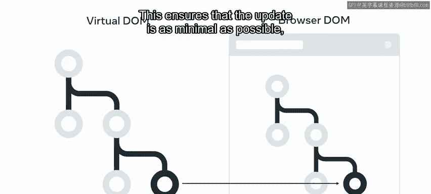

In this video， you learned about the basics of react by exploring the concepts of the component based architecture。

 components， and the virtual Dom。