# React 表单开发：第9章：在 React 中创建表单组件 📝

在本节课中，我们将学习如何在 React 中创建受控的表单组件。我们将了解如何利用 React 的状态管理来控制表单数据，如何阻止表单的默认提交行为，以及如何根据表单的有效性来禁用提交按钮。

表单看似简单，但其包含许多不同的特性和功能。对于开发者而言，构建表单是一门艺术。React 让开发者构建和定制表单变得更加容易，这也是它如此受欢迎的原因。

小柠檬餐厅的在线网页是早些时候创建的。虽然小柠檬餐厅对之前的结果一度满意，但他们开始意识到用户在使用旧的联系表单时遇到了问题。在收到一些建议后，他们决定重建表单，并选择 React 作为最合适的框架，因为它能轻松实现表单所需的功能和控制。

## 受控组件与不受控组件

在上一节中，我们了解了表单的重要性。本节中，我们来看看 React 中处理表单的两种主要方式：受控组件和不受控组件。

回忆一下，React 中的受控组件是指表单数据由组件的状态（state）处理的组件。而不受控组件则是指表单数据由 DOM 本身处理的组件。

**受控组件公式**：`表单数据 = 组件状态`

为了更深入地了解如何在 React 中创建表单组件，我们现在将分析一个基础表单示例的代码。

## 构建一个基础表单

我将使用之前构建的一个应用来演示如何在 React 中创建表单组件。在这个例子中，项目是使用 `create-react-app` 创建的。

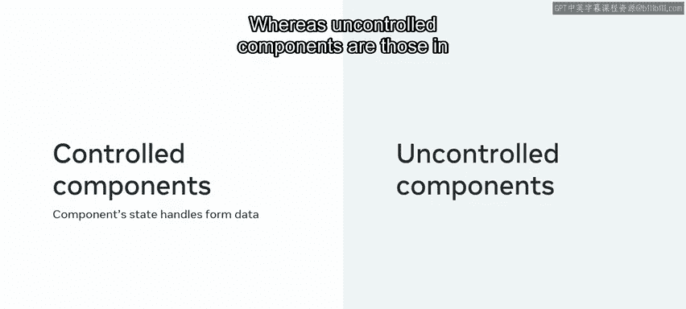

这个函数组件的 `return` 方法本质上包含一个表单，该表单有两个元素：一个用于输入用户名的文本输入框和一个提交按钮。这个表单类似于经典的 HTML 版本，因此无论你是否使用 React，它的工作方式都相同。

为了测试应用，我输入名字“John”并点击提交按钮。这样做会触发表单的默认行为，即向根路径发送一个 GET 请求并刷新页面。

在 React 中，当前的实现被认为是一个不受控表单，所有状态都存在于 DOM 中。让我们逐步完成必要的步骤，将这个表单转换为受控版本。

## 将表单转换为受控组件

以下是创建受控表单的关键步骤：

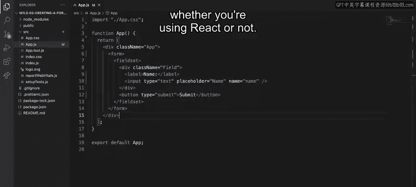

首先，我需要为文本输入框创建一些本地状态，我将其称为 `name`。

```javascript
const [name, setName] = useState('');
```

其次，我需要通过两个属性将这个状态连接到我的文本输入框：`value` 属性将输入框变为受控输入，`onChange` 属性接收每次按键的更改，从而更新输入框的状态。

最后，为了控制表单的提交，我必须在 `form` 标签中使用 `onSubmit` 属性。目前，我将在控制台记录一条基本消息，说明提交成功。

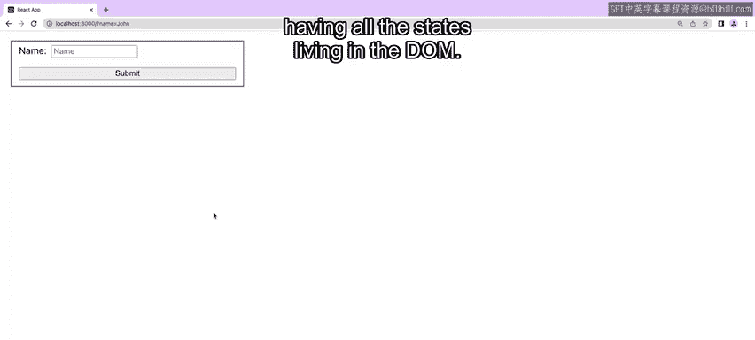

现在让我们检查表单是否仍像以前一样工作。我将输入一个名字并点击提交。

它正在工作。我的消息被记录到控制台，并且表单的默认行为仍在继续。

虽然这很好，但我实际上希望更多地控制表单的提交。具体来说，我不希望触发默认的调用服务器根路径和刷新页面的行为。

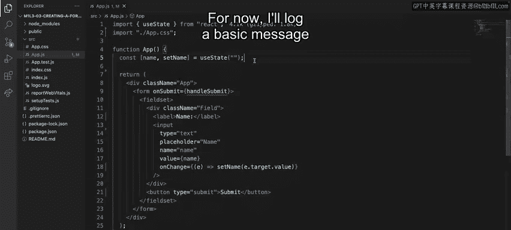

你可能想知道如何防止这种情况发生。

## 阻止表单的默认行为

在传统表单中，你可以通过从 `onsubmit` 属性返回 `false` 来实现这一点。然而，在 React 中，做法是使用你在 `onSubmit` 回调中作为参数获取的事件属性，并对其调用 `preventDefault` 方法。

```javascript
const handleSubmit = (event) => {
  event.preventDefault();
  console.log('提交成功！');
};
```

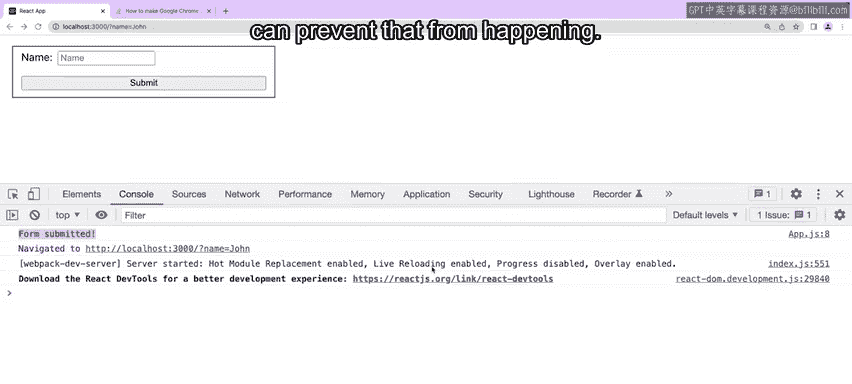

现在，当我再次提交表单时，不会发生页面刷新，也不会向服务器发送请求。

让我们更进一步，在提交后清空输入框。为此，我在 `onSubmit` 回调中调用状态设置函数并传入一个空字符串。

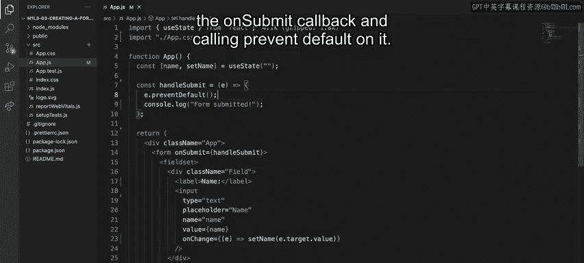

```javascript
const handleSubmit = (event) => {
  event.preventDefault();
  console.log('提交成功！', name);
  setName(''); // 清空输入框
};
```

很好，我的表单正在成形。为了展示受控组件的更多好处，让我们进行一项额外的改进：仅当文本输入框不为空时才允许用户提交表单。

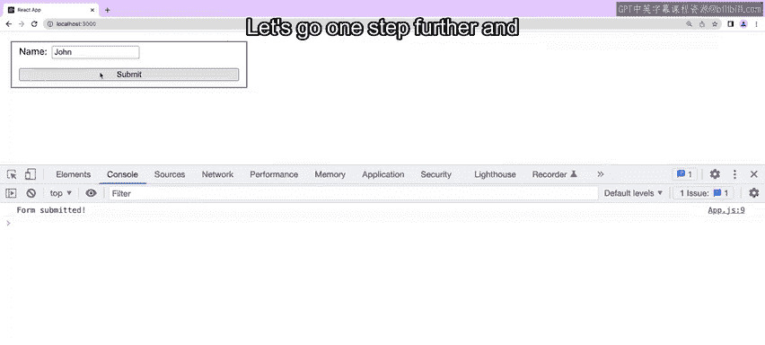

## 根据条件禁用提交按钮

禁用按钮就像使用 `disabled` 属性一样简单。在这种情况下，如果 `name` 是一个空字符串，这个表达式将被评估为 `true`，按钮将被禁用。

```javascript
<button type="submit" disabled={name === ''}>提交</button>
```

所以在应用中，如果没有提供名字，我就无法点击按钮。

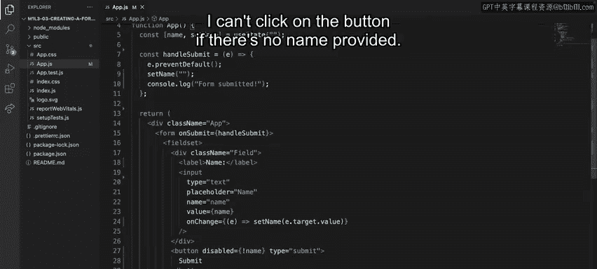

最后，为了遵循最佳的无障碍实践，让我们将标签（label）与输入框（input）连接起来。我为输入框设置了一个 ID 叫 `name`，现在我将连接标签。

在传统的 HTML 表单中，你会使用 `for` 属性，但在 React 中，`for` 是一个保留字，所以你必须使用 `htmlFor` 并传入输入框的 ID。

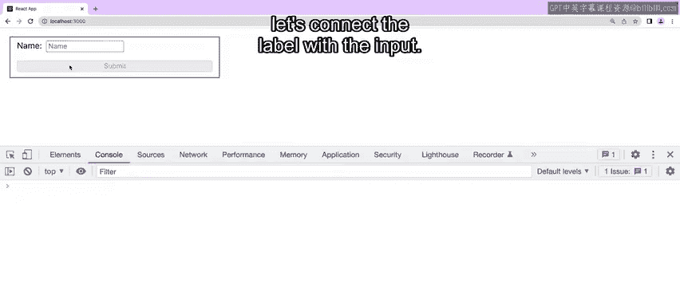

```javascript
<label htmlFor="name">用户名：</label>
<input id="name" type="text" value={name} onChange={(e) => setName(e.target.value)} />
```

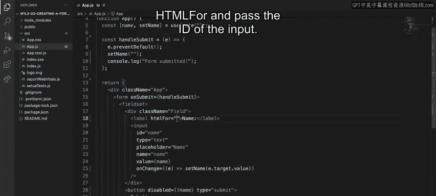

现在，如果我点击标签，其对应的输入框会获得焦点。

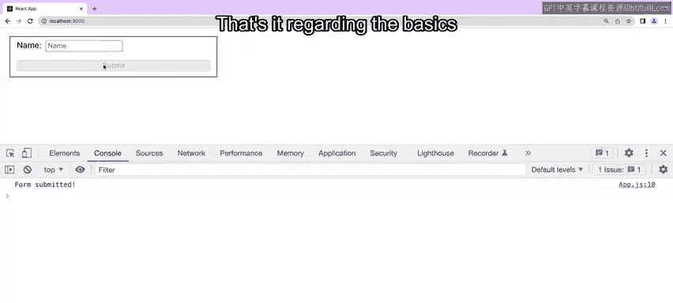

## 总结

本节课中，我们一起学习了 React 中受控表单的基础知识。

你学会了如何使用本地状态和 `onChange` 事件，以及 `onSubmit` 属性，将一个不受控的表单转换为受控版本，并了解了这样做的一些好处。在表单提交方面，你还学会了如何避免默认行为，以及在表单无效时如何禁用提交按钮。

做得好，你取得了很大的进步。